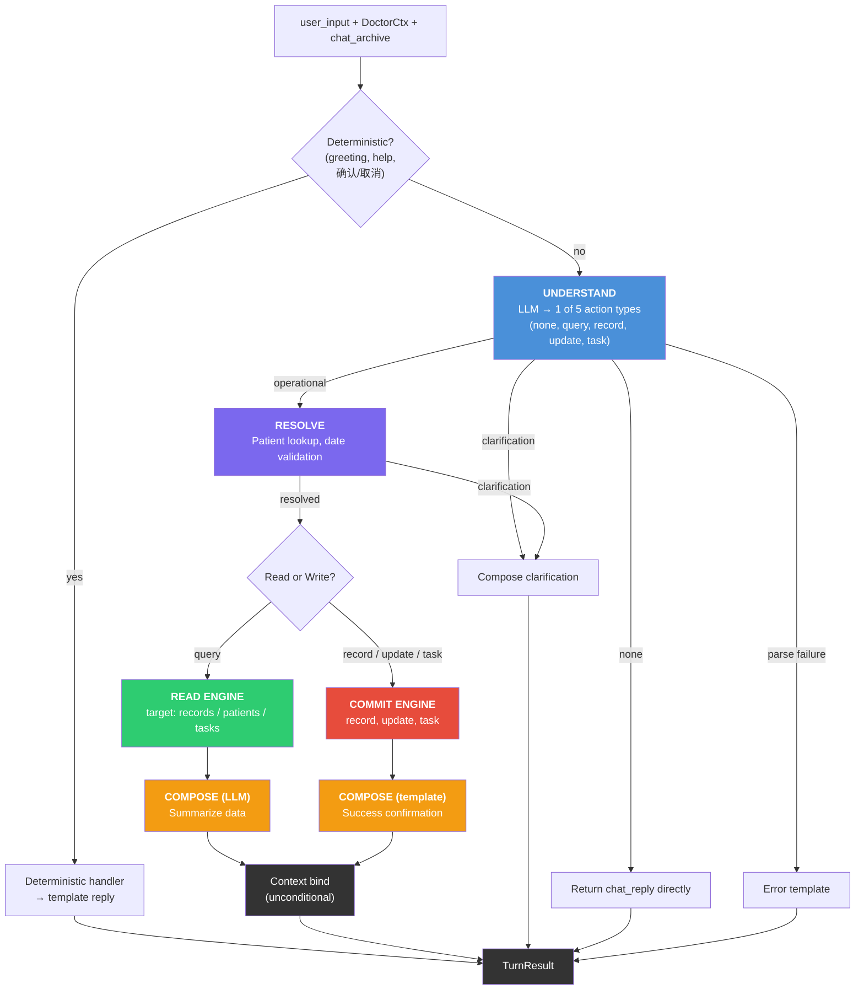
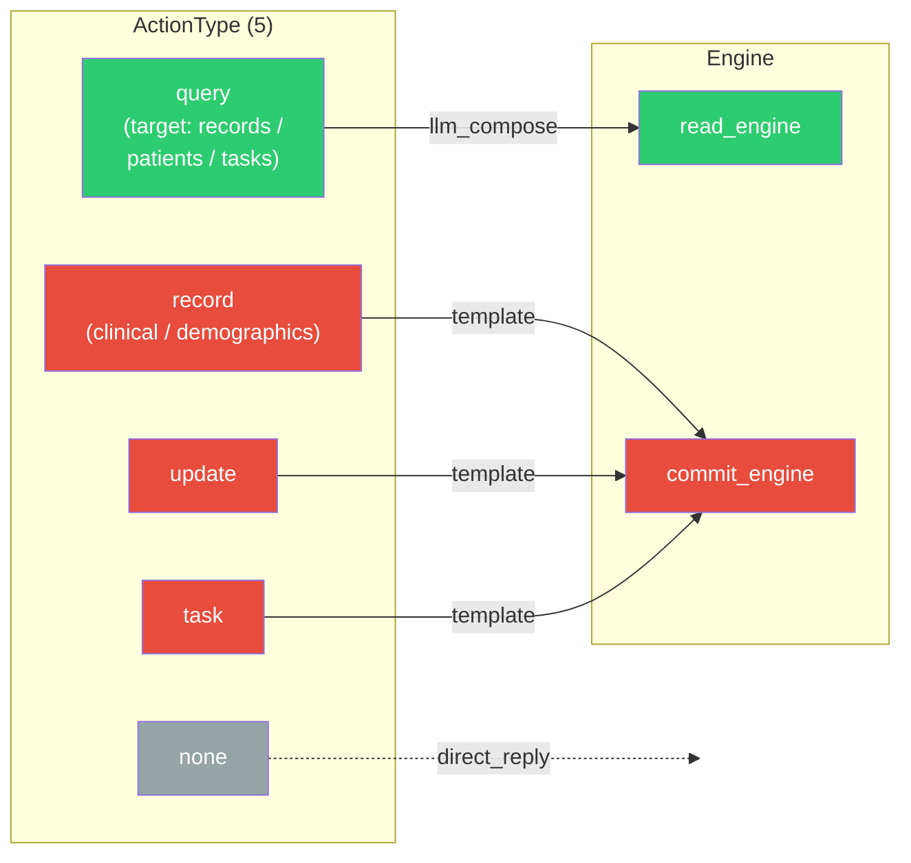
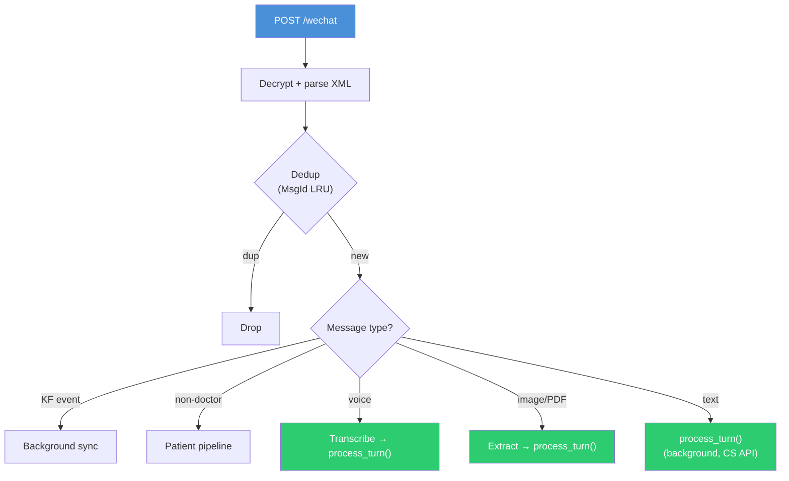
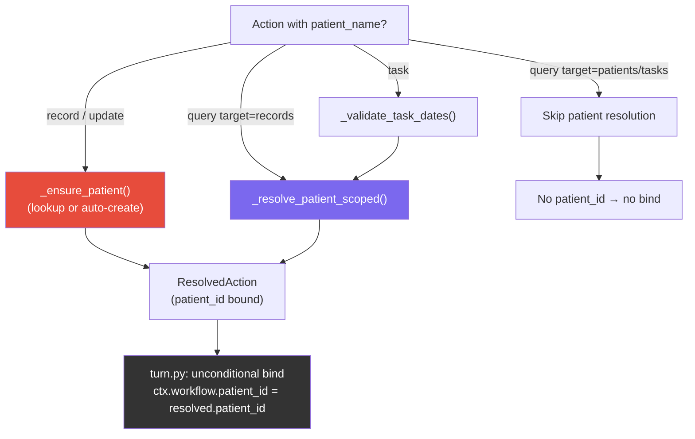
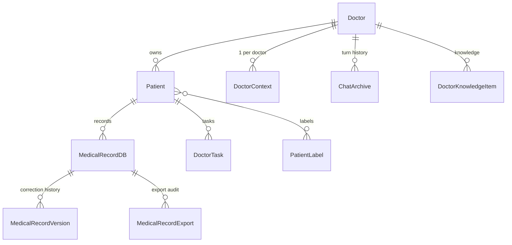

# Architecture

**Last updated:** 2026-03-16

## Overview

Doctor AI Agent is a FastAPI backend with a React web frontend for doctor-facing
workflows: patient management, medical record dictation, task management, and
follow-up support.

The architecture is centered on a **thread-centric conversation runtime**
(ADR 0011) extended by a **three-phase Understand → Execute → Compose
pipeline** (ADR 0012), simplified to **5 action types with uniform patient
binding** (ADR 0013). Every channel calls `process_turn()`, which runs
pre-pipeline guards, then the UEC pipeline for all turn types.

Key invariants:

- **One entry point** — all channels call `process_turn(doctor_id, text)`.
  No channel reaches into runtime internals.
- **Understand never authors operational replies** — for operational turns
  (reads, writes), the LLM emits structured intent only. Compose generates
  the reply from execution results.
- **Execute splits reads from writes** — `read_engine` (SELECT only, no state
  mutation) and `commit_engine` (durable writes) are separate modules with a
  hard import boundary.
- **Direct save** — record creation saves directly (no pending draft). Task
  creation commits immediately.
- **Uniform patient binding** — every action that resolves a patient switches
  context. No `scoped_only` asymmetry between reads and writes (ADR 0013 §2).
- **Deterministic commits** — the LLM proposes an `UnderstandResult`; resolve
  validates bindings; the commit engine executes. LLMs never write directly.
- **Services are RPC, channels choose transport** — the service layer exposes
  plain async functions (RPC-style). Channels choose the transport protocol
  (REST, webhook, XML reply) appropriate for their consumer.

---

## Layer Diagram

```text
┌─────────────────────────────────────────────────────────┐
│                    CHANNEL LAYER                        │
│  Web (chat.py)  │  WeChat (router.py)  │  Voice (.py)  │
│  normalize input → call process_turn()                  │
└──────────────────────────┬──────────────────────────────┘
                           │
                  process_turn(doctor_id, text)
                           │
┌──────────────────────────▼──────────────────────────────┐
│                 RUNTIME (services/runtime/)              │
│                                                         │
│  1. Load DoctorCtx from DB                              │
│  2. Deterministic handler (greeting, help, 确认/取消)    │
│  3. UNDERSTAND — LLM → 1 of 5 action types              │
│  4. EXECUTE                                             │
│     ├── Resolve (patient lookup, binding, dates)        │
│     ├── Read engine (SELECT only — target dispatch)     │
│     └── Commit engine (record, update, task)            │
│  5. COMPOSE — template or LLM from execution results    │
│  6. Context bind + persist + archive turns              │
│                                                         │
│  Public API:                                            │
│    process_turn()  TurnResult                           │
└──────────────────────────┬──────────────────────────────┘
                           │
┌──────────────────────────▼──────────────────────────────┐
│               SERVICE LAYER                             │
│  ai/        structuring, transcription, vision, LLM     │
│  domain/    confirm_pending                              │
│  patient/   risk scoring, search, timeline               │
│  knowledge/ PDF/Word extraction, doctor knowledge        │
│  notify/    task scheduling, notifications               │
│  export/    PDF generation                               │
│  auth/      JWT, rate limiting                           │
│  observability/  audit, metrics, tracing                 │
└──────────────────────────┬──────────────────────────────┘
                           │
┌──────────────────────────▼──────────────────────────────┐
│                    DATA LAYER (db/)                      │
│  models/     SQLAlchemy ORM (Doctor, Patient, Record…)  │
│  crud/       Async CRUD functions                        │
│  repositories/  Higher-level query wrappers              │
│  engine.py   AsyncEngine + session factory               │
└─────────────────────────────────────────────────────────┘
```

---

## Pipeline Flow (ADR 0013)



---

## Action Types (ADR 0013)



| Type | Replaces (ADR 0012) | Key behavior |
|---|---|---|
| `none` | `none` | Chat/help. Only type that returns `chat_reply`. |
| `query` | `query_records`, `list_patients`, `list_tasks`, `select_patient` | `target` field routes to records/patients/tasks. Unknown target defaults to records. |
| `record` | `create_record`, `create_patient` | Clinical content → structure + save. Empty content + patient name → demographics-only registration. |
| `update` | `update_record` | Re-structure with amendment instruction. |
| `task` | `schedule_task` | `task_type` always "general". Title carries meaning. |

---

## Channel Layer

All channels normalize input and delegate to `process_turn()`. No channel
imports runtime internals.

### Web (`src/channels/web/`)

| File | Route | Role |
|------|-------|------|
| `chat.py` | `POST /api/records/chat` | Main chat endpoint; delegates to `process_turn()` |
| `chat.py` | `POST /api/records/from-{text,image,audio}` | Media import (OCR/transcribe then import) |
| `auth.py` | `/api/auth/*` | JWT login, invite codes |
| `tasks.py` | `/api/tasks/*` | Task CRUD |
| `voice.py` | — | See Voice channel below |
| `export.py` | `/api/export/*` | PDF/report export |
| `neuro.py` | `/api/neuro/*` | Specialty CVD/neuro endpoints |
| `patient_portal.py` | `/api/patient_portal/*` | Patient self-service (read-only) |
| `ui/` | `/ui/*` | Admin dashboard, debug, invites |

### WeChat (`src/channels/wechat/`)

| File | Role |
|------|------|
| `router.py` | WeChat/WeCom webhook; text → `process_turn()`; voice → transcribe → `process_turn()`; image/PDF/Word → extraction pipelines |
| `flows.py` | Menu events, notify control, media background handlers |
| `infra.py` | Signature verification, token refresh, KF cursor persistence |
| `patient_pipeline.py` | Patient (non-doctor) message handling |
| `wechat_notify.py` | Customer service API (message delivery) |
| `wechat_voice.py` | Voice download and conversion |
| `wechat_media_pipeline.py` | Image/PDF/document extraction pipeline |
| `wechat_domain.py` | Formatting, XML parsing, menu event logic |
| `wecom_kf_sync.py` | WeCom KF message sync |



### Voice (`src/channels/voice.py`)

| Route | Role |
|-------|------|
| `POST /api/voice/chat` | Transcribe audio → `process_turn()` |
| `POST /api/voice/consultation` | Same, with `consultation_mode=True` transcription hint |

---

## Runtime Layer (`src/services/runtime/`)

The runtime is the sole orchestrator for doctor turns. All internal modules are
implementation details — channels import only from the package root.

### Public API (`__init__.py`)

```python
process_turn(doctor_id, text) -> TurnResult
TurnResult                                    # reply + optional view_payload + record_id
```

### Pipeline (`turn.py`)

```text
text → strip → load DoctorCtx → deterministic handler
  → Understand (LLM) → multi-action loop [Resolve → Dispatch → Compose]
  → context bind → persist → reply
```

| Stage | Module | Purpose |
|-------|--------|---------|
| Context | `context.py` | Load/save `DoctorCtx` from `doctor_context` table; read/write `chat_archive` |
| Deterministic handler | `turn.py` | Greeting/help regex fast path (0 LLM calls) |
| Understand | `understand.py` | LLM → `UnderstandResult` (1-3 actions, structured intent) |
| Resolve | `resolve.py` | Patient DB lookup, uniform binding, date validation |
| Read engine | `read_engine.py` | Target-based dispatch: records / patients / tasks |
| Commit engine | `commit_engine.py` | Durable writes: record (+ demographics-only), update, task |
| Compose | `compose.py` | Template or LLM reply from execution results |
| Context bind | `turn.py` | Unconditional: if `patient_id` resolved → switch context |
| Persist | `turn.py` | Best-effort save context + archive turns (never raises) |

### Data Model

```python
DoctorCtx
  ├── doctor_id: str
  ├── workflow: WorkflowState
  │     ├── patient_id: Optional[int]
  │     └── patient_name: Optional[str]
  └── memory: MemoryState            # dead fields — retained for column compat

ActionType (enum):  none | query | record | update | task

UnderstandResult
  ├── actions: List[ActionIntent]    # 1-3 actions per turn
  │     ├── action_type: ActionType
  │     └── args: QueryArgs | RecordArgs | UpdateArgs | TaskArgs | None
  ├── chat_reply: Optional[str]      # only when action_type == none
  └── clarification: Optional[Clarification]

TurnResult
  ├── reply: str
  ├── record_id: Optional[int]       # set when record created/updated
  ├── view_payload: Optional[dict]   # structured data for web rendering
  └── switch_notification: Optional[str]  # patient context switch notice
```

### Resolve: Patient Binding



---

## Service Layer

### AI Services (`src/services/ai/`)

| File | Role |
|------|------|
| `llm_client.py` | Lazy-load OpenAI-compatible client; multi-provider (Ollama, DeepSeek, Groq, etc.) |
| `llm_resilience.py` | Retry with exponential backoff and provider fallback |
| `structuring.py` | Transform raw clinical text into structured medical record |
| `neuro_structuring.py` | Specialty CVD/neuro field extraction (background) |
| `transcription.py` | Audio → text (Ollama/Groq/API, Chinese-optimized) |
| `vision.py` | Image → text (OCR, table, handwriting) |
| `egress_policy.py` | Compliance guard for outbound LLM calls |

### Domain (`src/services/domain/`)

| File | Role |
|------|------|
| `intent_handlers/_confirm_pending.py` | Post-save hooks: audit, follow-up tasks, auto-learn |

### Other Services

| Directory | Role |
|-----------|------|
| `auth/` | JWT, rate limiting, access codes, WeChat ID hashing |
| `patient/` | Risk scoring, NL search, timeline, encounter detection |
| `knowledge/` | PDF/Word extraction, doctor knowledge base |
| `notify/` | Task scheduling (APScheduler), notification delivery |
| `export/` | PDF generation, outpatient reports |
| `observability/` | Audit trail, routing metrics, trace context |

---

## Data Layer (`src/db/`)

### Key Models



### CRUD (`db/crud/`)

Async functions taking `AsyncSession`. Key modules: `doctor.py` (patient search,
turn archiving), `patient.py` (CRUD), `records.py` (save + versioning),
`tasks.py` (task CRUD), `retention.py` (compliance cleanup).

### Repositories (`db/repositories/`)

Higher-level query wrappers: `patients.py`, `records.py`, `tasks.py`.

### Storage

SQLite in development, MySQL/PostgreSQL in production. Async via SQLAlchemy.
No Alembic migrations until first production launch; `create_tables()` handles
DDL.

---

## Configuration

**Primary:** `config/runtime.json` (gitignored; sample in `config/runtime.json.sample`)

| Variable | Purpose | Default |
|----------|---------|---------|
| `DATABASE_URL` | DB connection | `sqlite+aiosqlite:///data/patients.db` |
| `ENVIRONMENT` | `development`/`production` | (required in prod) |
| `ROUTING_LLM` | LLM for understand + compose | `deepseek` |
| `STRUCTURING_LLM` | LLM for record structuring | `deepseek` |
| `OLLAMA_BASE_URL` | Ollama endpoint | `http://192.168.0.123:11434` (LAN) |
| `WECHAT_TOKEN`, `WECHAT_APP_ID` | WeChat credentials | (required for WeChat) |
| `DEEPSEEK_API_KEY` | DeepSeek provider | (optional) |

---

## Messages (`src/messages.py`)

Template strings for all pipeline responses (Chinese default, English with
`RUNTIME_LANG=en`). Includes clarification templates, action success templates,
error templates. Confirm/abandon regex patterns live in `turn.py`.

---

## Application Entry (`src/main.py`)

- Registers 9 routers (records, wechat, auth, ui, neuro, tasks, voice, export, patient_portal)
- Middleware: request size limit (50 MB), trace ID propagation, CORS
- Health endpoints: `/healthz`, `/readyz`
- Lifespan: create tables → seed prompts → hydrate LLMs → start scheduler + background workers
- APScheduler: task notifications, conversation cleanup, session pruning, audit retention, CVD extraction

---

## Infrastructure

| Component | Technology |
|-----------|------------|
| Framework | FastAPI |
| ORM | SQLAlchemy async |
| Scheduler | APScheduler |
| Frontend | React + Vite + MUI |
| Auth | HS256 JWT |
| LLM providers | Ollama, DeepSeek, OpenAI, Tencent LKEAP, Claude, Gemini, Groq |

---

## Key ADRs

| ADR | Title | Status |
|-----|-------|--------|
| 0011 | Thread-centric conversation runtime and deterministic commits | Active — foundation |
| 0012 | Understand / Execute / Compose pipeline for operational actions | Active — pipeline architecture |
| 0013 | Action type simplification (9→5, uniform binding, no task_type) | Active — current |

---

## Known Debt

1. **`services/session.py`** — legacy parallel session model. Still used by
   WeChat background processing (locks, hydration). Scheduled for removal in
   Shared Workflow Unification.

2. **WeChat fast paths** — task completion (`完成 N`), knowledge add, and notify
   control are handled in `_handle_intent()` before `process_turn()`. These
   could be folded into the runtime as custom action types.

3. **`DoctorTask.task_type`** — column always written as "general" (ADR 0013).
   Retained for backward compat; can be removed at first production migration.

4. **`MemoryState` dead fields** — `working_note`, `candidate_patient`,
   `summary` retained in DB column for compat but never read by pipeline.

---

## Further Reading

- [ADR 0011 — Architecture and Workflows](docs/adr/0011-architecture-and-workflows.md)
- [ADR 0012 — UEC Pipeline](docs/adr/0012-understand-execute-compose-pipeline.md)
  ([Architecture Diagram](docs/adr/0012-architecture-diagram.md))
- [ADR 0013 — Action Type Simplification](docs/adr/0013-action-type-simplification.md)
  ([Architecture Diagram](docs/adr/0013-architecture-diagram.md))
- [ADR index](docs/adr/README.md)
