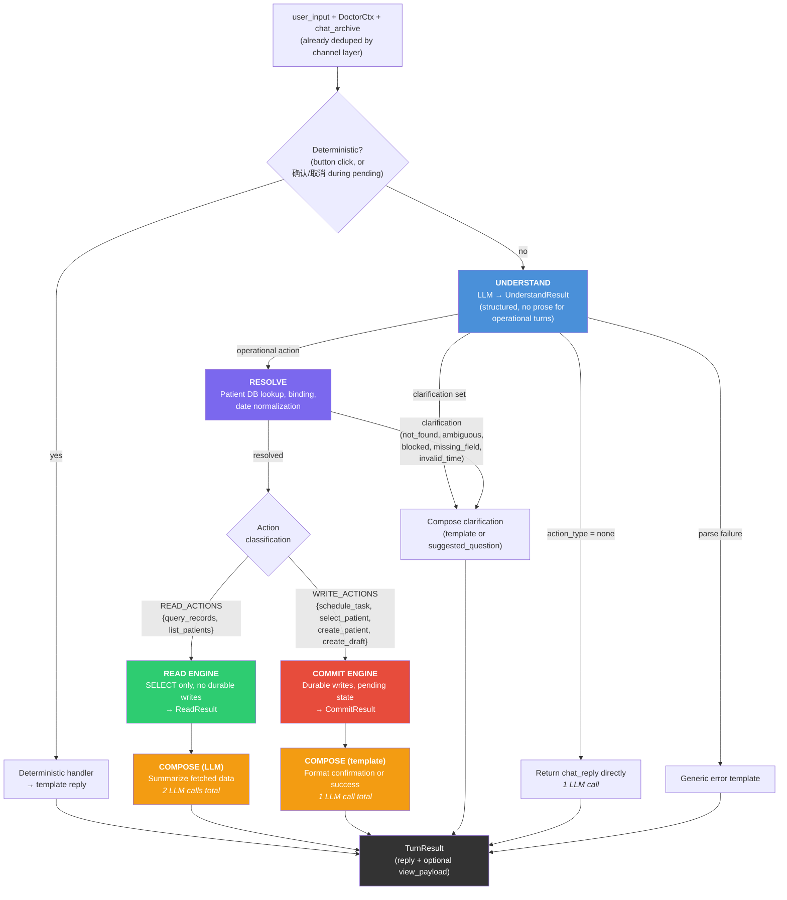
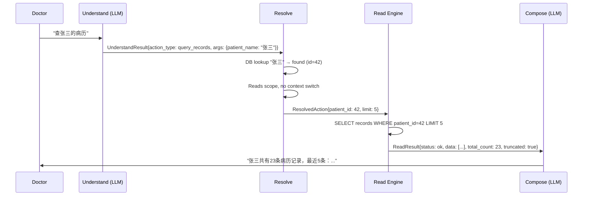
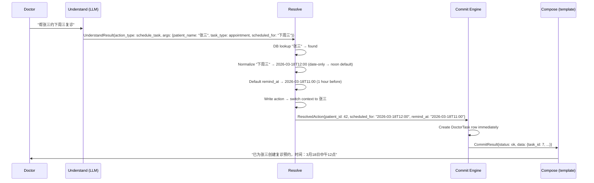
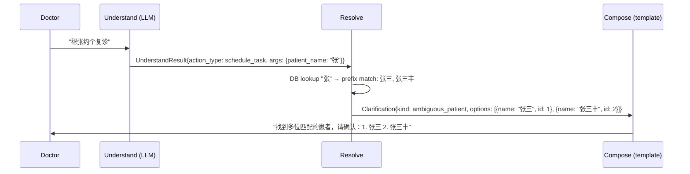
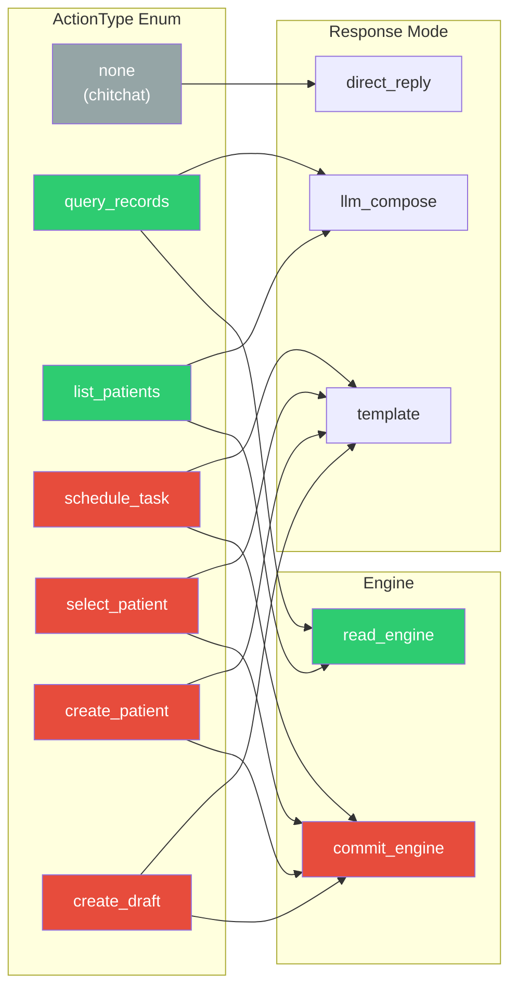
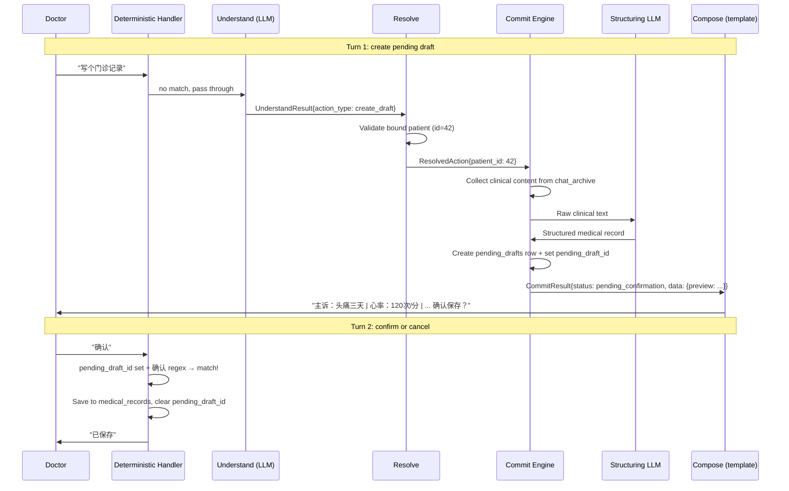
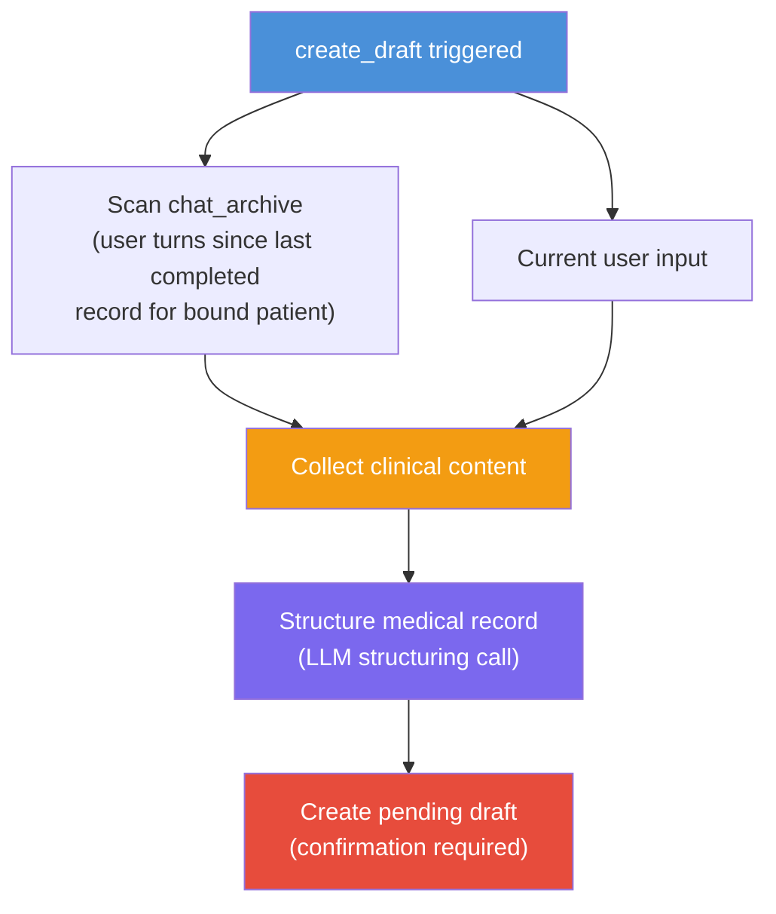

# ADR 0012: Architecture Diagram

Companion diagram for
[ADR 0012](./0012-understand-execute-compose-pipeline.md).

## Full Pipeline Flow

## Data Flow: Read Query Path

## Data Flow: Immediate Write Path (schedule_task)

## Data Flow: Clarification Path

## Action Type Overview

## Data Flow: Pending Draft Lifecycle (create_draft)

The only two-turn flow in the system. Turn 1 creates the pending draft via
the pipeline; turn 2 resolves it via the deterministic handler (no pipeline).

## Clinical Context for Drafting (no memory_patch)

No `memory_patch` needed — the full `chat_archive` is the clinical context
source. Deferred until conversation history truncation is implemented.
