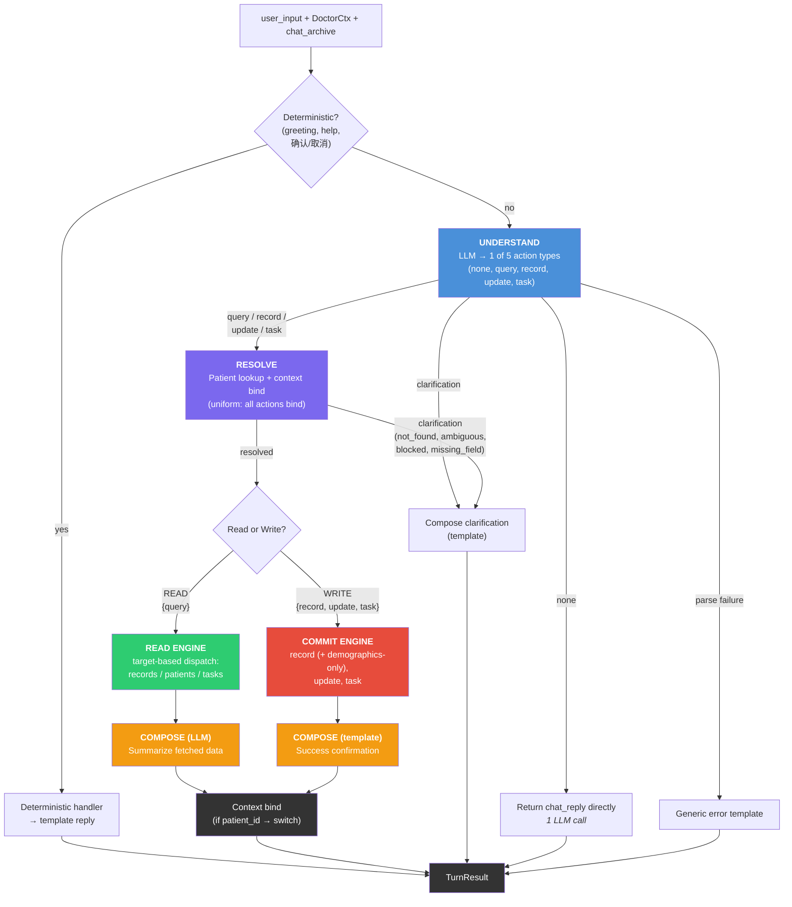
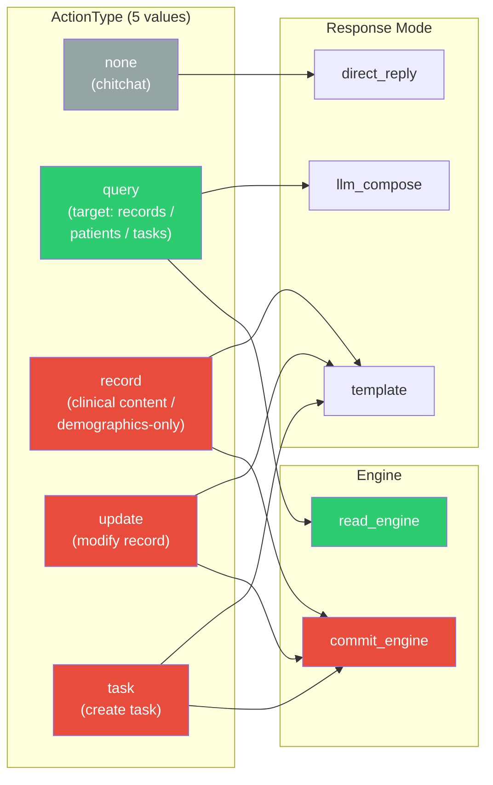
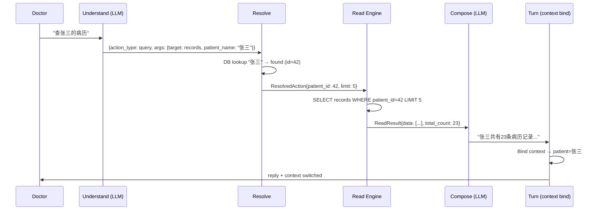
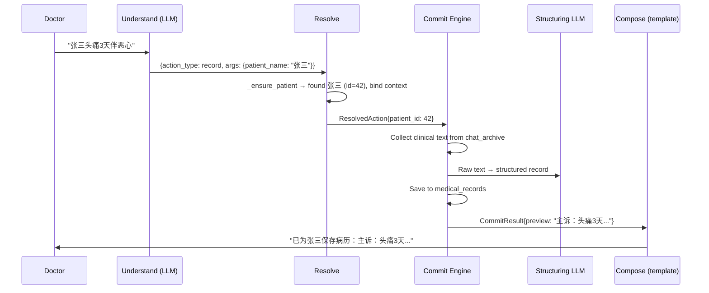
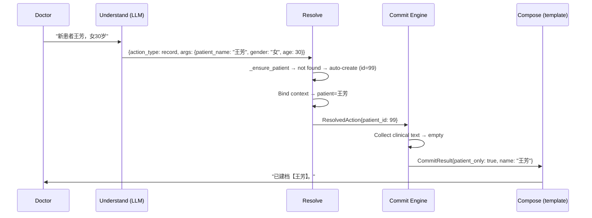
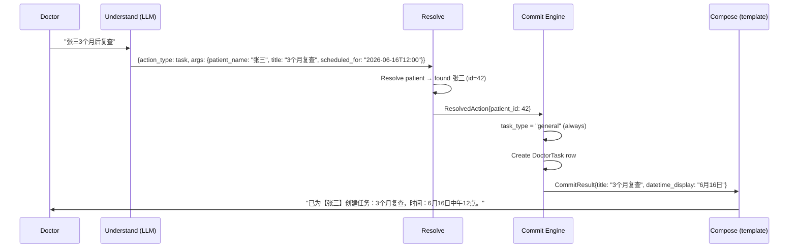
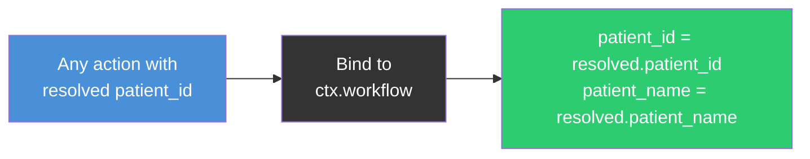

# ADR 0013: Architecture Diagram

Companion diagram for
[ADR 0013](./0013-action-type-simplification.md).

## Full Pipeline Flow (ADR 0013)

## Action Type Overview (ADR 0013)

## Data Flow: Read Query (records)

## Data Flow: Record with Clinical Content

## Data Flow: Demographics-Only (new patient)

## Data Flow: Task Creation

## Patient Context Binding (ADR 0013)

**Uniform rule: all patient-scoped actions bind context.**

No `scoped_only` flag. No asymmetry between reads and writes.

Replaces ADR 0012 §10 "binding asymmetry" (reads scope, writes switch).
