# ADR 0013: Architecture Diagram

Companion diagram for
[ADR 0013](./0013-action-type-simplification.md).

## Full Pipeline Flow (ADR 0013)

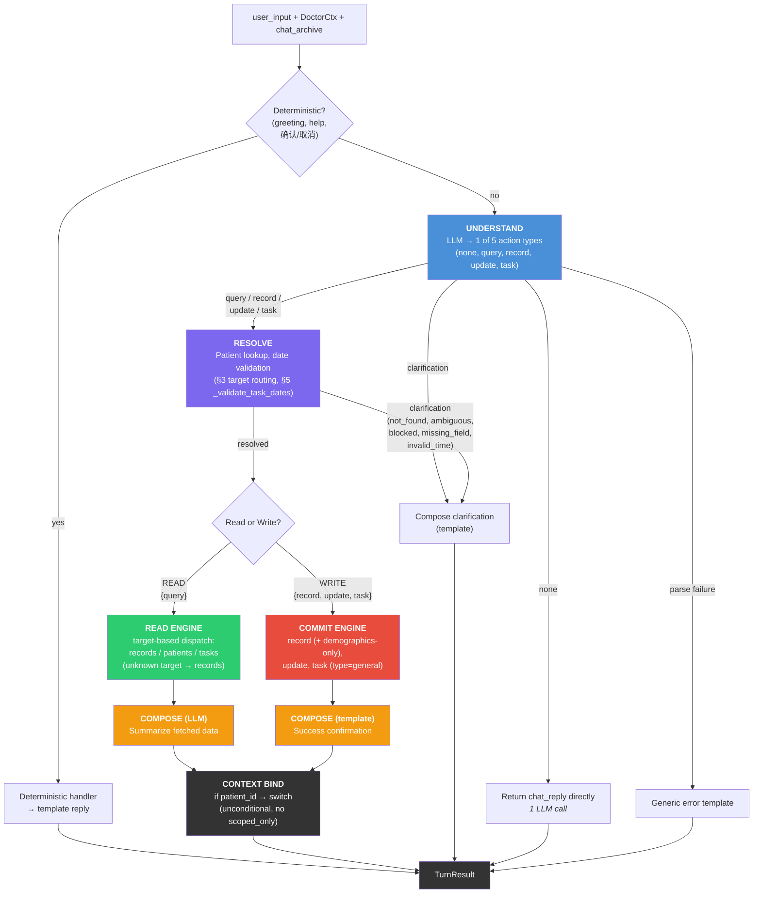

## Action Type Overview (ADR 0013 §1)

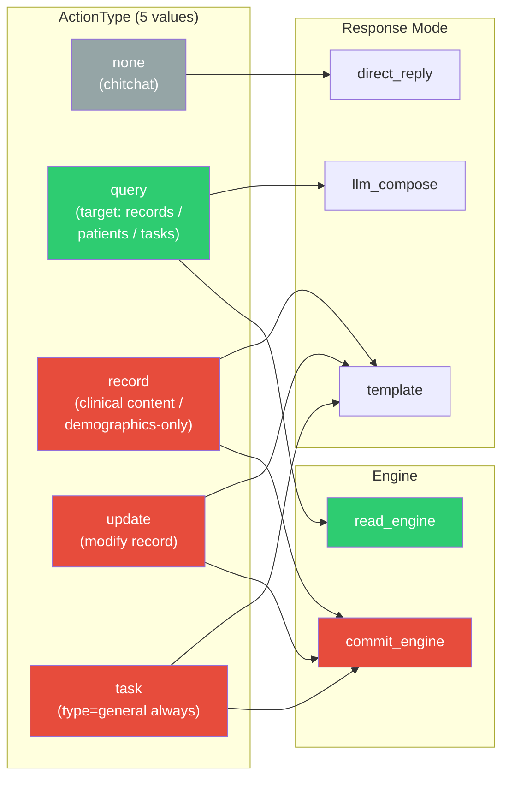

## Data Flow: Query Records + Context Switch (ADR 0013 §2, §3)

Also covers "切换到张三" which maps to `query` (ADR 0013 §4).

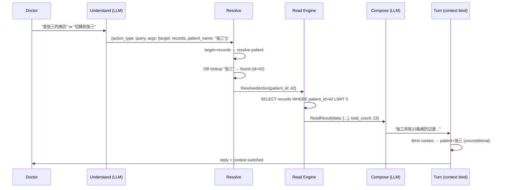

## Data Flow: Query Unscoped (patients / tasks)

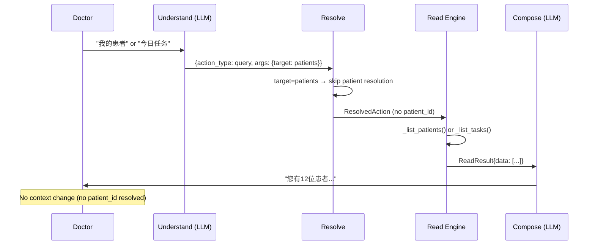

## Data Flow: Record with Clinical Content (ADR 0013 §4)

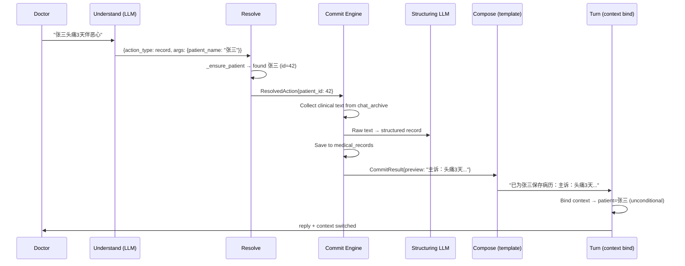

## Data Flow: Demographics-Only Registration (ADR 0013 §4)

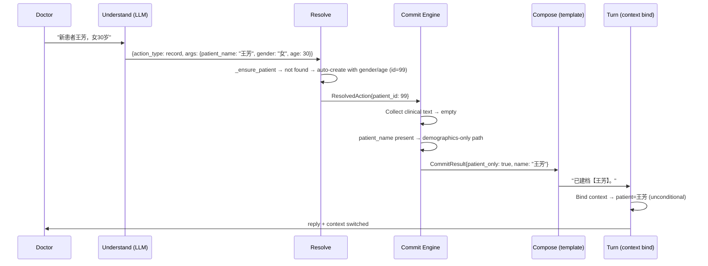

## Data Flow: Task Creation (ADR 0013 §5)

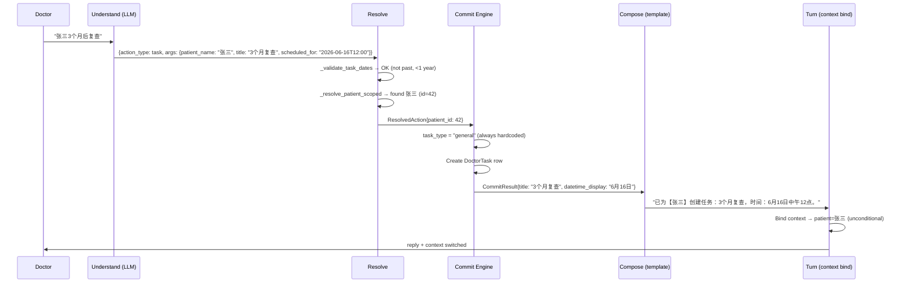

## Data Flow: Clarification (ambiguous patient)

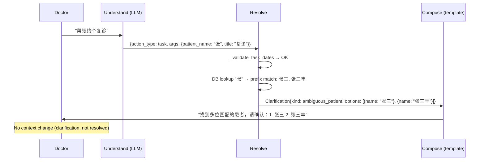

## Data Flow: Task Date Validation Failure (ADR 0013 §5)

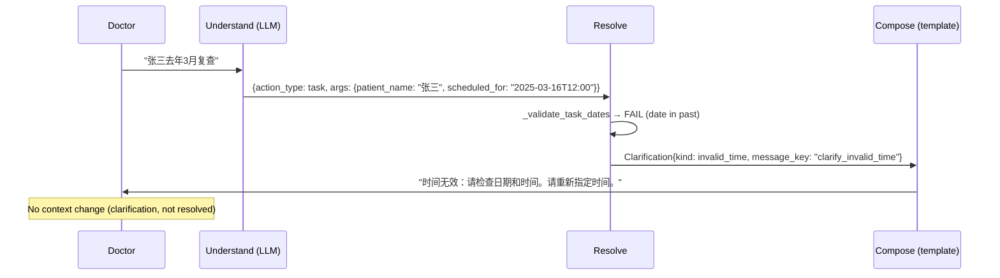

## Patient Context Binding (ADR 0013 §2)

**Uniform rule: all patient-scoped actions bind context unconditionally.**

No `scoped_only` flag. No asymmetry between reads and writes.

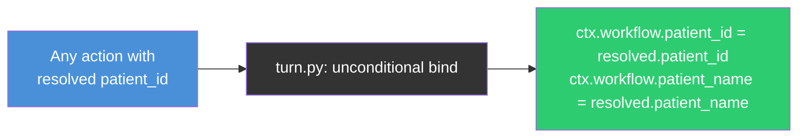

Replaces ADR 0012 §10 "binding asymmetry" (reads scope, writes switch).
In practice, `scoped_only` only affected `query_records` — `list_patients`
and `list_tasks` never resolved a patient_id, so the flag was irrelevant
for them (see ADR 0013 §2 note).

## Multi-Action Example (ADR 0013 §1)

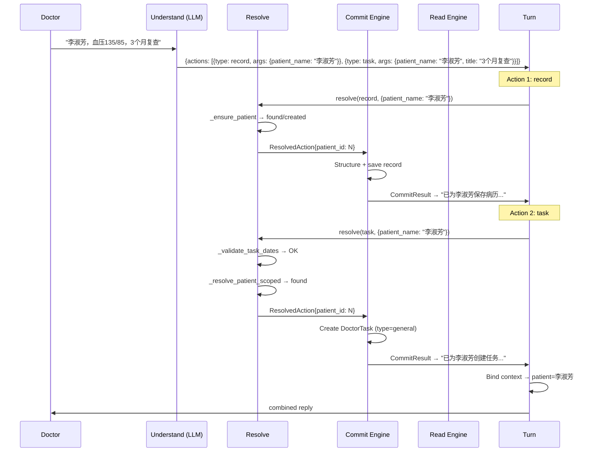
