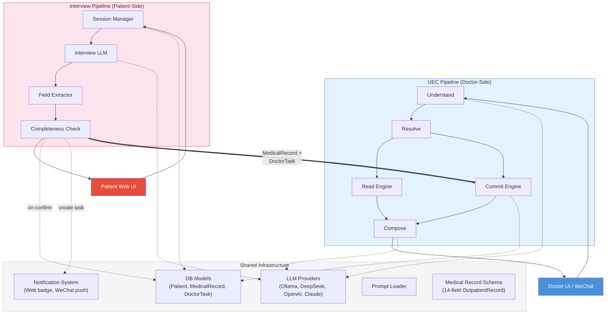
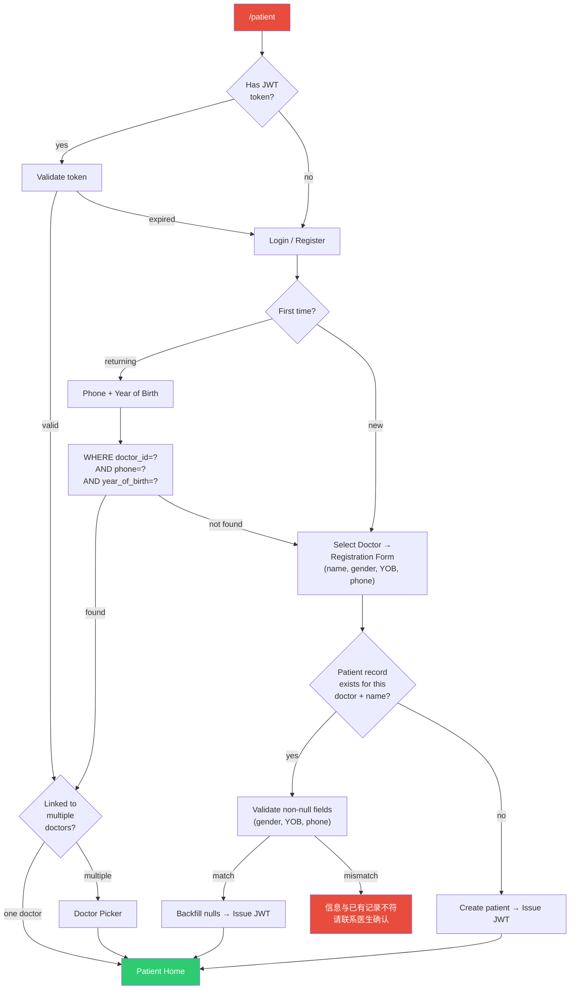
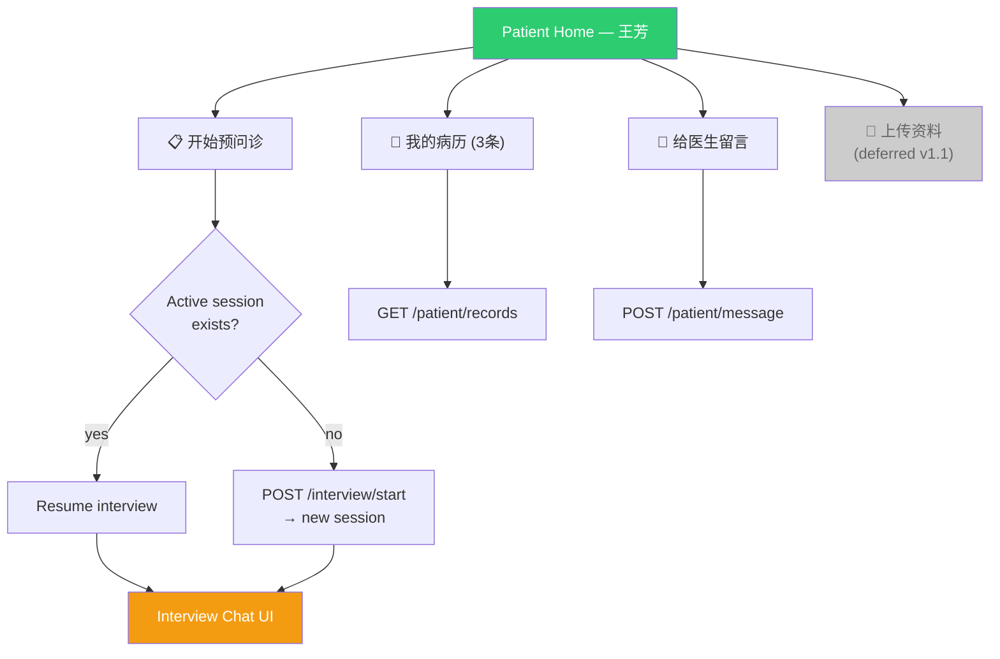
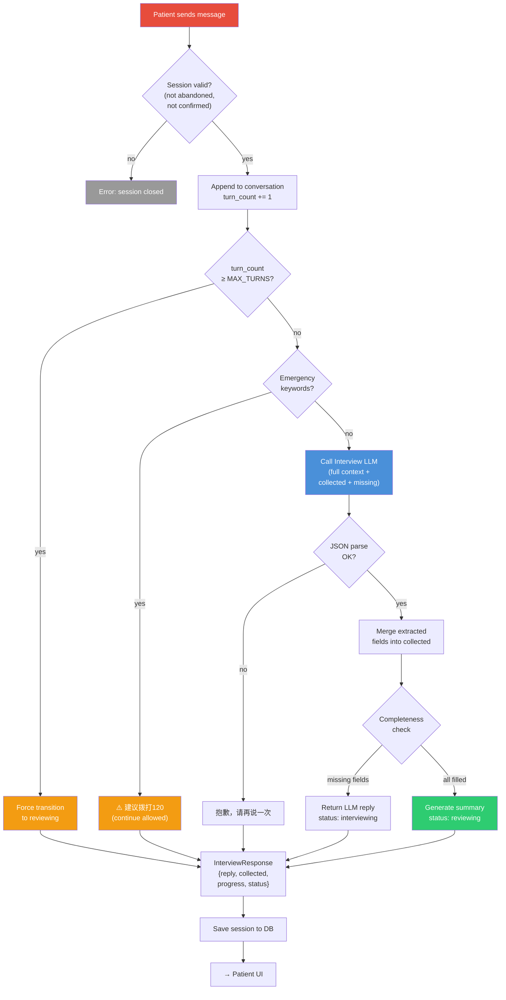
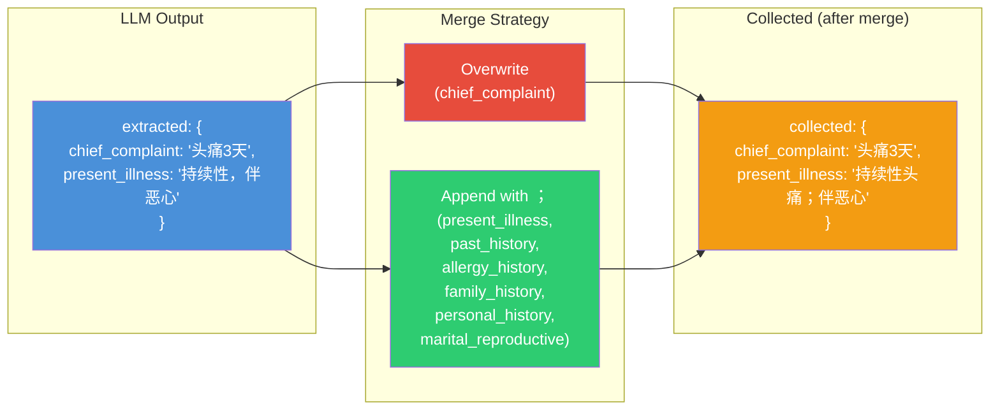
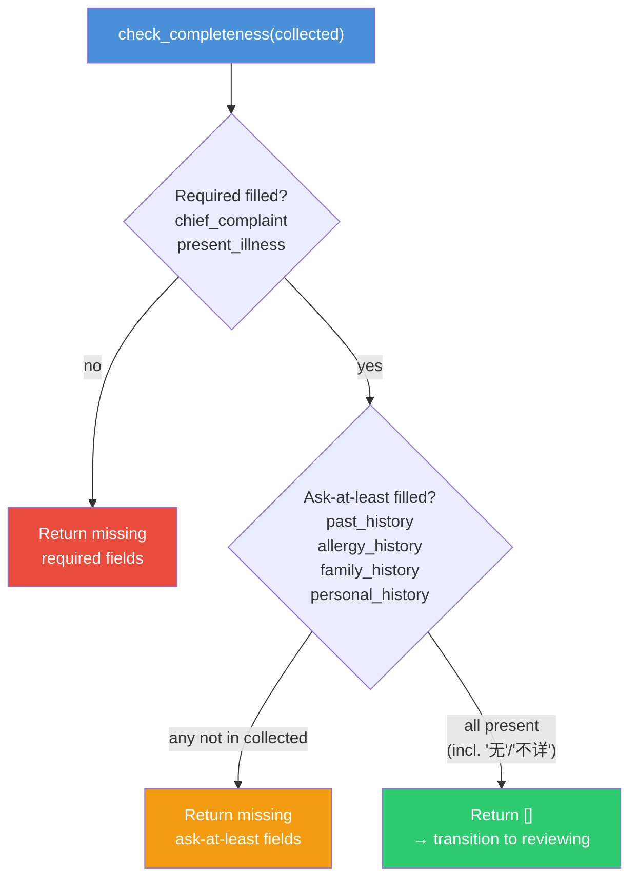
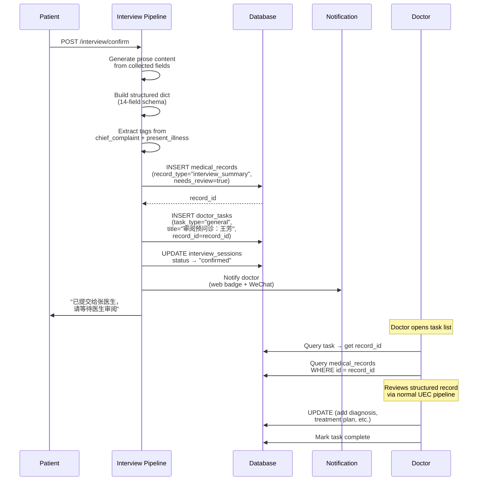
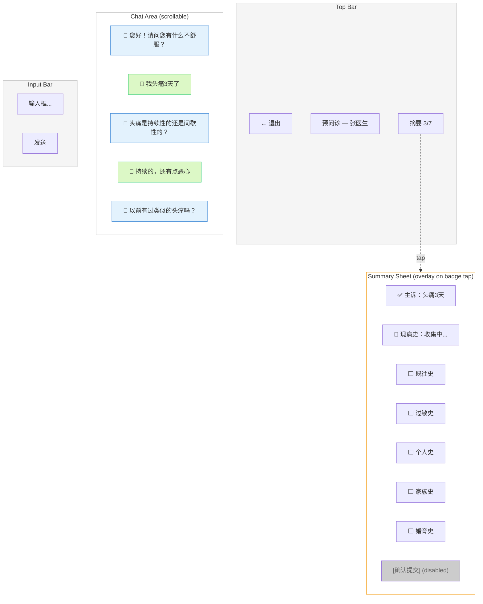
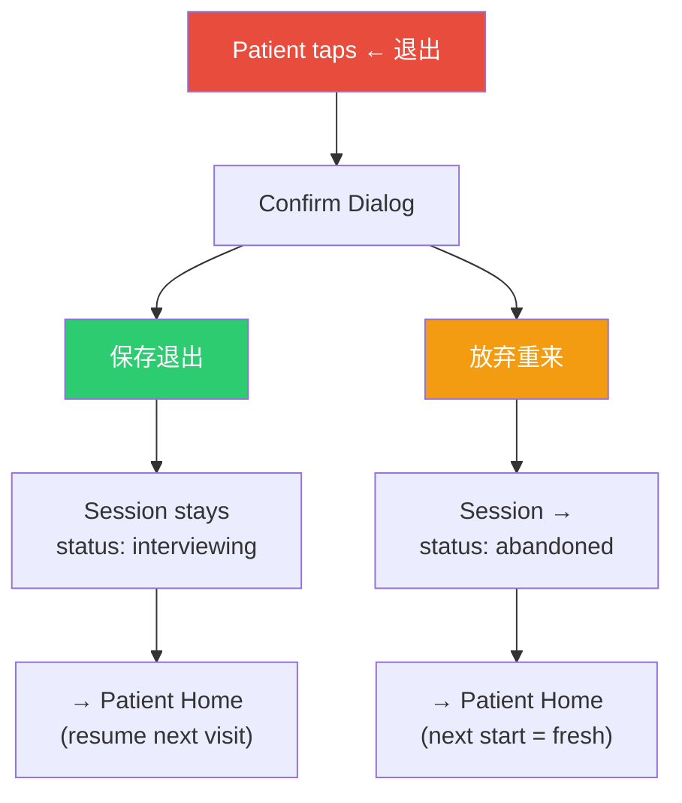
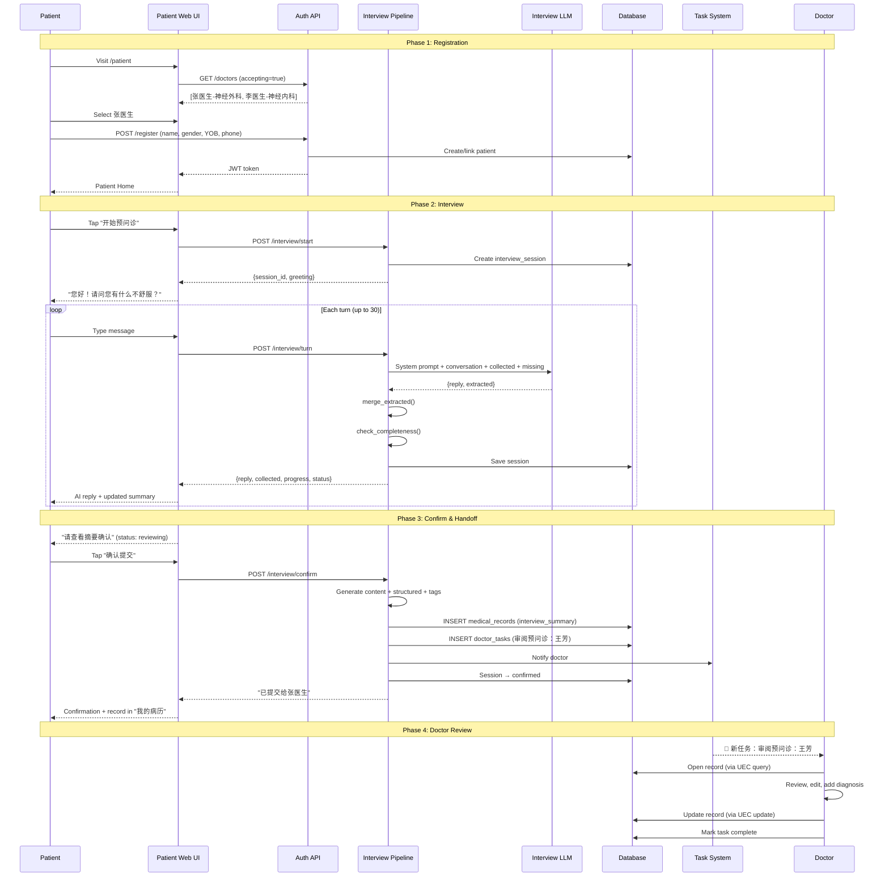

# ADR 0016: Architecture Diagram

Companion diagram for
[ADR 0016](./0016-patient-pre-consultation-interview.md).

## System Overview: Two Pipelines

## Patient Entry & Auth Flow

## Patient Home Page

## Interview Turn Flow

## Field Extraction & Merge

## Completeness Check

## Handoff: Patient Confirm → Doctor Task

## Interview Chat UI Layout

## Exit Behavior

## End-to-End Data Flow

