# Architecture — Doctor AI Agent

> **Visual version:** [architecture-visual.html](architecture-visual.html) — open in browser for interactive diagrams

**Last updated: 2026-03-30**

---

## What Is This?

A personal AI assistant for doctors managing private patients outside hospitals. Doctors use it to dictate medical records, get AI-powered differential diagnoses, manage follow-up tasks, and communicate with patients. NOT an EMR — it's a lightweight clinical productivity tool.

Three channels: **Web dashboard** (React SPA, primary), **WeChat/WeCom** (mobile), **Patient portal** (pre-consultation). FastAPI backend with explicit-action architecture (no routing LLM).

---

## Start Here

| I want to... | Look at |
|--------------|---------|
| Understand the LLM pipelines | Doctor interview: `src/domain/patients/interview_turn.py`, Diagnosis: `src/domain/diagnosis_pipeline.py` |
| Add a new LLM flow | `src/agent/prompt_config.py` (LayerConfig) -> `prompts/intent/` (new .md) -> domain function |
| Edit an LLM prompt | `src/agent/prompts/intent/*.md` — see `docs/dev/llm-prompting-guide.md` |
| Add a new API endpoint | `src/channels/web/` (new route file) -> register in `main.py` |
| Modify the database | `src/db/models/` (SQLAlchemy model) -> `src/db/crud/` (operations) |
| Understand the frontend | `frontend/web/src/App.jsx` (routing) -> `pages/doctor/` (doctor app) -> `pages/patient/` (patient app) |
| Run tests | `pytest tests/scenarios/` (in-process E2E) or `tests/prompts/run.sh` (promptfoo) |
| Debug with mock data | `http://localhost:5173/debug/doctor/` (uses MockApiProvider) |

---

## System Overview

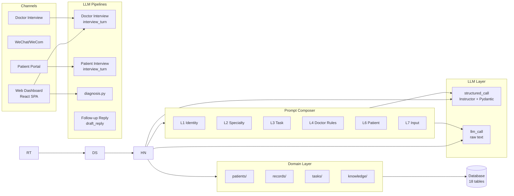

### Key Design Decisions

1. **Explicit-action architecture** -- all flows are triggered by UI actions (buttons), not free-text classification. No routing LLM. Doctor interview, patient interview, and diagnosis each have a dedicated pipeline with focused prompts.

2. **Instructor JSON mode** -- Groq/Qwen3 does not support tool-calling. Instructor uses `response_format` + Pydantic validation + automatic retries.

3. **6-layer prompt composer** -- separates identity/safety (static) from knowledge/context (dynamic). XML tags for context injection. Config matrix ensures every intent has explicit layer definitions.

4. **Clinical columns** -- 14 outpatient fields as real DB columns (not JSON blob). Queryable, indexable, absorbs former case_history table.

5. **Interview-first record creation** -- records go through multi-turn interview for guided field collection.

### Technology Stack

| Component | Technology |
|-----------|-----------|
| Backend | FastAPI + uvicorn |
| Frontend | React + MUI (Vite) |
| Database | SQLite (dev) / MySQL (prod), SQLAlchemy async |
| LLM Provider | Env-driven: Groq, DeepSeek, Tencent LKEAP, Ollama, OpenAI-compatible |
| Structured Output | Instructor (JSON mode) + Pydantic v2 |
| Agent Pattern | Explicit-action (UI-driven, no routing LLM) |
| Prompt Assembly | 6-layer composer with XML context tags |
| Observability | JSONL traces + spans, `trace_block` context manager |
| Task Scheduling | APScheduler with distributed lease |
| WeChat | Custom webhook + KF customer service |

> **Note on embeddings/RAG:** BGE-M3 local embeddings were used for case matching but are currently **disabled**. The `embedding.py` module has been deleted. Case matching via `matched_cases` always returns `[]`. The concept is retained for future re-enablement when the system migrates to `medical_records`-based similarity search.

---

## Where to Find Things

| Area | Directory | Key Files |
|------|-----------|-----------|
| LLM calls | `src/agent/llm.py` | `structured_call()`, `llm_call()` |
| Prompt files | `src/agent/prompts/` | `common/base.md`, `domain/*.md`, `intent/*.md` |
| Prompt assembly | `src/agent/` | `prompt_composer.py`, `prompt_config.py` |
| Web API | `src/channels/web/` | `doctor_interview/`, `tasks.py`, `export/` |
| WeChat | `src/channels/wechat/` | `router.py`, `wechat_notify.py` |
| Patient portal | `src/channels/web/` | `patient_portal/`, `patient_interview_routes.py` |
| Business logic | `src/domain/` | `patients/`, `records/`, `tasks/`, `knowledge/`, `diagnosis.py` |
| Database models | `src/db/models/` | 18 SQLAlchemy models |
| Database ops | `src/db/crud/` | CRUD functions per model |
| Auth | `src/infra/auth/` | JWT, rate limiting, access codes |
| Startup | `src/startup/` | `db_init.py`, `scheduler.py`, `warmup.py` |
| Frontend | `frontend/web/src/` | `App.jsx` (routing), `pages/`, `components/`, `api.js` |
| Tests | `tests/` | `scenarios/` (E2E), `prompts/` (promptfoo), `regression/`, `core/` |

---

## LLM Pipelines

All flows are explicit-action-driven (UI buttons, not free-text classification). Three core pipelines:

1. **Doctor Interview** (`interview_turn.py`) -- doctor dictates, AI extracts structured fields turn-by-turn
2. **Patient Interview** (`interview_turn.py`, patient mode) -- AI interviews patient pre-visit, extracts structured fields
3. **Diagnosis** (`diagnosis_pipeline.py`) -- structured record → differentials + workup + treatment + red_flags

Plus: **Follow-up Reply** (`draft_reply.py`) -- auto-drafts patient replies from triage context.

### Pipeline Flow (Doctor Interview)

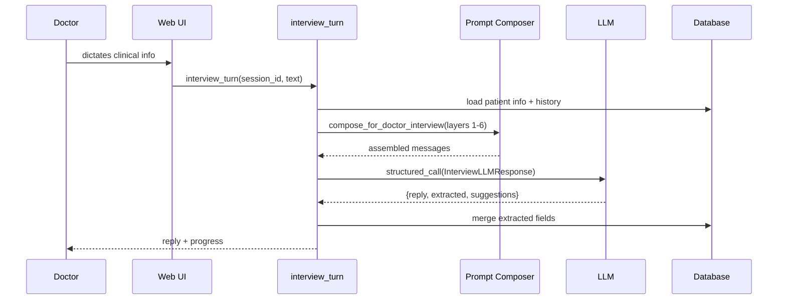

### Key Data Flows

**Doctor creates a record (chat):**

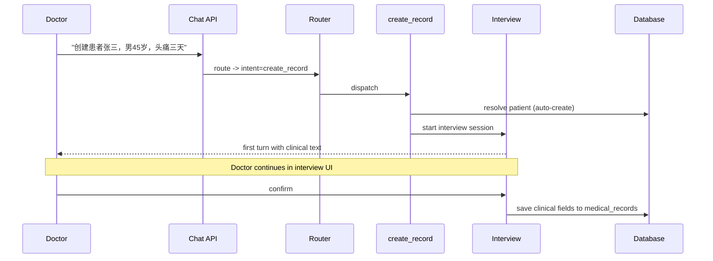

**Doctor queries records (chat):**

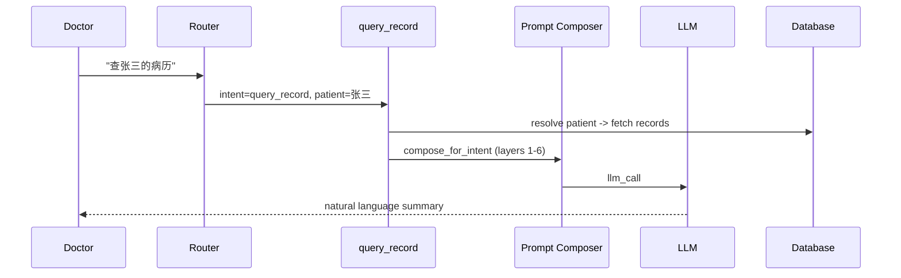

**Review record (UI-triggered, not chat):**

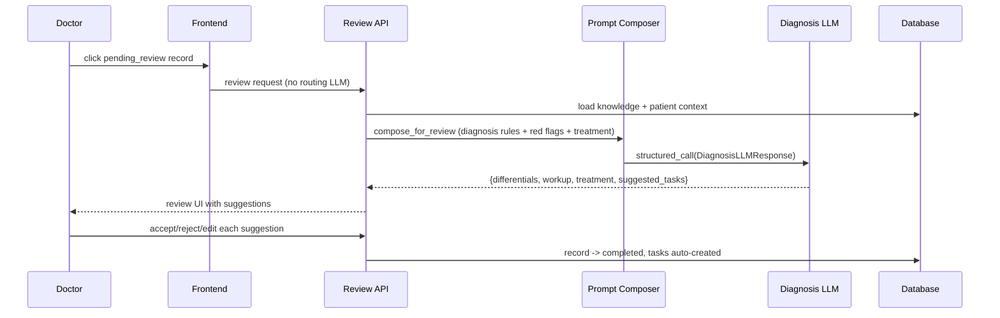

---

## Core Flows

All flows are UI-triggered (explicit actions, no intent classification):

| Flow | Entry Point | LLM Pipeline | Description |
|------|-------------|-------------|-------------|
| Doctor Interview | UI: click patient → dictate | `interview_turn.py` | Multi-turn field extraction from doctor dictation |
| Patient Interview | Patient portal: scan QR | `interview_turn.py` (patient mode) | AI-guided pre-visit history collection |
| Diagnosis | UI: click "诊断" on record | `diagnosis_pipeline.py` | Differential diagnosis + workup + treatment |
| Review | UI: click pending_review record | `diagnosis_pipeline.py` | Doctor reviews AI suggestions |
| Follow-up Reply | Auto-triggered by triage | `draft_reply.py` | AI drafts patient reply for doctor approval |

### Flow Configs

Each flow has its own `LayerConfig` in `prompt_config.py`:

| Flow | Config | Prompt | Description |
|------|--------|--------|-------------|
| Doctor Interview | `DOCTOR_INTERVIEW_LAYERS` | `intent/interview.md` | Turn-by-turn field extraction |
| Diagnosis | `REVIEW_LAYERS` | `intent/diagnosis.md` | Differential diagnosis pipeline |
| Patient Interview | `PATIENT_INTERVIEW_LAYERS` | `intent/patient-interview.md` | Patient pre-consultation interview |
| Follow-up Reply | `FOLLOWUP_REPLY_LAYERS` | `intent/followup_reply.md` | Patient reply drafting |

---

## Prompt Architecture

### 6-Layer Prompt Composer

All LLM calls use a shared prompt composer (`agent/prompt_composer.py`) that assembles messages from 6 layers:

| Layer | Name | Source | Content |
|-------|------|--------|---------|
| Layer | Name | Source | Content |
|-------|------|--------|---------|
| 1 | **Identity** | `common/base.md` | Role, safety rules, precedence |
| 2 | **Specialty** | `domain/{specialty}.md` | Domain knowledge (e.g. neurology red flags) |
| 3 | **Task** | `intent/{intent}.md` | Action-specific rules + output format |
| 4 | **Doctor Rules** | Doctor knowledge (DB) | User-authored KB, auto-loaded and scored |
| 5 | **Case Memory** | Confirmed records (DB) | Similar past decisions (diagnosis pipeline only) |
| 6 | **Patient** | Patient context (DB) | Records, collected state, history |
| 7 | **Input** | User message | Actual doctor/patient input |

The stack reads: "You are [Identity] specializing in [Specialty], doing [Task], following [Doctor Rules] and [Case Memory], for this [Patient], given this [Input]."

### Two Composition Patterns

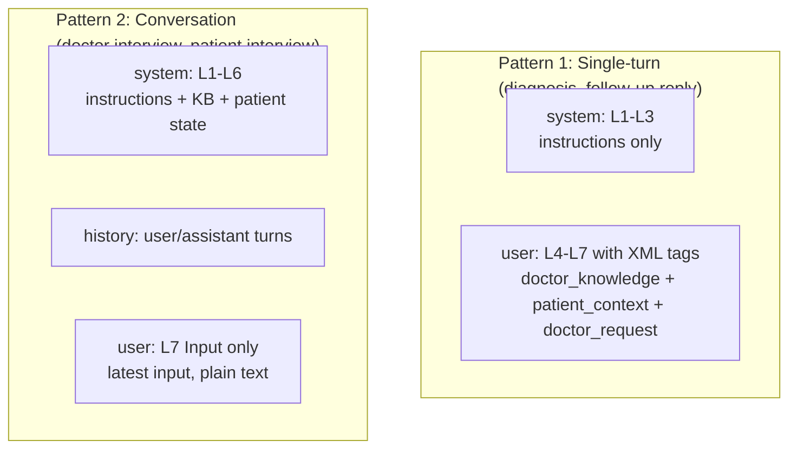

Pattern 2 puts patient context in system (factual DB data) and KB in the final user message (trust boundary: user-authored content is not system-level instructions).

### LayerConfig

`agent/prompt_config.py` defines one `LayerConfig` per flow:

```python
@dataclass(frozen=True)
class LayerConfig:
    system: bool = True           # L1 Identity: common/base.md
    domain: bool = False          # L2 Specialty: domain/{specialty}.md
    intent: str = "general"       # L3 Task: intent/{intent}.md
    load_knowledge: bool = False  # L4 Doctor Rules: KB items from DB
    patient_context: bool = False # L6 Patient: records/state from DB
    conversation_mode: bool = False  # Pattern 1 (False) or Pattern 2 (True)
```

### Layer Usage Matrix

| Flow | Pattern | Domain | Intent Prompt | Dr Knowledge | Patient Ctx |
|------|---------|--------|---------------|-------------|-------------|
| doctor_interview | convo | | interview | | Y |
| patient_interview | convo | Y | patient-interview | top-5 | Y |
| diagnosis | single | Y | diagnosis | top-5 | Y |
| followup_reply | single | Y | followup_reply | top-5 | Y |

### Knowledge Categories

Doctor knowledge items (`doctor_knowledge_items` table) are categorized. Each category maps to specific LLM intent layers:

| Category | Chinese Name | Description |
|----------|-------------|-------------|
| `custom` | 自定义 | General-purpose rules |
| `diagnosis` | 诊断规则 | Diagnosis and differential rules |
| `communication` | 沟通规则 | Patient communication style/rules |
| `followup` | 随访规则 | Follow-up scheduling and protocols |
| `medication` | 用药规则 | Medication guidelines |
| `preference` | 个人偏好 | Doctor's personal preferences |

Doctor knowledge outranks patient context in the prompt stack. If the doctor's KB says "偏头痛首选曲普坦" but a past case used a different drug, the doctor's stated preference wins (enforced by prompt ordering).

### Case Memory (Layer 4b)

The diagnosis pipeline injects similar confirmed cases as Layer 4b between doctor knowledge (L4) and patient context (L5). Implemented in `domain/knowledge/case_matching.py`.

- **Source:** `medical_records` JOIN `ai_suggestions` WHERE `decision IN (confirmed, edited)`
- **Tokenizer:** jieba word segmentation with 60+ medical term dictionary (脑膜瘤, 去骨瓣减压, Spetzler-Martin, etc.). Preserves negation (无/未/不) and laterality (左/右).
- **Matching fields (weighted):** `diagnosis` (3.0), `final_diagnosis` (3.0), `auxiliary_exam` (2.5), `key_symptoms` (2.0), `chief_complaint` (1.5), `present_illness` (1.0)
- **Similarity:** Weighted asymmetric coverage: `sum(weight[t] for t in intersection) / sum(weight[t] for t in query)`. Biased toward covering query concepts.
- **Threshold:** 0.15 minimum similarity, top 3 matches, ordered by recency within the search window (100 most recent confirmed records)
- **Injected as:** `【类似病例参考】` section with similarity %, diagnosis, treatment, outcome
- **No new tables** — queries existing confirmed decisions

### Citation Tracking

When the LLM produces `[KB-{id}]` markers in its output, `citation_parser.py` extracts and validates them. Valid citations are logged to `knowledge_usage_log` via `usage_tracking.py`. This powers:
- Knowledge usage stats on the 我的AI dashboard
- "引用了你的规则" display on review and followup cards
- Per-item usage history on the knowledge detail page

### Draft Reply Pipeline (FOLLOWUP_REPLY_LAYERS)

When a patient message is escalated to the doctor, `draft_reply.py` generates a WeChat-style reply (conversational, <=100 chars) using the doctor's communication rules. Registered as `FOLLOWUP_REPLY_LAYERS` in prompt_config.py. Includes red-flag detection, medical safety constraints, and AI disclosure labeling. Triggered as a background task from the escalation handler with 30-second batching.

**Key behaviors:** `[KB-*]` markers are stripped from draft text before display. If no KB rule is cited, no draft is generated (the message is marked "undrafted" for manual reply). The API response includes `cited_rules` (list of cited KB item IDs) alongside the draft text. When the doctor replies, the inbound message is marked `ai_handled` and any existing draft is marked stale.

### Structured Output

All LLM calls returning structured data use `instructor` (JSON mode) + Pydantic response models via `agent/llm.py:structured_call()`. Prompts do NOT contain JSON format specifications -- Pydantic models are the single source of truth for output structure.

Key response models: `InterviewLLMResponse`, `DiagnosisLLMResponse`, `StructuringLLMResponse`.

---

## Database Schema

**18 tables** across SQLite (dev) / MySQL (prod). All fields with fixed value sets use `(str, Enum)`.

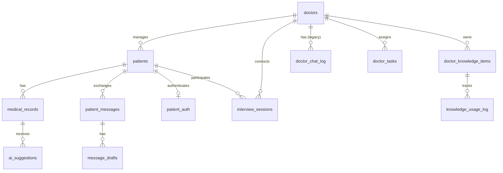

### Core Data (9 tables)

**`doctors`** -- Doctor identity and profile. Fields: `doctor_id` (PK), `name`, `specialty`, `department`, `phone`, `year_of_birth`, `clinic_name`, `bio`.

**`doctor_wechat`** -- WeChat/WeCom channel binding (optional). FK -> doctors.

**`patients`** -- Patient identity, scoped to a doctor. Fields: `id` (PK), `doctor_id` (FK), `name`, `gender` (Enum), `year_of_birth`, `phone`.

**`patient_auth`** -- Portal access credentials (optional). FK -> patients.

**`medical_records`** -- Clinical records with 14 structured fields and outcome data. Record types: `visit`, `dictation`, `import`, `interview_summary`. Statuses: `interview_active`, `pending_review`, `completed`. Append-only versioning via `version_of` FK. Outcome fields (`final_diagnosis`, `treatment_outcome`, `key_symptoms`) absorb the former `case_history` table.

**`ai_suggestions`** -- Per-item AI diagnosis suggestions with doctor decisions. Sections: `differential`, `workup`, `treatment`. Decisions: `confirmed`, `rejected`, `edited`, `custom`. One row per suggestion item.

**`doctor_knowledge_items`** -- Per-doctor reusable knowledge snippets. Categories: `custom`, `diagnosis`, `communication`, `followup`, `medication`, `preference`. Fields: `id`, `doctor_id` (FK), `content` (Text), `category`, `title`, `summary`, `reference_count`.

**`doctor_chat_log`** -- Legacy doctor <-> AI conversation history (no longer written to after routing removal).

**`patient_messages`** -- Patient <-> Doctor/AI message history. Directions: `inbound`, `outbound`. Sources: `patient`, `ai`, `doctor`.

### Workflow State (4 tables)

**`interview_sessions`** -- Multi-turn clinical field collection state. Statuses: `interviewing`, `reviewing`, `confirmed`, `abandoned`, `draft_created`. Modes: `patient`, `doctor`.

**`doctor_tasks`** -- Doctor tasks and follow-ups. Fields: `id` (PK), `doctor_id` (FK), `patient_id` (FK, optional), `type` (Enum: general/review/follow_up/medication/checkup), `title`, `content` (optional), `status` (Enum: pending/notified/completed/cancelled), `due_at`, `notes` (TEXT, optional), `reminder_at` (DATETIME, optional), `completed_at` (DATETIME, optional).

**`message_drafts`** -- AI-generated draft replies for patient messages. Statuses: `generated`, `edited`, `sent`, `dismissed`, `stale`.

**`doctor_edits`** -- Doctor edit history (teaching loop: draft edits → KB rules).

### System/Infrastructure (4 tables)

**`audit_log`** -- Compliance audit trail. **`invite_codes`** -- Doctor signup gating. **`runtime_tokens`** -- WeChat access token cache. **`scheduler_leases`** -- Distributed lock for task notification scheduler.

### Record Lifecycle State Machine

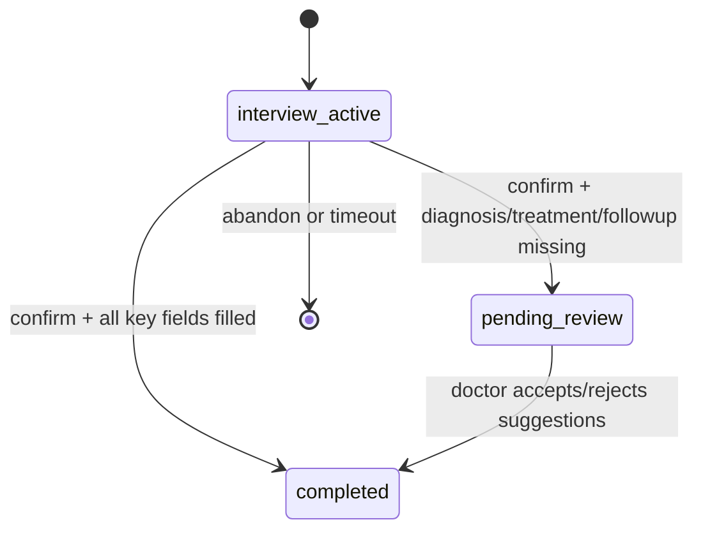

---

## Key AI Workflows — Knowledge Injection

The two most important AI-powered workflows are **diagnosis** and **patient reply**. Both are knowledge-driven: the doctor's KB and case history shape every output. Without injection, the LLM falls back to generic medical knowledge.

### 1. AI Diagnosis Pipeline

Triggered when a record enters `pending_review` status. Produces differential diagnoses, workup, and treatment suggestions.

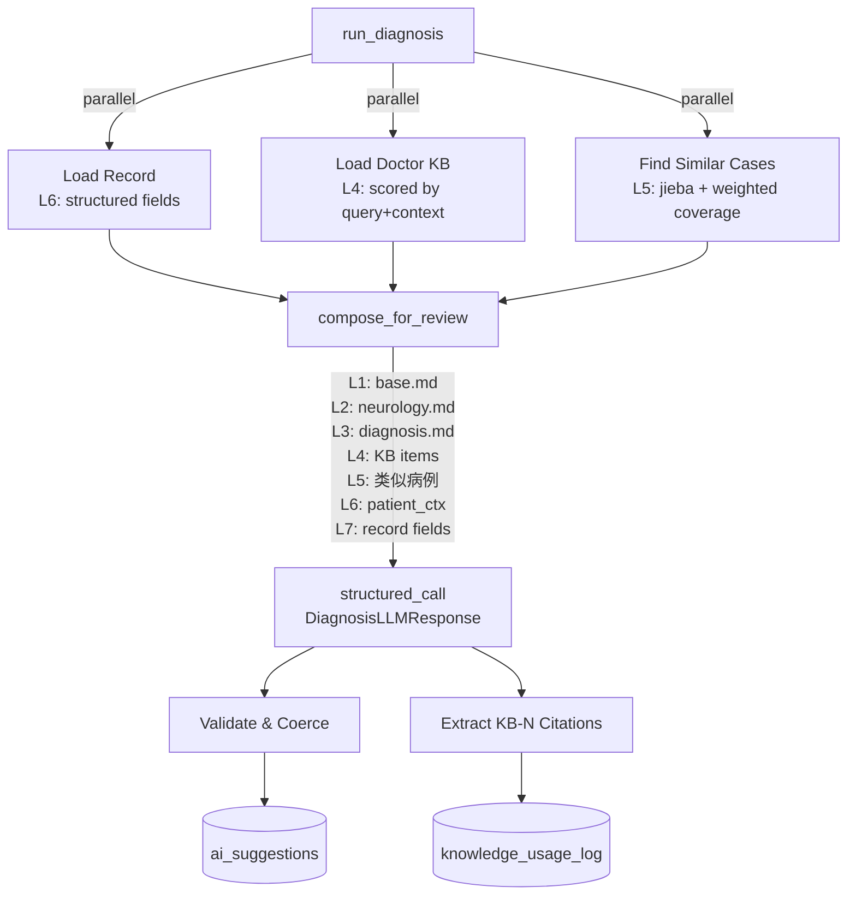

**Knowledge injection points:**
- **L4 Doctor KB**: All KB items loaded, scored by `query + patient_context`, ranked by `field_weight * relevance`. Formatted as `[KB-{id}] {text}`.
- **L5 Case Memory**: `find_similar_cases()` uses jieba tokenization + weighted asymmetric coverage across 6 record fields (`diagnosis` 3.0, `auxiliary_exam` 2.5, `key_symptoms` 2.0, `chief_complaint` 1.5, `present_illness` 1.0). Medical term dictionary with 60+ neurosurgery terms.
- **L7 Patient Data**: All 14 structured clinical fields formatted as labeled text.

**E2E test coverage:** `scripts/run_diagnosis_sim.py` — 12 scenarios with counterfactual validation (±KB, ±case injection). Tests prove KB causally influences output by diffing baseline (no injection) vs full run.

### 2. AI Patient Reply Pipeline

Triggered when a patient sends a message via `/api/patient/chat`. Triage classifies, then routes to the appropriate handler.

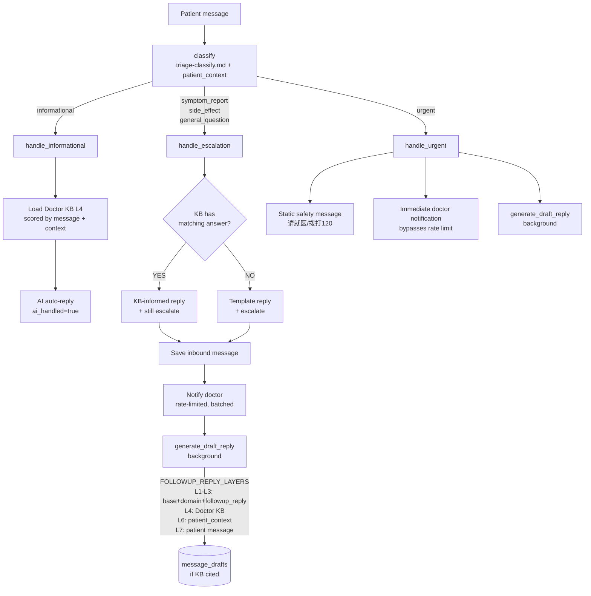

**Knowledge injection points:**
- **Triage classification**: patient_context injected into classify prompt. Pure classification, no KB.
- **Informational auto-reply**: Doctor KB loaded and appended to system prompt. AI grounds its answer in KB rules (e.g., wound care instructions, appointment scheduling).
- **Escalation with KB-informed reply**: When escalated messages (side_effect, general_question) match doctor KB content, the handler generates a KB-grounded reply AND still escalates to the doctor. Patient gets immediate useful information; doctor still reviews. If KB has no match, falls back to template ("已通知医生").
- **Draft reply (background)**: Full 6-layer composer with `FOLLOWUP_REPLY_LAYERS`. KB auto-loaded, citations tracked. Draft only generated if KB is cited.

**Triage balance:**
- **AI auto-replies** (informational): Appointment scheduling, test result interpretation, lifestyle questions (diet, exercise). Answer exists in record or KB, no clinical judgment needed.
- **Escalate + KB reply** (side_effect/general with KB match): Known side effects, medication questions, treatment-related queries. Patient gets KB-grounded answer immediately; doctor still notified and reviews.
- **Escalate only** (symptom/side_effect/general without KB): New symptoms, recovery judgment ("这样正常吗?"), ambiguous messages. Template reply, doctor must respond.
- **Urgent** (immediate): Post-op headache+vomiting, new neuro deficits, chest pain, hemorrhage. Static safety message, bypasses all rate limiting.

**E2E test coverage:** `scripts/run_reply_sim.py` — 14 scenarios covering all 5 triage categories, KB-driven auto-replies (4 scenarios), KB selectivity (relevant vs irrelevant), mixed messages, and safety-critical urgent detection.

---

## Clinical Decision Support — Safety Guardrails

- Never auto-confirm any diagnosis — doctor MUST explicitly confirm each item
- Red flag detection triggers prominent UI alerts
- Drug classes only (e.g., "脱水剂") in treatment — no specific drug names in `detail` field
- Confidence levels: 低 = consider, 中 = likely, 高 = highly suggestive
- Audit trail: every AI suggestion + doctor decision logged with timestamp
- Fallback: if LLM fails, show structured record without diagnosis
- Disclaimer always present: "AI建议仅供参考，最终诊断由医生决定"
- Patient reply safety: messages default to escalation when classification uncertain (confidence < 0.7)

---

## Channels & API Routes

### Web Dashboard (Primary)

| Route | Handler | Description |
|-------|---------|-------------|
| `POST /api/records/chat` | `channels/web/chat.py` | Doctor chat -> agent pipeline |
| `POST /api/records/interview/*` | `channels/web/doctor_interview/` | Interview turn, confirm, cancel |
| `GET/POST/DELETE /api/manage/*` | `channels/web/doctor_dashboard/` | Admin: knowledge, profile, patients |
| `POST /api/manage/onboarding/patient-entry` | `channels/web/doctor_dashboard/onboarding_handlers.py` | Create or reuse patient, then return deterministic portal + preview entry |
| `POST /api/manage/onboarding/examples` | `channels/web/doctor_dashboard/onboarding_handlers.py` | Backend proof data for onboarding wizard (legacy) |
| `POST /api/manage/onboarding/seed-demo` | `channels/web/doctor_dashboard/onboarding_handlers.py` | Preseed 5 demo patients with records, messages, tasks (non-destructive) |
| `POST /api/manage/onboarding/seed-demo/reset` | `channels/web/doctor_dashboard/onboarding_handlers.py` | Delete + recreate all preseed demo data |
| `DELETE /api/manage/onboarding/seed-demo` | `channels/web/doctor_dashboard/onboarding_handlers.py` | Remove all preseed demo data |
| `GET /api/manage/knowledge/file/{path}` | `channels/web/doctor_dashboard/knowledge_handlers.py` | Serve uploaded original file (auth-checked) |
| `POST /api/manage/drafts/{draft_id}/save-as-rule` | `channels/web/doctor_dashboard/draft_handlers.py` | Teaching loop: convert draft edit into KB rule |
| `GET/POST/PUT/DELETE /api/tasks/*` | `channels/web/tasks.py` | Task CRUD |
| `GET /api/tasks/{task_id}` | `channels/web/tasks.py` | Fetch single task with patient_name join |
| `PATCH /api/tasks/{task_id}/notes` | `channels/web/tasks.py` | Update task notes |
| `GET /api/export/*` | `channels/web/export/` | PDF/JSON export |
| `POST /api/import/*` | `channels/web/import_routes.py` | Image/PDF import |
| `POST /api/auth/*` | `channels/web/auth/` | JWT authentication |
| `POST /api/unified-auth/*` | `channels/web/auth/unified.py` | Unified login (doctor + patient) |

### Patient Portal

| Route | Handler | Description |
|-------|---------|-------------|
| `POST /api/patient/interview/*` | `channels/web/patient_interview_routes.py` | Patient pre-consultation interview. Turn/start/current responses emit `ready_to_review` when required fields are complete so the frontend can end questioning and show explicit confirm-or-continue UI. |
| `POST /api/patient/chat` | `channels/web/patient_portal/` | Patient triage pipeline |
| `GET /api/patient/*` | `channels/web/patient_portal/` | Patient records, auth |

### Doctor Frontend Routes

| Route | Purpose | Description |
|-------|---------|-------------|
| `/doctor/onboarding?step=1-5` | Onboarding Wizard | 5-step guided flow: 教AI规则 → 诊断审核 → AI处理消息 → 患者预问诊 → 查看任务. State persisted in localStorage (`onboarding_wizard_done`, `onboarding_wizard_progress`). Auto-redirects on first login, skippable, replayable via 我的AI. |

### WeChat/WeCom

| Route | Handler | Description |
|-------|---------|-------------|
| `POST /wechat` | `channels/wechat/router.py` | WeChat webhook (message receive + verify) |

WeChat text messages return a redirect to the mini-program. Deterministic commands (`完成 N`, `add_to_knowledge_base`) are still handled inline. Notifications are sent via customer service (KF) messages.

---

## Task System

### Task Types

5 task types defined in `TaskType(str, Enum)`:

| Type | Description |
|------|-------------|
| `general` | Default: to-dos, reminders, appointments |
| `review` | Auto-created when a record enters `pending_review`. Links to the record. |
| `follow_up` | Follow-up appointments and check-ins |
| `medication` | Medication-related reminders |
| `checkup` | Scheduled examination reminders |

### Task Lifecycle

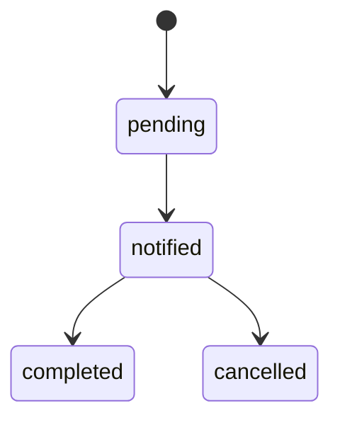

Tasks can be created via:
- **UI:** doctor fills form directly (no LLM)
- **Patient intake confirm:** patient pre-consultation confirm creates a linked `review` task for the doctor
- **Review finalize:** `domain/tasks/from_record.py` extracts approved follow-up tasks from confirmed `orders_followup` + `treatment_plan`

### Scheduling

APScheduler runs on an interval (configurable via `TASK_SCHEDULER_INTERVAL_MINUTES`, default 1 minute) or cron schedule. Checks for due tasks and sends notifications. Distributed lock via `scheduler_leases` table prevents duplicate notifications in multi-instance deployments.

---

## Demo Simulation Engine

`scripts/demo_sim.py` provides a YAML-driven patient simulation for product demos. Reads `scripts/demo_config.yaml` with patient profiles, scripted messages, KB seed entries, and timing schedules. Uses `scripts/patient_sim/http_client.py` (shared with the E2E sim engine) for HTTP calls.

Subcommands: `--seed` (register patients + KB), `--tick` (send time-elapsed messages), `--skip-to PATIENT MSG` (force-send), `--reset` (cleanup), `--status` (progress). State tracked in `scripts/.demo_state.json`.

---

## Startup & Initialization

Application startup is managed through `src/startup/` and orchestrated by the FastAPI lifespan handler in `main.py`.

### Startup Sequence

1. `enforce_production_guards()` -- verify required secrets (HMAC key, portal secret)
2. `init_database()` -- create tables, run migrations, backfill doctors, seed prompts
3. `run_warmup()` -- Jieba init + Ollama/LKEAP connectivity (background)
4. `_startup_background_workers()` -- observability writer + audit drain async tasks
5. `_startup_recovery()` -- log pending tasks, re-queue stale messages
6. `configure_scheduler()` -- register all APScheduler jobs
7. `scheduler.start()` -- begin scheduled job execution

### Startup Modules

**`startup/db_init.py`** -- Database initialization: `create_tables()`, `run_alembic_migrations()` (fails hard in production, warns in dev), `backfill_doctors_registry()`, `seed_prompts()`, `enforce_production_guards()`.

**`startup/scheduler.py`** -- APScheduler configuration: task notification timer (interval or cron), chat log cleanup (daily 04:30, >365 days), audit log retention (monthly day 1 03:00, >7 years), turn log pruning (daily 05:30).

**`startup/warmup.py`** -- Pre-flight connectivity: Jieba segmentation init (synchronous, blocks startup), Ollama warmup (ping + retry + fallback, background), LKEAP warmup (TCP/TLS to Tencent, background).

### Shutdown

On shutdown, the scheduler is stopped and all background worker tasks (disk writer, audit drain) are cancelled.
