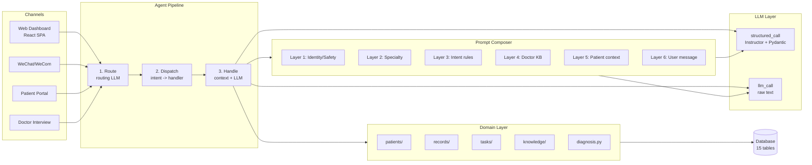
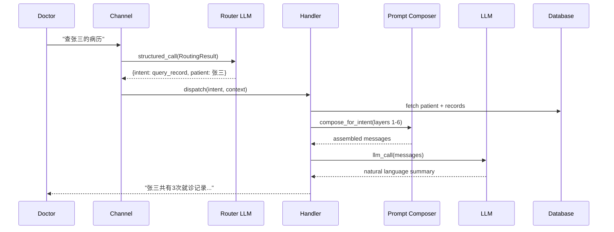
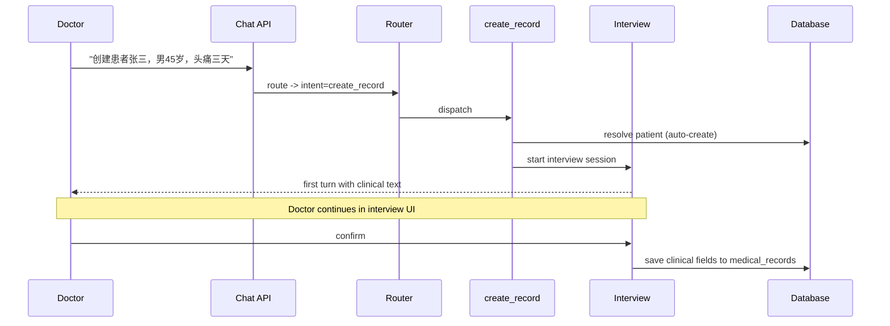
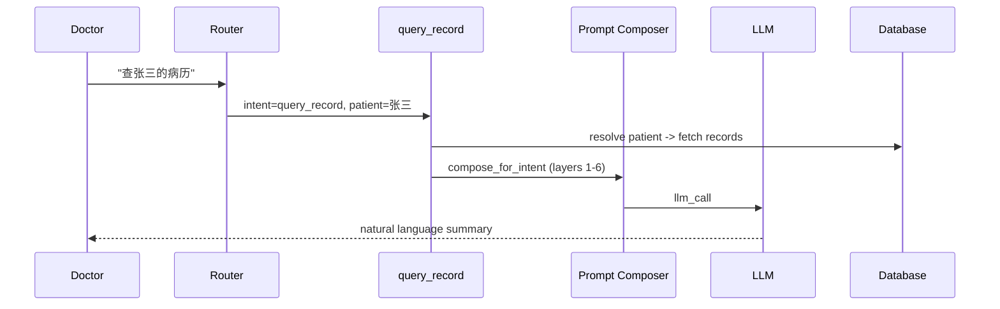
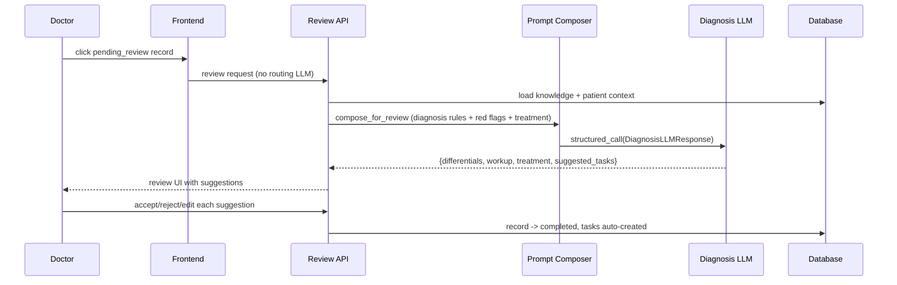
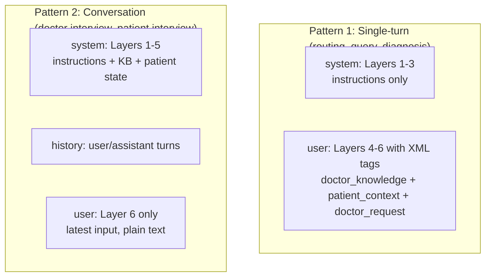
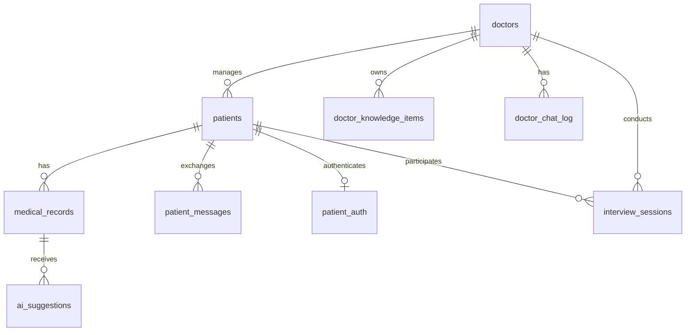
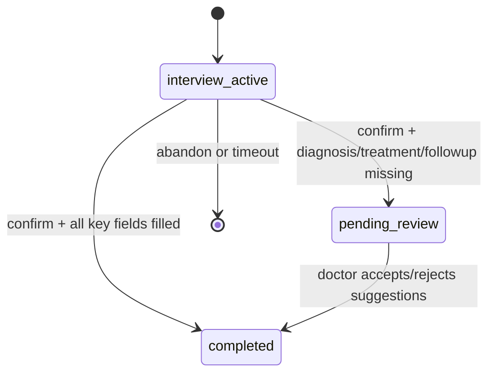
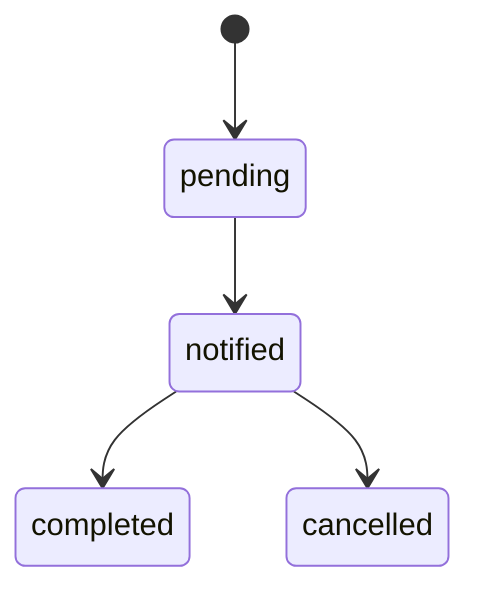

# Architecture — Doctor AI Agent

> **Visual version:** [architecture-visual.html](architecture-visual.html) — open in browser for interactive diagrams

**Last updated: 2026-03-28**

---

## What Is This?

A personal AI assistant for doctors managing private patients outside hospitals. Doctors use it to dictate medical records, get AI-powered differential diagnoses, manage follow-up tasks, and communicate with patients. NOT an EMR — it's a lightweight clinical productivity tool.

Three channels: **Web dashboard** (React SPA, primary), **WeChat/WeCom** (mobile), **Patient portal** (pre-consultation). FastAPI backend with Plan-and-Act agent pipeline.

---

## Start Here

| I want to... | Look at |
|--------------|---------|
| Understand the agent pipeline | `src/agent/handle_turn.py` -> `router.py` -> `dispatcher.py` -> `handlers/` |
| Add a new intent | `src/agent/types.py` (add enum) -> `handlers/` (new file) -> `prompt_config.py` (LayerConfig) -> `prompts/intent/` (new .md) |
| Edit an LLM prompt | `src/agent/prompts/intent/*.md` — see `docs/guides/llm-prompting-guide.md` |
| Add a new API endpoint | `src/channels/web/` (new route file) -> register in `main.py` |
| Modify the database | `src/db/models/` (SQLAlchemy model) -> `src/db/crud/` (operations) |
| Understand the frontend | `frontend/web/src/App.jsx` (routing) -> `pages/doctor/` (doctor app) -> `pages/patient/` (patient app) |
| Run tests | `pytest tests/scenarios/` (in-process E2E) or `tests/prompts/run.sh` (promptfoo) |
| Debug with mock data | `http://localhost:5173/debug/doctor/` (uses MockApiProvider) |

---

## System Overview



### Key Design Decisions

1. **Plan-and-Act over ReAct** -- routing LLM classifies intent (1 call), handler executes with focused prompt (1 call). 2 LLM calls vs 3-5 with ReAct. Predictable, debuggable, works with free-tier Chinese LLMs.

2. **Instructor JSON mode** -- Groq/Qwen3 does not support tool-calling. Instructor uses `response_format` + Pydantic validation + automatic retries.

3. **6-layer prompt composer** -- separates identity/safety (static) from knowledge/context (dynamic). XML tags for context injection. Config matrix ensures every intent has explicit layer definitions.

4. **Clinical columns** -- 14 outpatient fields as real DB columns (not JSON blob). Queryable, indexable, absorbs former case_history table.

5. **Interview-first record creation** -- chat-initiated records go through multi-turn interview for guided field collection.

6. **Single intent per turn** -- routing returns one intent + `deferred` field for multi-intent messages. `create_record` is exclusive (cannot chain with other intents).

### Technology Stack

| Component | Technology |
|-----------|-----------|
| Backend | FastAPI + uvicorn |
| Frontend | React + MUI (Vite) |
| Database | SQLite (dev) / MySQL (prod), SQLAlchemy async |
| LLM Provider | Env-driven: Groq, DeepSeek, Tencent LKEAP, Ollama, OpenAI-compatible |
| Structured Output | Instructor (JSON mode) + Pydantic v2 |
| Agent Pattern | Plan-and-Act (routing -> dispatch -> handler) |
| Prompt Assembly | 6-layer composer with XML context tags |
| Observability | JSONL traces + spans, `trace_block` context manager |
| Task Scheduling | APScheduler with distributed lease |
| WeChat | Custom webhook + KF customer service |

> **Note on embeddings/RAG:** BGE-M3 local embeddings were used for case matching but are currently **disabled**. The `embedding.py` module has been deleted. Case matching via `matched_cases` always returns `[]`. The concept is retained for future re-enablement when the system migrates to `medical_records`-based similarity search.

---

## Where to Find Things

| Area | Directory | Key Files |
|------|-----------|-----------|
| Agent pipeline | `src/agent/` | `handle_turn.py`, `router.py`, `dispatcher.py`, `types.py` |
| LLM calls | `src/agent/llm.py` | `structured_call()`, `llm_call()` |
| Intent handlers | `src/agent/handlers/` | One file per intent (7 handlers) |
| Prompt files | `src/agent/prompts/` | `common/base.md`, `domain/*.md`, `intent/*.md` |
| Prompt assembly | `src/agent/` | `prompt_composer.py`, `prompt_config.py` |
| Web API | `src/channels/web/` | `chat.py`, `doctor_interview.py`, `tasks.py`, `export.py` |
| WeChat | `src/channels/wechat/` | `router.py`, `wechat_notify.py` |
| Patient portal | `src/channels/web/` | `patient_portal.py`, `patient_interview_routes.py` |
| Business logic | `src/domain/` | `patients/`, `records/`, `tasks/`, `knowledge/`, `diagnosis.py` |
| Database models | `src/db/models/` | 15 SQLAlchemy models |
| Database ops | `src/db/crud/` | CRUD functions per model |
| Auth | `src/infra/auth/` | JWT, rate limiting, access codes |
| Startup | `src/startup/` | `db_init.py`, `scheduler.py`, `warmup.py` |
| Frontend | `frontend/web/src/` | `App.jsx` (routing), `pages/`, `components/`, `api.js` |
| Tests | `tests/` | `scenarios/` (E2E), `prompts/` (promptfoo), `regression/`, `core/` |

---

## Domain Operations Pipeline

All doctor chat messages follow the same pipeline:

```
message -> router LLM -> {intent, entities} -> dispatcher -> handler
        -> handler loads context + knowledge -> intent LLM -> response
```

### Pipeline Flow



### Routing

The routing LLM classifies the doctor's message into one of 7 intents and extracts relevant entities. One LLM call with structured output via Instructor.

```json
{
  "intent": "query_record",
  "patient_name": "张三",
  "params": {},
  "deferred": "建个随访任务"
}
```

If the message contains multiple intents, routing extracts the first and captures the rest in `deferred`. The compose LLM acknowledges deferred intents in its response.

### Dispatch

`dispatcher.py` maps the `IntentType` enum value to the corresponding handler function. Simple dict-based dispatch, no dynamic registration.

### Handler Execution

Each handler:
1. Loads per-intent context from the database (records, patients, tasks)
2. Builds the prompt via the 6-layer composer
3. Calls the intent-specific LLM (structured or free-text)
4. Returns `HandlerResult(reply, data)`

### Two-Stage Context Loading

- **Routing stage:** minimal context (chat history only) -- fast, cheap
- **Execution stage:** full context per intent (DB queries) -- loaded only after routing decides what is needed

This avoids loading heavy context (records, knowledge) for every message.

### Key Data Flows

**Doctor creates a record (chat):**



**Doctor queries records (chat):**



**Review record (UI-triggered, not chat):**



---

## Intent Types & Handler Registry

7 routing intents defined in `agent/types.py` as `IntentType(str, Enum)`:

| Intent | Handler | patient_name | params | Description |
|--------|---------|-------------|--------|-------------|
| `query_record` | `query_record.py` | optional | `limit` (int, default 5) | Fetch + summarize medical records |
| `create_record` | `create_record.py` | required | `gender`, `age`, `clinical_text` (all optional) | Enter interview flow for record creation |
| `query_task` | `query_task.py` | -- | `status` (optional: pending\|completed) | Fetch + summarize doctor tasks |
| `create_task` | `create_task.py` | optional | `title` (required), `content`, `due_at` | Create a new task |
| `query_patient` | `query_patient.py` | -- | `query` (required, NL search string) | Natural language patient search |
| `daily_summary` | `daily_summary.py` | -- | -- | Aggregated daily overview of tasks, patients, records |
| `general` | `general.py` | -- | -- | Fallback greeting / chitchat |

**`review_record` is NOT a routing intent** -- it is a UI-only flow. Doctor clicks a pending_review record in the UI, frontend calls the review API directly, no routing LLM involved.

### Non-Routing Flows (UI-Triggered)

These flows bypass routing entirely and have their own `LayerConfig`:

| Flow | Config | Prompt | Description |
|------|--------|--------|-------------|
| Routing | `ROUTING_LAYERS` | `intent/routing.md` | Intent classification (used by the router itself) |
| Review/Diagnosis | `REVIEW_LAYERS` | `intent/diagnosis.md` | Differential diagnosis pipeline |
| Patient Interview | `PATIENT_INTERVIEW_LAYERS` | `intent/patient-interview.md` | Patient pre-consultation interview |

---

## Prompt Architecture

### 6-Layer Prompt Composer

All LLM calls use a shared prompt composer (`agent/prompt_composer.py`) that assembles messages from 6 layers:

| Layer | Source | Content |
|-------|--------|---------|
| 1 | `common/base.md` | Identity, safety, precedence rules |
| 2 | `domain/{specialty}.md` | Specialty knowledge (e.g. neurology) |
| 3 | `intent/{intent}.md` | Action-specific rules + few-shot examples |
| 4 | Doctor knowledge (DB) | Per-intent KB slice, auto-loaded |
| 5 | Patient context (DB) | Records, collected state, history |
| 6 | User message | Actual doctor/patient input |

### Two Composition Patterns



Pattern 2 puts KB + context in system because conversation history occupies the user/assistant turns. KB rules in system = treated as behavioral constraints across all turns.

### LayerConfig

`agent/prompt_config.py` defines `INTENT_LAYERS` -- a dict mapping each `IntentType` to a `LayerConfig` dataclass:

```python
@dataclass(frozen=True)
class LayerConfig:
    system: bool = True           # Layer 1: system/base.md
    domain: bool = False          # Layer 2: common/{specialty}.md
    intent: str = "general"       # Layer 3: intent/{intent}.md
    load_knowledge: bool = False  # Layer 4: doctor KB items
    patient_context: bool = False # Layer 5: patient records/state
    conversation_mode: bool = False  # Pattern 1 (False) or Pattern 2 (True)
```

An assert at import time ensures every `IntentType` has a config entry -- adding a new intent without a `LayerConfig` crashes at server startup.

### Layer Usage Matrix

| Intent | Pattern | Domain | Intent Prompt | Dr Knowledge | Case Memory | Patient Ctx |
|--------|---------|--------|---------------|-------------|-------------|-------------|
| routing | single | | routing | all | | |
| create_record | convo | Y | interview | all | | Y |
| query_record | single | | query | all | | Y |
| query_task | single | | query | all | | |
| create_task | single | | general | all | | |
| query_patient | single | | query | all | | Y |
| daily_summary | single | | general | all | | |
| general | single | | general | all | | |
| patient_interview | convo | Y | patient-interview | all | | Y |
| review/diagnosis | single | Y | diagnosis | all | **L4b** | Y |
| **followup_reply** | single | Y | followup_reply | all | | Y |

### Knowledge Categories

Doctor knowledge items (`doctor_knowledge_items` table) are categorized. Each category maps to specific LLM intent layers:

| Category | Chinese Name | Injected Into |
|----------|-------------|---------------|
| `interview_guide` | 问诊指导 | Interview LLM |
| `diagnosis_rule` | 诊断规则 | Review/diagnosis LLM |
| `red_flag` | 危险信号 | Interview LLM + Review/diagnosis LLM |
| `treatment_protocol` | 治疗方案 | Review/diagnosis LLM |
| `custom` | 自定义 | All intents (always injected) |

Doctor knowledge outranks patient context in the prompt stack. If the doctor's KB says "偏头痛首选曲普坦" but a past case used a different drug, the doctor's stated preference wins (enforced by prompt ordering).

### Case Memory (Layer 4b)

The diagnosis pipeline injects similar confirmed cases as Layer 4b between doctor knowledge (L4) and patient context (L5). Implemented in `domain/knowledge/case_matching.py`.

- **Source:** `medical_records` JOIN `ai_suggestions` WHERE `decision IN (confirmed, edited)`
- **Matching:** Keyword-based Jaccard similarity on `chief_complaint` + `present_illness`
- **Injected as:** `【类似病例参考】` section with similarity %, diagnosis, treatment
- **Formatter:** `_format_matched_cases()` in `diagnosis_pipeline.py`
- **No new tables** — queries existing confirmed decisions

### Citation Tracking

When the LLM produces `[KB-{id}]` markers in its output, `citation_parser.py` extracts and validates them. Valid citations are logged to `knowledge_usage_log` via `usage_tracking.py`. This powers:
- Knowledge usage stats on the 我的AI dashboard
- "引用了你的规则" display on review and followup cards
- Per-item usage history on the knowledge detail page

### Draft Reply Pipeline (FOLLOWUP_REPLY_LAYERS)

When a patient message is escalated to the doctor, `draft_reply.py` generates a WeChat-style reply (conversational, <=100 chars) using the doctor's communication rules. Registered as `FOLLOWUP_REPLY_LAYERS` in prompt_config.py. Includes red-flag detection, medical safety constraints, and AI disclosure labeling. Triggered as a background task from the escalation handler with 30-second batching.

**Key behaviors:** `[KB-*]` markers are stripped from draft text before display. If no KB rule is cited, no draft is generated (the message is marked "undrafted" for manual reply). The API response includes `cited_rules` (list of cited KB item IDs) alongside the draft text. When the doctor replies, the inbound message is marked `ai_handled` and any existing draft is marked stale.

### Structured Output

All LLM calls returning structured data use `instructor` (JSON mode) + Pydantic response models via `agent/llm.py:structured_call()`. Prompts do NOT contain JSON format specifications -- Pydantic models are the single source of truth for output structure.

Key response models: `RoutingResult`, `InterviewLLMResponse`, `DiagnosisLLMResponse`, `StructuringLLMResponse`.

---

## Database Schema

**15 tables** across SQLite (dev) / MySQL (prod). All fields with fixed value sets use `(str, Enum)`.



### Core Data (9 tables)

**`doctors`** -- Doctor identity and profile. Fields: `doctor_id` (PK), `name`, `specialty`, `department`, `phone`, `year_of_birth`, `clinic_name`, `bio`.

**`doctor_wechat`** -- WeChat/WeCom channel binding (optional). FK -> doctors.

**`patients`** -- Patient identity, scoped to a doctor. Fields: `id` (PK), `doctor_id` (FK), `name`, `gender` (Enum), `year_of_birth`, `phone`.

**`patient_auth`** -- Portal access credentials (optional). FK -> patients.

**`medical_records`** -- Clinical records with 14 structured fields and outcome data. Record types: `visit`, `import`, `interview_summary`. Statuses: `interview_active`, `pending_review`, `completed`. Append-only versioning via `version_of` FK. Outcome fields (`final_diagnosis`, `treatment_outcome`, `key_symptoms`) absorb the former `case_history` table.

**`ai_suggestions`** -- Per-item AI diagnosis suggestions with doctor decisions. Sections: `differential`, `workup`, `treatment`. Decisions: `confirmed`, `rejected`, `edited`, `custom`. One row per suggestion item.

**`doctor_knowledge_items`** -- Per-doctor reusable knowledge snippets. Categories: `interview_guide`, `diagnosis_rule`, `red_flag`, `treatment_protocol`, `custom`. Content column stores a JSON payload (v1 format) with `text`, optional `source_url`, and optional `file_path` (path to uploaded original file on disk under `uploads/{doctor_id}/`).

**`doctor_chat_log`** -- Doctor <-> AI conversation history. Roles: `user`, `assistant`.

**`patient_messages`** -- Patient <-> Doctor/AI message history. Directions: `inbound`, `outbound`. Sources: `patient`, `ai`, `doctor`.

### Workflow State (1 table)

**`interview_sessions`** -- Multi-turn clinical field collection state. Statuses: `interviewing`, `confirmed`, `abandoned`. Modes: `patient`, `doctor`.

### System/Infrastructure (5 tables)

**`audit_log`** -- Compliance audit trail. **`invite_codes`** -- Doctor signup gating. **`runtime_tokens`** -- WeChat access token cache. **`scheduler_leases`** -- Distributed lock for task notification scheduler.

### Record Lifecycle State Machine



---

## Clinical Decision Support Pipeline

Triggered when a record's `diagnosis`, `treatment_plan`, or `orders_followup` fields are incomplete after interview confirmation. The record enters `pending_review` status.

**Pipeline steps:**
1. Record saved with `status=pending_review`
2. Gather context (parallel): doctor knowledge (`diagnosis_rule` + `red_flag` + `treatment_protocol`), patient's past records, similar symptom records (keyword search on `chief_complaint`/`key_symptoms`)
3. Build prompt via 6-layer composer using `REVIEW_LAYERS` config
4. Call diagnosis LLM (structured output) -> `DiagnosisLLMResponse`
5. Save individual items to `ai_suggestions` table (one row per differential/workup/treatment)
6. Doctor reviews each suggestion: confirm / reject / edit

**DiagnosisLLMResponse structure:**
```python
differentials: List[DiagnosisDifferential]  # condition, confidence (低/中/高), detail
workup: List[DiagnosisWorkup]               # test, detail, urgency (常规/紧急/急诊)
treatment: List[DiagnosisTreatment]         # drug_class, intervention (手术/药物/观察/转诊), detail
red_flags: List[str]                        # urgent findings requiring immediate action
```

**Execution:** async background task via APScheduler. Record saves immediately, diagnosis runs asynchronously. Graceful degradation if LLM fails -- record is available for manual review without AI suggestions.

### Safety Guardrails

- Never auto-confirm any diagnosis -- doctor MUST explicitly confirm each item
- Red flag detection triggers prominent UI alerts
- Drug classes only (e.g., "Corticosteroid for cerebral edema") -- no specific doses
- Confidence levels: 低 = consider, 中 = likely, 高 = highly suggestive
- Audit trail: every AI suggestion + doctor decision logged with timestamp
- Fallback: if LLM fails, show structured record without diagnosis
- Disclaimer always present: "AI建议仅供参考，最终诊断由医生决定"

---

## Channels & API Routes

### Web Dashboard (Primary)

| Route | Handler | Description |
|-------|---------|-------------|
| `POST /api/records/chat` | `channels/web/chat.py` | Doctor chat -> agent pipeline |
| `POST /api/records/interview/*` | `channels/web/doctor_interview.py` | Interview turn, confirm, cancel |
| `GET/POST/DELETE /api/manage/*` | `channels/web/ui/` | Admin: knowledge, profile, patients |
| `GET /api/manage/knowledge/file/{path}` | `channels/web/ui/knowledge_handlers.py` | Serve uploaded original file (auth-checked) |
| `POST /api/manage/drafts/{draft_id}/save-as-rule` | `channels/web/ui/draft_handlers.py` | Teaching loop: convert draft edit into KB rule |
| `GET/POST/PUT/DELETE /api/tasks/*` | `channels/web/tasks.py` | Task CRUD |
| `GET /api/export/*` | `channels/web/export.py` | PDF/JSON export |
| `POST /api/import/*` | `channels/web/import_routes.py` | Image/PDF import |
| `POST /api/auth/*` | `channels/web/auth.py` | JWT authentication |
| `POST /api/unified-auth/*` | `channels/web/unified_auth_routes.py` | Unified login (doctor + patient) |

### Patient Portal

| Route | Handler | Description |
|-------|---------|-------------|
| `POST /api/patient/interview/*` | `channels/web/patient_interview_routes.py` | Patient pre-consultation interview |
| `POST /api/patient/chat` | `channels/web/patient_portal.py` | Patient triage pipeline |
| `GET /api/patient/*` | `channels/web/patient_portal.py` | Patient records, auth |

### WeChat/WeCom

| Route | Handler | Description |
|-------|---------|-------------|
| `POST /wechat` | `channels/wechat/router.py` | WeChat webhook (message receive + verify) |

WeChat messages are routed through the same `handle_turn` pipeline as web chat. Notifications are sent via customer service (KF) messages.

---

## Task System

### Task Types

5 task types defined in `TaskType(str, Enum)`:

| Type | Description |
|------|-------------|
| `general` | Default: to-dos, reminders, appointments |
| `review` | Auto-created when a record enters `pending_review`. Links to the record. |
| `follow_up` | Follow-up appointments and check-ins |
| `medication` | Medication-related reminders |
| `checkup` | Scheduled examination reminders |

### Task Lifecycle



Tasks can be created via:
- **UI:** doctor fills form directly (no LLM)
- **Chat:** routing LLM -> `intent=create_task` -> handler creates task
- **Diagnosis auto:** review LLM includes `suggested_tasks` in output, auto-created when doctor confirms review

### Scheduling

APScheduler runs on an interval (configurable via `TASK_SCHEDULER_INTERVAL_MINUTES`, default 1 minute) or cron schedule. Checks for due tasks and sends notifications. Distributed lock via `scheduler_leases` table prevents duplicate notifications in multi-instance deployments.

---

## Demo Simulation Engine

`scripts/demo_sim.py` provides a YAML-driven patient simulation for product demos. Reads `scripts/demo_config.yaml` with patient profiles, scripted messages, KB seed entries, and timing schedules. Uses `scripts/patient_sim/http_client.py` (shared with the E2E sim engine) for HTTP calls.

Subcommands: `--seed` (register patients + KB), `--tick` (send time-elapsed messages), `--skip-to PATIENT MSG` (force-send), `--reset` (cleanup), `--status` (progress). State tracked in `scripts/.demo_state.json`.

---

## Startup & Initialization

Application startup is managed through `src/startup/` and orchestrated by the FastAPI lifespan handler in `main.py`.

### Startup Sequence

1. `enforce_production_guards()` -- verify required secrets (HMAC key, portal secret)
2. `init_database()` -- create tables, run migrations, backfill doctors, seed prompts
3. `run_warmup()` -- Jieba init + Ollama/LKEAP connectivity (background)
4. `_startup_background_workers()` -- observability writer + audit drain async tasks
5. `_startup_recovery()` -- log pending tasks, re-queue stale messages
6. `configure_scheduler()` -- register all APScheduler jobs
7. `scheduler.start()` -- begin scheduled job execution

### Startup Modules

**`startup/db_init.py`** -- Database initialization: `create_tables()`, `run_alembic_migrations()` (fails hard in production, warns in dev), `backfill_doctors_registry()`, `seed_prompts()`, `enforce_production_guards()`.

**`startup/scheduler.py`** -- APScheduler configuration: task notification timer (interval or cron), chat log cleanup (daily 04:30, >365 days), audit log retention (monthly day 1 03:00, >7 years), turn log pruning (daily 05:30).

**`startup/warmup.py`** -- Pre-flight connectivity: Jieba segmentation init (synchronous, blocks startup), Ollama warmup (ping + retry + fallback, background), LKEAP warmup (TCP/TLS to Tencent, background).

### Shutdown

On shutdown, the scheduler is stopped and all background worker tasks (disk writer, audit drain) are cancelled.
