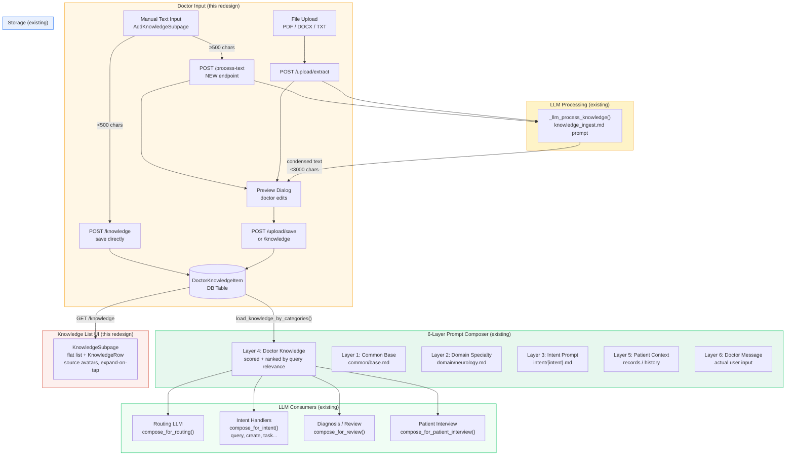
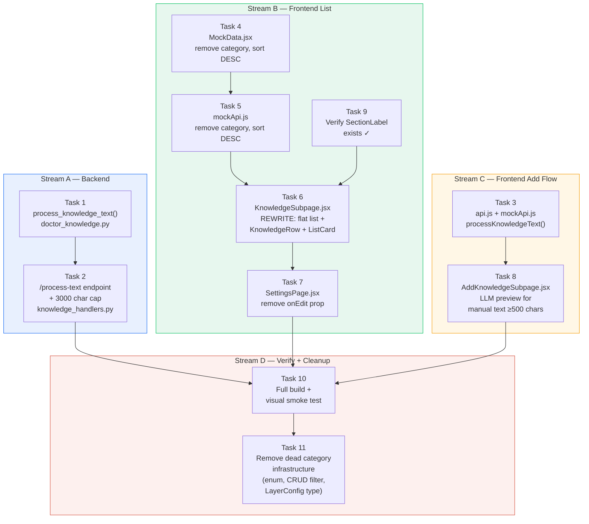

# Knowledge List Redesign Implementation Plan

> **For agentic workers:** REQUIRED SUB-SKILL: Use superpowers:subagent-driven-development (recommended) or superpowers:executing-plans to implement this plan task-by-task. Steps use checkbox (`- [ ]`) syntax for tracking.

**Goal:** Replace the dead category-grouped knowledge list with a flat chronological list using ListCard, and unify manual text input processing with the file upload LLM pipeline.

**Architecture:** Two independent streams — (A) backend adds a new `/process-text` endpoint and 3000-char cap on the existing add endpoint, (B) frontend rewrites KnowledgeSubpage as flat list with KnowledgeRow, and AddKnowledgeSubpage gains LLM preview for long manual text. Both streams converge when the frontend calls the new endpoint.

**Tech Stack:** React (MUI), FastAPI, Python async, existing `_llm_process_knowledge()` function, existing `ListCard` component.

**Spec:** `docs/specs/2026-03-27-knowledge-list-redesign.md`

---

## System Integration Diagram

How knowledge flows through the system — from doctor input to LLM prompt injection:



### Key Integration Points

- **Ingestion:** Both manual text (NEW) and file upload (existing) share `_llm_process_knowledge()` + `knowledge_ingest.md` prompt for text ≥500 chars
- **Storage:** All items land in `DoctorKnowledgeItem` table with JSON payload (`{text, source, confidence}`)
- **Prompt injection:** `prompt_composer.py` Layer 4 auto-loads ALL KB items for every intent via `load_knowledge_by_categories("all")`, scores them against the current query, and injects as `[KB-{id}]` citations
- **Consumers:** Every LLM call (routing, intent handlers, diagnosis, patient interview) receives knowledge context — configured in `prompt_config.py` LayerConfig

## Cascading Impact Analysis

1. **DB schema** — None. `category VARCHAR(32)` column stays on `doctor_knowledge_items`; all rows already `"custom"`. No migration needed (per AGENTS.md policy).
2. **ORM models & Pydantic schemas** — `KnowledgeCategory` enum in `db/models/doctor.py` is dead code (all configs use `"all"`). Cleanup in Task 11.
3. **API endpoints** — New: `POST /api/manage/knowledge/process-text`. Changed: `POST /api/manage/knowledge` gets 3000-char cap. No removed endpoints.
4. **Domain logic** — New public `process_knowledge_text()` extracted from private `_llm_process_knowledge()`. `load_knowledge_by_categories()` simplified (cleanup in Task 11).
5. **Prompt files** — None. `knowledge_ingest.md` reused as-is for both flows.
6. **Frontend** — `KnowledgeSubpage.jsx` rewritten (flat list). `AddKnowledgeSubpage.jsx` gains LLM preview. `SettingsPage.jsx` drops `onEdit`. MockData/mockApi updated.
7. **Configuration** — None. No new env vars or runtime.json keys.
8. **Existing tests** — None. No existing tests reference `KnowledgeSubpage` or the knowledge API handlers.
9. **Cleanup** — Dead category infrastructure to remove (Task 11):
   - `KnowledgeCategory` enum in `db/models/doctor.py`
   - `categories` filter param in `list_doctor_knowledge_items()` CRUD function
   - `Union[str, List[KnowledgeCategory]]` type on `LayerConfig.knowledge_categories` → simplify to `bool`
   - Rename `load_knowledge_by_categories()` → `load_knowledge()` in `doctor_knowledge.py`
   - `KNOWLEDGE_CATEGORY_COLORS` export from old `KnowledgeSubpage.jsx` (gone with rewrite)
   - `category` field in `AddKnowledgeRequest` schema in `knowledge_handlers.py`
   - `category` param in `save_knowledge_item()` (always `"custom"`)
   - `KnowledgeDeleteDialog` in `SettingsPage.jsx` (handled in Task 7)

## Task Dependency Diagram



**Parallelizable streams:**
- Stream A: Tasks 1 → 2 (backend)
- Stream B: Tasks 4 → 5 → 9 → 6 → 7 (frontend list)
- Stream C: Task 3 → 8 (frontend add flow)
- Stream D: Task 10 (smoke test) → Task 11 (category cleanup)

---

## File Structure

| File | Responsibility |
|------|---------------|
| `src/channels/web/ui/knowledge_handlers.py` | **Modify** — add `POST /api/manage/knowledge/process-text` endpoint; add 3000-char cap to `add_knowledge` |
| `src/domain/knowledge/doctor_knowledge.py` | **Modify** — extract `process_knowledge_text()` public function from private `_llm_process_knowledge()` |
| `frontend/web/src/api.js` | **Modify** — add `processKnowledgeText()` API function |
| `frontend/web/src/api/mockApi.js` | **Modify** — add mock `processKnowledgeText()`; remove category from `addKnowledgeItem`; sort items by `created_at` DESC |
| `frontend/web/src/pages/doctor/debug/MockData.jsx` | **Modify** — remove `category` field from `MOCK_KNOWLEDGE_ITEMS`; set realistic source values; sort by `created_at` DESC |
| `frontend/web/src/pages/doctor/subpages/KnowledgeSubpage.jsx` | **Rewrite** — flat list with `KnowledgeRow` wrapper around `ListCard`, expand-on-tap, delete |
| `frontend/web/src/pages/doctor/subpages/AddKnowledgeSubpage.jsx` | **Modify** — add LLM processing flow for manual text >=500 chars |
| `frontend/web/src/pages/doctor/SettingsPage.jsx` | **Modify** — remove `onEdit` prop from `KnowledgeSubpageWrapper` |

---

## Task 1: Backend — Public `process_knowledge_text()` function

**Files:**
- Modify: `src/domain/knowledge/doctor_knowledge.py:375-396`

- [ ] **Step 1: Add public `process_knowledge_text()` function**

Add this function right after the existing `_llm_process_knowledge()` (line 396):

```python
async def process_knowledge_text(raw_text: str) -> dict:
    """Process manual text input through LLM if >=500 chars.

    Returns dict with processed_text, original_length, processed_length, llm_processed.
    """
    text = (raw_text or "").strip()
    if not text:
        raise ValueError("内容不能为空")

    original_length = len(text)
    llm_processed = False

    if original_length >= 500:
        processed = await _llm_process_knowledge(text)
        if processed:
            text = processed
            llm_processed = True

    return {
        "processed_text": text,
        "original_length": original_length,
        "processed_length": len(text),
        "llm_processed": llm_processed,
    }
```

- [ ] **Step 2: Verify the function is importable**

Run:
```bash
cd /Volumes/ORICO/Code/doctor-ai-agent && .venv/bin/python -c "from domain.knowledge.doctor_knowledge import process_knowledge_text; print('OK')"
```
Expected: `OK`

- [ ] **Step 3: Commit**

```bash
git add src/domain/knowledge/doctor_knowledge.py
git commit -m "feat(knowledge): extract public process_knowledge_text function"
```

---

## Task 2: Backend — New `/process-text` endpoint + 3000-char cap

**Files:**
- Modify: `src/channels/web/ui/knowledge_handlers.py:1-87`

- [ ] **Step 1: Add import for the new function**

In `knowledge_handlers.py`, update the import block (line 11-16) to include `process_knowledge_text`:

```python
from domain.knowledge.doctor_knowledge import (
    save_knowledge_item,
    invalidate_knowledge_cache,
    extract_and_process_document,
    save_uploaded_knowledge,
    process_knowledge_text,
)
```

- [ ] **Step 2: Add 3000-char cap to `add_knowledge` handler**

In the `add_knowledge` function (after `if not content:` check on line 74-75), add:

```python
    if len(content) > 3000:
        raise HTTPException(400, "内容过长（最多3000字）")
```

The function should now read:
```python
@router.post("/api/manage/knowledge")
async def add_knowledge(
    body: AddKnowledgeRequest,
    doctor_id: str = Query(...),
    authorization: Optional[str] = Header(default=None),
):
    resolved = _resolve_ui_doctor_id(doctor_id, authorization)
    content = body.content.strip()
    if not content:
        raise HTTPException(400, "内容不能为空")
    if len(content) > 3000:
        raise HTTPException(400, "内容过长（最多3000字）")

    async with AsyncSessionLocal() as session:
        item = await save_knowledge_item(
            session, resolved, content,
            source="doctor", confidence=1.0,
            category="custom",
        )
    invalidate_knowledge_cache(resolved)
    if not item:
        raise HTTPException(409, "重复内容，已存在相同知识条目")
    return {"status": "ok", "id": item.id}
```

- [ ] **Step 3: Add the Pydantic model for the new endpoint**

After the `AddKnowledgeRequest` model (line 27-28), add:

```python
class ProcessTextRequest(BaseModel):
    text: str
```

- [ ] **Step 4: Add the `POST /api/manage/knowledge/process-text` endpoint**

Add this endpoint right after the `add_knowledge` handler (before the `remove_knowledge` handler):

```python
@router.post("/api/manage/knowledge/process-text")
async def process_text(
    body: ProcessTextRequest,
    doctor_id: str = Query(...),
    authorization: Optional[str] = Header(default=None),
):
    """Process manual text through LLM if >=500 chars."""
    _resolve_ui_doctor_id(doctor_id, authorization)  # auth check

    try:
        result = await process_knowledge_text(body.text)
    except ValueError as e:
        raise HTTPException(400, str(e))

    return result
```

- [ ] **Step 5: Verify syntax**

Run:
```bash
cd /Volumes/ORICO/Code/doctor-ai-agent && .venv/bin/python -c "import channels.web.ui.knowledge_handlers; print('OK')"
```
Expected: `OK`

- [ ] **Step 6: Commit**

```bash
git add src/channels/web/ui/knowledge_handlers.py
git commit -m "feat(knowledge): add /process-text endpoint and 3000-char cap"
```

---

## Task 3: Frontend API — Add `processKnowledgeText` function

**Files:**
- Modify: `frontend/web/src/api.js:932-937` (after `uploadKnowledgeSave`, before `getKnowledgeBatch`)

- [ ] **Step 1: Add the function to `api.js`**

After the `uploadKnowledgeSave` function (line 932) and before `getKnowledgeBatch` (line 934), add:

```javascript
export async function processKnowledgeText(doctorId, text) {
  return request(`/api/manage/knowledge/process-text?doctor_id=${encodeURIComponent(doctorId)}`, {
    method: "POST",
    headers: { "Content-Type": "application/json" },
    body: JSON.stringify({ text }),
  });
}
```

- [ ] **Step 2: Add mock version to `mockApi.js`**

After the `uploadKnowledgeSave` function (line 176) and before `getKnowledgeBatch` (line 178), add:

```javascript
export async function processKnowledgeText(_doctorId, text) {
  await new Promise((r) => setTimeout(r, 600)); // simulate network
  const trimmed = (text || "").trim();
  if (trimmed.length >= 500) {
    const processed = `（AI整理）${trimmed.slice(0, 200)}...\n\n以上内容已由AI整理，保留了核心临床要点。`;
    return {
      processed_text: processed,
      original_length: trimmed.length,
      processed_length: processed.length,
      llm_processed: true,
    };
  }
  return {
    processed_text: trimmed,
    original_length: trimmed.length,
    processed_length: trimmed.length,
    llm_processed: false,
  };
}
```

- [ ] **Step 3: Commit**

```bash
git add frontend/web/src/api.js frontend/web/src/api/mockApi.js
git commit -m "feat(knowledge): add processKnowledgeText API function and mock"
```

---

## Task 4: MockData — Remove categories, fix sources, sort DESC

**Files:**
- Modify: `frontend/web/src/pages/doctor/debug/MockData.jsx:210-222`

- [ ] **Step 1: Replace `MOCK_KNOWLEDGE_ITEMS`**

Replace the entire `MOCK_KNOWLEDGE_ITEMS` array (lines 210-222) with:

```javascript
export const MOCK_KNOWLEDGE_ITEMS = [
  { id: 7, text: "脑疝早期征象：一侧瞳孔进行性散大、对光反射消失，对侧肢体瘫痪加重，意识水平下降。需立即脱水降颅压。", source: "doctor", created_at: "2026-03-23", reference_count: 7 },
  { id: 5, text: "脑动脉瘤术后管理：尼莫地平60mg/d预防血管痉挛14天。术后3天CT排除再出血。7天DSA评估效果。每日TCD监测。", source: "doctor", created_at: "2026-03-22", reference_count: 2 },
  { id: 8, text: "癫痫持续状态：持续发作>5分钟或连续发作间期意识未恢复。立即地西泮10mg iv，同时准备丙戊酸钠负荷量。", source: "doctor", created_at: "2026-03-21", reference_count: 4 },
  { id: 1, text: "蛛网膜下腔出血（SAH）：突发剧烈头痛（雷击样），伴恶心呕吐、颈强直、意识障碍。Fisher分级指导治疗。Hunt-Hess分级评估预后。", source: "agent_auto", created_at: "2026-03-20", reference_count: 5 },
  { id: 9, text: "颅内压增高三联征：头痛、呕吐、视乳头水肿。儿童可见前囟膨隆。紧急CT排除占位。", source: "agent_auto", created_at: "2026-03-19", reference_count: 6 },
  { id: 2, text: "急性脑梗死：突发偏瘫、失语、视野缺损。NIHSS评分＞4分考虑溶栓或取栓。4.5h窗口期rtPA，24h窗口期机械取栓。", source: "doctor", created_at: "2026-03-18", reference_count: 3 },
  { id: 10, text: "脊髓压迫症：进行性双下肢无力、感觉平面、大小便障碍。MRI急查，外科会诊。", source: "doctor", created_at: "2026-03-17", reference_count: 2 },
  { id: 11, text: "重症肌无力危象：呼吸肌无力导致呼吸困难，吞咽困难加重。紧急插管准备，新斯的明试验。", source: "doctor", created_at: "2026-03-16", reference_count: 1 },
  { id: 3, text: "高血压患者首诊：必须询问头痛、头晕、视物模糊、胸闷。必须测量双上肢血压。询问家族史、用药依从性。", source: "doctor", created_at: "2026-03-15", reference_count: 8 },
  { id: 4, text: "高血压分级：1级（140-159/90-99）2级（160-179/100-109）3级（≥180/≥110）。危险分层：低危/中危/高危/很高危。", source: "agent_auto", created_at: "2026-03-10", reference_count: 12 },
  { id: 6, text: "腰椎穿刺术后护理要点：去枕平卧6小时、观察穿刺点渗液、监测头痛程度。鼓励饮水促进脑脊液恢复。", source: "upload:腰穿护理指南.pdf", created_at: "2026-03-12", reference_count: 3 },
];
```

Key changes: removed `category` field, sorted by `created_at` DESC, item 6 now has `source: "upload:腰穿护理指南.pdf"` to demonstrate the upload source type.

- [ ] **Step 2: Verify no import errors**

Run:
```bash
cd /Volumes/ORICO/Code/doctor-ai-agent/frontend/web && npx vite build --mode development 2>&1 | head -20
```
Expected: no errors referencing MockData

- [ ] **Step 3: Commit**

```bash
git add frontend/web/src/pages/doctor/debug/MockData.jsx
git commit -m "refactor(knowledge): remove category from mock data, sort DESC"
```

---

## Task 5: MockApi — Remove category logic, sort DESC

**Files:**
- Modify: `frontend/web/src/api/mockApi.js:71-72,136-148`

- [ ] **Step 1: Update `getKnowledgeItems` to sort by `created_at` DESC**

Replace line 71-73:

```javascript
export async function getKnowledgeItems() {
  return { items: knowledgeItems };
}
```

With:

```javascript
export async function getKnowledgeItems() {
  const sorted = [...knowledgeItems].sort((a, b) =>
    (b.created_at || "").localeCompare(a.created_at || "")
  );
  return { items: sorted };
}
```

- [ ] **Step 2: Update `addKnowledgeItem` — remove category param, use source "doctor"**

Replace lines 136-148:

```javascript
export async function addKnowledgeItem(doctorId, content, category = "custom") {
  const newItem = {
    id: Date.now(),
    category,
    text: content,
    content,
    source: "doctor",
    created_at: new Date().toISOString().slice(0, 10),
    reference_count: 0,
  };
  knowledgeItems = [...knowledgeItems, newItem];
  return newItem;
}
```

With:

```javascript
export async function addKnowledgeItem(doctorId, content) {
  const newItem = {
    id: Date.now(),
    text: content,
    content,
    source: "doctor",
    created_at: new Date().toISOString().slice(0, 10),
    reference_count: 0,
  };
  knowledgeItems = [...knowledgeItems, newItem];
  return newItem;
}
```

- [ ] **Step 3: Update `uploadKnowledgeSave` — remove category field**

Replace lines 164-176:

```javascript
export async function uploadKnowledgeSave(doctorId, text, sourceFilename) {
  const newItem = {
    id: Date.now(),
    category: "custom",
    text,
    content: text,
    source: `upload:${sourceFilename}`,
    created_at: new Date().toISOString().slice(0, 10),
    reference_count: 0,
  };
  knowledgeItems = [...knowledgeItems, newItem];
  return newItem;
}
```

With:

```javascript
export async function uploadKnowledgeSave(doctorId, text, sourceFilename) {
  const newItem = {
    id: Date.now(),
    text,
    content: text,
    source: `upload:${sourceFilename}`,
    created_at: new Date().toISOString().slice(0, 10),
    reference_count: 0,
  };
  knowledgeItems = [...knowledgeItems, newItem];
  return newItem;
}
```

- [ ] **Step 4: Commit**

```bash
git add frontend/web/src/api/mockApi.js
git commit -m "refactor(knowledge): remove category from mock API, sort items DESC"
```

---

## Task 6: KnowledgeSubpage — Flat list rewrite

**Files:**
- Rewrite: `frontend/web/src/pages/doctor/subpages/KnowledgeSubpage.jsx`

- [ ] **Step 1: Rewrite the entire file**

Replace the full contents of `KnowledgeSubpage.jsx` with:

```jsx
/**
 * KnowledgeSubpage — flat chronological list with source-type avatars.
 *
 * Uses ListCard pattern (same as PatientsPage). Items expand on tap
 * to show full text + delete button. No inline edit until PATCH endpoint exists.
 *
 * @see /debug/doctor/settings/knowledge
 */
import { useState } from "react";
import { Avatar, Box, Typography } from "@mui/material";
import EditNoteOutlinedIcon from "@mui/icons-material/EditNoteOutlined";
import DescriptionOutlinedIcon from "@mui/icons-material/DescriptionOutlined";
import SmartToyOutlinedIcon from "@mui/icons-material/SmartToyOutlined";
import MenuBookOutlinedIcon from "@mui/icons-material/MenuBookOutlined";
import DeleteOutlineIcon from "@mui/icons-material/DeleteOutline";
import { TYPE, COLOR } from "../../../theme";
import PageSkeleton from "../../../components/PageSkeleton";
import BarButton from "../../../components/BarButton";
import ListCard from "../../../components/ListCard";
import EmptyState from "../../../components/EmptyState";
import ConfirmDialog from "../../../components/ConfirmDialog";
import SectionLabel from "../../../components/SectionLabel";

/* ── Source config ── */

const SOURCE_CONFIG = {
  doctor: {
    label: "手动添加",
    icon: <EditNoteOutlinedIcon sx={{ fontSize: 18, color: "#fff" }} />,
    bg: COLOR.primary,
  },
  agent_auto: {
    label: "AI生成",
    icon: <SmartToyOutlinedIcon sx={{ fontSize: 18, color: "#fff" }} />,
    bg: COLOR.text3,
  },
};

function getSourceConfig(source) {
  if (!source) return SOURCE_CONFIG.doctor;
  if (source.startsWith("upload:")) {
    return {
      label: source.slice("upload:".length),
      icon: <DescriptionOutlinedIcon sx={{ fontSize: 18, color: "#fff" }} />,
      bg: COLOR.success,
    };
  }
  return SOURCE_CONFIG[source] || SOURCE_CONFIG.doctor;
}

/* ── Helpers ── */

function formatDate(dateStr) {
  if (!dateStr) return "";
  const d = new Date(dateStr);
  if (isNaN(d)) return dateStr;
  return `${d.getMonth() + 1}月${d.getDate()}日`;
}

function firstLine(text) {
  if (!text) return "";
  const lines = text.split("\n").filter((l) => l.trim());
  return lines[0] || "";
}

/* ── KnowledgeRow ── */

function KnowledgeRow({ item, expanded, onToggle, onDelete }) {
  const text = item.text || item.content || "";
  const cfg = getSourceConfig(item.source);

  const avatar = (
    <Avatar sx={{ width: 36, height: 36, bgcolor: cfg.bg, flexShrink: 0 }}>
      {cfg.icon}
    </Avatar>
  );

  const right = (
    <Box sx={{ textAlign: "right", flexShrink: 0 }}>
      {(item.reference_count || 0) > 0 && (
        <Typography sx={{ fontSize: TYPE.caption.fontSize, color: COLOR.text4, whiteSpace: "nowrap" }}>
          引用{item.reference_count}次
        </Typography>
      )}
      <Typography sx={{ fontSize: TYPE.caption.fontSize, color: COLOR.text4, whiteSpace: "nowrap" }}>
        {formatDate(item.created_at)}
      </Typography>
    </Box>
  );

  return (
    <Box>
      <ListCard
        avatar={avatar}
        title={firstLine(text)}
        subtitle={cfg.label}
        right={right}
        onClick={onToggle}
      />
      {expanded && (
        <Box sx={{ bgcolor: COLOR.surface, px: 2, py: 1.5, borderBottom: `0.5px solid ${COLOR.borderLight}` }}>
          <Typography sx={{
            fontSize: TYPE.body.fontSize, color: COLOR.text2, lineHeight: 1.6,
            whiteSpace: "pre-wrap", wordBreak: "break-word",
          }}>
            {text}
          </Typography>
          {onDelete && (
            <Box
              onClick={() => onDelete(item.id)}
              sx={{
                display: "inline-flex", alignItems: "center", gap: 0.5,
                mt: 1.5, cursor: "pointer", color: COLOR.danger,
                "&:active": { opacity: 0.6 },
              }}
            >
              <DeleteOutlineIcon sx={{ fontSize: 16 }} />
              <Typography sx={{ fontSize: TYPE.caption.fontSize }}>删除</Typography>
            </Box>
          )}
        </Box>
      )}
    </Box>
  );
}

/* ── Main ── */

export default function KnowledgeSubpage({
  items = [],
  loading = false,
  onBack,
  onAdd,
  onDelete,
  title = "知识库",
}) {
  const [expandedId, setExpandedId] = useState(null);
  const [deleteTarget, setDeleteTarget] = useState(null);

  function toggleExpand(id) {
    setExpandedId((prev) => (prev === id ? null : id));
  }

  const listContent = (
    <Box sx={{ flex: 1, overflowY: "auto" }}>
      {loading && (
        <Box sx={{ textAlign: "center", py: 4 }}>
          <Typography sx={{ color: COLOR.text4 }}>加载中...</Typography>
        </Box>
      )}

      {!loading && items.length === 0 && (
        <EmptyState
          icon={<MenuBookOutlinedIcon />}
          title="暂无知识条目"
          subtitle="点击右上角「添加」开始构建您的知识库"
        />
      )}

      {!loading && items.length > 0 && (
        <>
          <SectionLabel>共 {items.length} 条知识</SectionLabel>
          {items.map((item) => (
            <KnowledgeRow
              key={item.id}
              item={item}
              expanded={expandedId === item.id}
              onToggle={() => toggleExpand(item.id)}
              onDelete={onDelete ? (id) => setDeleteTarget(id) : undefined}
            />
          ))}
          <Box sx={{ height: 24 }} />
        </>
      )}
    </Box>
  );

  return (
    <>
      <PageSkeleton
        title={title}
        onBack={onBack}
        headerRight={onAdd ? <BarButton onClick={onAdd}>添加</BarButton> : undefined}
        isMobile
        listPane={listContent}
      />
      <ConfirmDialog
        open={deleteTarget != null}
        onClose={() => setDeleteTarget(null)}
        onCancel={() => setDeleteTarget(null)}
        onConfirm={() => { onDelete?.(deleteTarget); setDeleteTarget(null); }}
        title="确认删除"
        message="删除后该知识将不再影响 AI 行为，确定要删除吗？"
        cancelLabel="保留"
        confirmLabel="删除"
        confirmTone="danger"
      />
    </>
  );
}
```

- [ ] **Step 2: Verify no build errors**

Run:
```bash
cd /Volumes/ORICO/Code/doctor-ai-agent/frontend/web && npx vite build --mode development 2>&1 | tail -5
```
Expected: build succeeds

- [ ] **Step 3: Commit**

```bash
git add frontend/web/src/pages/doctor/subpages/KnowledgeSubpage.jsx
git commit -m "feat(knowledge): rewrite KnowledgeSubpage as flat chronological list"
```

---

## Task 7: SettingsPage — Remove `onEdit` prop

**Files:**
- Modify: `frontend/web/src/pages/doctor/SettingsPage.jsx:154-194`

- [ ] **Step 1: Remove `onEdit` prop from `KnowledgeSubpageWrapper`**

In `KnowledgeSubpageWrapper` (line 182-193), replace the `<KnowledgeSubpage>` render:

```jsx
    <KnowledgeSubpage
      items={items}
      loading={loading}
      onBack={isMobile ? onBack : undefined}
      onAdd={() => navigate("/doctor/settings/knowledge/new")}
      onDelete={handleDelete}
      onEdit={(id, text) => {
        // TODO: add updateKnowledgeItem API call
        setItems(prev => prev.map(i => i.id === id ? { ...i, text, content: text } : i));
      }}
    />
```

With:

```jsx
    <KnowledgeSubpage
      items={items}
      loading={loading}
      onBack={isMobile ? onBack : undefined}
      onAdd={() => navigate("/doctor/settings/knowledge/new")}
      onDelete={handleDelete}
    />
```

- [ ] **Step 2: Remove unused imports**

In `KnowledgeSubpage.jsx` the old file imported `InlineEditor` and `InsertDriveFileOutlinedIcon` — these are gone with the rewrite. No changes needed to `SettingsPage.jsx` itself as it doesn't import those.

Check: does `SettingsPage.jsx` import `KnowledgeDeleteDialog`? Yes (line 138-152), but it's defined inline and never used externally. The delete dialog is now inside `KnowledgeSubpage` itself. Remove the unused `KnowledgeDeleteDialog` function from `SettingsPage.jsx`.

Replace lines 138-152 (the entire `KnowledgeDeleteDialog` function) — delete them entirely.

- [ ] **Step 3: Verify no build errors**

Run:
```bash
cd /Volumes/ORICO/Code/doctor-ai-agent/frontend/web && npx vite build --mode development 2>&1 | tail -5
```
Expected: build succeeds

- [ ] **Step 4: Commit**

```bash
git add frontend/web/src/pages/doctor/SettingsPage.jsx
git commit -m "refactor(knowledge): remove onEdit prop and unused KnowledgeDeleteDialog"
```

---

## Task 8: AddKnowledgeSubpage — LLM processing for manual text >=500 chars

**Files:**
- Modify: `frontend/web/src/pages/doctor/subpages/AddKnowledgeSubpage.jsx`

- [ ] **Step 1: Add `processKnowledgeText` to the `useApi()` destructure**

Replace line 20:

```jsx
  const { addKnowledgeItem, uploadKnowledgeExtract, uploadKnowledgeSave } = useApi();
```

With:

```jsx
  const { addKnowledgeItem, uploadKnowledgeExtract, uploadKnowledgeSave, processKnowledgeText } = useApi();
```

- [ ] **Step 2: Add state for manual text processing**

After the file upload state block (line 36, after `const [toast, setToast] = useState(null);`), add:

```jsx
  // ── Manual text processing state ──
  const [processing, setProcessing] = useState(false);
  const [textPreviewOpen, setTextPreviewOpen] = useState(false);
  const [processedText, setProcessedText] = useState("");
  const [editedProcessedText, setEditedProcessedText] = useState("");
  const [textLlmProcessed, setTextLlmProcessed] = useState(false);
```

- [ ] **Step 3: Add `AutoFixHighOutlinedIcon` import**

The file already imports `AutoFixHighOutlinedIcon` on line 11 — no change needed. Confirm it's there.

- [ ] **Step 4: Replace the `handleAdd` function**

Replace the existing `handleAdd` (lines 39-52) with:

```jsx
  async function handleAdd() {
    const trimmed = content.trim();
    if (!trimmed) return;

    // Long text → LLM process → preview
    if (trimmed.length >= 500) {
      setProcessing(true);
      setError("");
      try {
        const result = await processKnowledgeText(doctorId, trimmed);
        setProcessedText(result.processed_text);
        setEditedProcessedText(result.processed_text);
        setTextLlmProcessed(result.llm_processed);
        setTextPreviewOpen(true);
      } catch (e) {
        setError(e.message || "处理失败");
      } finally {
        setProcessing(false);
      }
      return;
    }

    // Short text → save directly
    setAdding(true);
    setError("");
    try {
      await addKnowledgeItem(doctorId, trimmed);
      onBack();
    } catch (e) {
      setError(e.message || "添加失败");
    } finally {
      setAdding(false);
    }
  }
```

- [ ] **Step 5: Add save handler and cancel handler for text preview**

After the `showToast` function (line 109), add:

```jsx
  async function handleSaveProcessedText() {
    const trimmed = editedProcessedText.trim();
    if (!trimmed) return;
    setSaving(true);
    setError("");
    try {
      await addKnowledgeItem(doctorId, trimmed);
      setTextPreviewOpen(false);
      showToast("已保存到知识库");
      setTimeout(() => onBack(), 600);
    } catch (e) {
      setError(e.message || "保存失败");
    } finally {
      setSaving(false);
    }
  }

  function handleCancelTextPreview() {
    setTextPreviewOpen(false);
    setProcessedText("");
    setEditedProcessedText("");
    setTextLlmProcessed(false);
  }
```

- [ ] **Step 6: Update the header "添加" button to show loading state during processing**

Replace line 195:

```jsx
          <BarButton onClick={handleAdd} loading={adding} disabled={!content.trim()}>
```

With:

```jsx
          <BarButton onClick={handleAdd} loading={adding || processing} disabled={!content.trim()}>
```

- [ ] **Step 7: Add character count hint below the textarea**

Replace lines 182-184:

```jsx
        <Typography sx={{ fontSize: TYPE.caption.fontSize, color: COLOR.text4, mt: 0.5 }}>
          用自然语言描述，AI 会在相关场景中参考
        </Typography>
```

With:

```jsx
        <Box sx={{ display: "flex", justifyContent: "space-between", mt: 0.5 }}>
          <Typography sx={{ fontSize: TYPE.caption.fontSize, color: COLOR.text4 }}>
            {content.length >= 500 ? "内容较长，保存时AI将自动整理" : "用自然语言描述，AI 会在相关场景中参考"}
          </Typography>
          <Typography sx={{ fontSize: TYPE.caption.fontSize, color: content.length > 3000 ? COLOR.danger : COLOR.text4 }}>
            {content.length}/3000
          </Typography>
        </Box>
```

- [ ] **Step 8: Add text preview dialog**

After the file extract preview `</SheetDialog>` closing tag (line 270) and before the toast section (line 273), add:

```jsx
      {/* Manual text LLM preview dialog */}
      <SheetDialog
        open={textPreviewOpen}
        onClose={handleCancelTextPreview}
        title="内容预览"
        desktopMaxWidth={480}
        mobileMaxHeight="90vh"
        footer={
          <Box sx={{ display: "flex", gap: 1 }}>
            <AppButton variant="ghost" size="md" sx={{ flex: 1 }} onClick={handleCancelTextPreview}>
              取消
            </AppButton>
            <AppButton
              variant="primary"
              size="md"
              sx={{ flex: 2 }}
              onClick={handleSaveProcessedText}
              disabled={!editedProcessedText.trim() || saving}
            >
              {saving ? <CircularProgress size={16} sx={{ color: "#fff" }} /> : "保存"}
            </AppButton>
          </Box>
        }
      >
        {textLlmProcessed && (
          <Box
            sx={{
              display: "inline-flex", alignItems: "center", gap: 0.3,
              px: 0.8, py: 0.2, borderRadius: "3px", bgcolor: "#E8F5E9",
              mb: 1.5,
            }}
          >
            <AutoFixHighOutlinedIcon sx={{ fontSize: 12, color: COLOR.primary }} />
            <Typography sx={{ fontSize: 10, color: COLOR.primary, fontWeight: 500 }}>
              AI已整理
            </Typography>
          </Box>
        )}
        <TextField
          fullWidth
          multiline
          minRows={8}
          maxRows={16}
          size="small"
          value={editedProcessedText}
          onChange={(e) => setEditedProcessedText(e.target.value)}
          sx={{ "& .MuiOutlinedInput-root": { borderRadius: "6px" } }}
        />
        <Typography sx={{ fontSize: TYPE.caption.fontSize, color: COLOR.text4, mt: 0.5, textAlign: "right" }}>
          {editedProcessedText.length} 字
        </Typography>
      </SheetDialog>
```

- [ ] **Step 9: Verify no build errors**

Run:
```bash
cd /Volumes/ORICO/Code/doctor-ai-agent/frontend/web && npx vite build --mode development 2>&1 | tail -5
```
Expected: build succeeds

- [ ] **Step 10: Commit**

```bash
git add frontend/web/src/pages/doctor/subpages/AddKnowledgeSubpage.jsx
git commit -m "feat(knowledge): add LLM processing flow for manual text >=500 chars"
```

---

## Task 9: Verify SectionLabel component exists

**Files:**
- Check: `frontend/web/src/components/SectionLabel.jsx`

- [ ] **Step 1: Check if SectionLabel exists**

Run:
```bash
ls /Volumes/ORICO/Code/doctor-ai-agent/frontend/web/src/components/SectionLabel* 2>/dev/null || echo "NOT_FOUND"
```

If `NOT_FOUND`, create `frontend/web/src/components/SectionLabel.jsx`:

```jsx
import { Box, Typography } from "@mui/material";
import { TYPE, COLOR } from "../theme";

export default function SectionLabel({ children }) {
  return (
    <Box sx={{ px: 2, py: 1.2 }}>
      <Typography sx={{ fontSize: TYPE.caption.fontSize, color: COLOR.text4 }}>
        {children}
      </Typography>
    </Box>
  );
}
```

If it already exists, skip this step — read it to confirm API compatibility (must accept `children` prop).

- [ ] **Step 2: Commit (only if created)**

```bash
git add frontend/web/src/components/SectionLabel.jsx
git commit -m "feat: add SectionLabel component"
```

---

## Task 10: Full build + visual smoke test

- [ ] **Step 1: Full production build**

Run:
```bash
cd /Volumes/ORICO/Code/doctor-ai-agent/frontend/web && npx vite build 2>&1 | tail -10
```
Expected: build succeeds with no errors

- [ ] **Step 2: Visual check in mock mode**

Navigate to `/debug/doctor/settings/knowledge` in the browser and verify:
1. Flat list (no category headers, no colored bars)
2. Source-type avatars (blue for doctor, gray for agent_auto, green for upload)
3. Tap to expand shows full text + delete button
4. "共 11 条知识" section label at top
5. Items sorted newest-first

- [ ] **Step 3: Check AddKnowledge flow**

Navigate to `/debug/doctor/settings/knowledge/new`:
1. Type short text (<500 chars) → "添加" saves directly
2. Paste long text (>=500 chars) → "添加" triggers processing → preview dialog appears → "保存" saves

---

## Task 11: Cleanup — Remove dead category infrastructure

**Files:**
- Modify: `src/db/models/doctor.py`
- Modify: `src/db/crud/doctor.py`
- Modify: `src/agent/prompt_config.py`
- Modify: `src/domain/knowledge/doctor_knowledge.py`
- Modify: `src/channels/web/ui/knowledge_handlers.py`

- [ ] **Step 1: Remove `KnowledgeCategory` enum from `db/models/doctor.py`**

Delete the entire enum (lines 16-21):

```python
class KnowledgeCategory(str, Enum):
    interview_guide = "interview_guide"
    diagnosis_rule = "diagnosis_rule"
    red_flag = "red_flag"
    treatment_protocol = "treatment_protocol"
    custom = "custom"
```

Keep the `category` column on `DoctorKnowledgeItem` — DB column stays, just the Python enum goes.

- [ ] **Step 2: Remove `categories` filter from CRUD `list_doctor_knowledge_items()`**

In `src/db/crud/doctor.py`, remove the `categories` parameter and the `.where(... .in_(categories))` filter. The function signature becomes:

```python
async def list_doctor_knowledge_items(
    session: AsyncSession, doctor_id: str, limit: int = 50,
) -> list:
```

Remove the `if categories:` block.

- [ ] **Step 3: Simplify `LayerConfig.knowledge_categories` to `bool`**

In `src/agent/prompt_config.py`:

Replace:
```python
from db.models.doctor import KnowledgeCategory
```
With: (delete the import entirely)

Replace:
```python
    knowledge_categories: Union[str, List[KnowledgeCategory]] = field(default_factory=list)
```
With:
```python
    load_knowledge: bool = False
```

Replace every `knowledge_categories="all"` with `load_knowledge=True` (all 10 occurrences).

Remove the `Union` import if no longer used.

- [ ] **Step 4: Update `_load_doctor_knowledge()` in `prompt_composer.py`**

Replace:
```python
    if not doctor_id or not config.knowledge_categories:
```
With:
```python
    if not doctor_id or not config.load_knowledge:
```

Replace:
```python
        result = await load_knowledge_by_categories(
            doctor_id, config.knowledge_categories, query=query,
        )
```
With:
```python
        result = await load_knowledge(doctor_id, query=query)
```

Remove the `cats_desc` logging lines (no longer meaningful).

- [ ] **Step 5: Rename `load_knowledge_by_categories()` → `load_knowledge()` in `doctor_knowledge.py`**

Rename the function. Remove the `categories` parameter and the category-filtering branch — always load all items:

```python
async def load_knowledge(
    doctor_id: str,
    query: str = "",
    patient_context: str = "",
) -> str:
    """Load all knowledge items for a doctor, scored against query."""
    from db.engine import AsyncSessionLocal

    if not doctor_id:
        return ""

    limits = knowledge_limits()
    async with AsyncSessionLocal() as session:
        items = await list_doctor_knowledge_items(
            session, doctor_id, limit=limits["candidate_limit"],
        )
    if not items:
        return ""

    return render_knowledge_context(query=query, items=items, patient_context=patient_context)
```

- [ ] **Step 6: Remove `category` from `AddKnowledgeRequest` in `knowledge_handlers.py`**

Replace:
```python
class AddKnowledgeRequest(BaseModel):
    content: str
    category: str = "custom"
```
With:
```python
class AddKnowledgeRequest(BaseModel):
    content: str
```

In `add_knowledge` handler, remove `category="custom"` from the `save_knowledge_item()` call — it defaults to `"custom"` already.

- [ ] **Step 7: Remove `category` param from `save_knowledge_item()` in `doctor_knowledge.py`**

Replace:
```python
async def save_knowledge_item(
    session,
    doctor_id: str,
    text: str,
    source: str = "doctor",
    confidence: float = 1.0,
    category: str = "custom",
) -> Optional[DoctorKnowledgeItem]:
```
With:
```python
async def save_knowledge_item(
    session,
    doctor_id: str,
    text: str,
    source: str = "doctor",
    confidence: float = 1.0,
) -> Optional[DoctorKnowledgeItem]:
```

Update the `add_doctor_knowledge_item` call at the bottom to hardcode `category="custom"`.

- [ ] **Step 8: Grep for all stale references and fix**

Run:
```bash
cd /Volumes/ORICO/Code/doctor-ai-agent && grep -rn "KnowledgeCategory\|knowledge_categories\|load_knowledge_by_categories" src/
```
Expected: zero matches

- [ ] **Step 9: Verify import chain**

Run:
```bash
cd /Volumes/ORICO/Code/doctor-ai-agent && .venv/bin/python -c "from agent.prompt_composer import compose_messages; print('OK')"
```
Expected: `OK`

- [ ] **Step 10: Commit**

```bash
git add src/db/models/doctor.py src/db/crud/doctor.py src/agent/prompt_config.py src/agent/prompt_composer.py src/domain/knowledge/doctor_knowledge.py src/channels/web/ui/knowledge_handlers.py
git commit -m "refactor(knowledge): remove dead category infrastructure"
```

---

