# Plan: Deterministic Onboarding MVP

**Goal:** Ship the smallest onboarding flow that deterministically shows doctors how to teach the AI, how that knowledge appears in diagnosis review and reply review, how patient intake starts from QR or doctor chat, and how both review-task creation and approved follow-up task creation become visible.

**Spec:** [../../specs/2026-03-28-deterministic-onboarding-discovery-design.md](../../specs/2026-03-28-deterministic-onboarding-discovery-design.md)

**Mock:** [../../specs/2026-03-28-mockups/deterministic-onboarding-demo.html](../../specs/2026-03-28-mockups/deterministic-onboarding-demo.html)

**Status:** ✅ DONE (implemented 2026-03-28)

---

## Affected Files

- `frontend/web/src/pages/doctor/MyAIPage.jsx` — add first-run checklist and ordered mission CTAs
- `frontend/web/src/pages/doctor/subpages/AddKnowledgeSubpage.jsx` — add three entry types and post-save handoff sheet
- `frontend/web/src/pages/doctor/subpages/KnowledgeSubpage.jsx` — optional onboarding affordances for “体验示例”
- `frontend/web/src/components/QRDialog.jsx` — add explanatory copy and patient preview actions
- `frontend/web/src/pages/doctor/ChatPage.jsx` — add doctor-chat patient record creation shortcut before intake link generation
- `frontend/web/src/pages/doctor/PatientPreviewPage.jsx` — NEW: doctor-side mini patient page that acts like patient intake preview
- `frontend/web/src/pages/patient/IntakePage.jsx` — extract or adapt reusable intake UI for doctor-side preview shell
- `frontend/web/src/pages/doctor/ReviewQueuePage.jsx` — highlight seeded diagnosis/reply examples and patient-submit case
- `frontend/web/src/pages/doctor/ReviewPage.jsx` — surface input provenance and post-finalize task bridge
- `frontend/web/src/pages/doctor/TaskPage.jsx` — highlight generated tasks from just-finalized review
- `frontend/web/src/api.js` or equivalent API helper if route helpers/query wrappers are needed
- `frontend/web/src/pages/doctor/constants.jsx` or a new onboarding constants file — centralize seeded example keys and labels
- `src/channels/web/ui/doctor_onboarding_handlers.py` — NEW: deterministic doctor-chat provisional patient creation + intake entry helper
- `src/channels/web/ui/diagnosis_handlers.py` — return or create approved follow-up tasks on review finalize
- `scripts/demo_sim.py` or demo fixture source — ensure stable seeded cases exist for diagnosis, reply, intake, and task proof

---

## Workflow

```mermaid
flowchart LR
    A[我的AI checklist] --> B[Add rule]
    B --> C[Choose URL / image-file / text]
    C --> D[Editable prefilled draft]
    D --> E[Post-save sheet]
    E --> F[Diagnosis proof screen]
    F --> G[Reply proof screen]
    G --> H[QR dialog or doctor-chat record creation]
    H --> I[Patient preview enters IntakePage intro]
    I --> J[Patient submits intake]
    J --> K[Review queue highlights new case]
    K --> L[Doctor finalizes review]
    L --> M[Task page highlights generated tasks]
```

---

## Smallest Shippable Scope

1. Frontend onboarding layer with deterministic deep links and highlight states.
2. Seeded example contract for four showcase objects:
   - one diagnosis review example
   - one reply review example
   - one patient intake preview path
   - one patient-submit to review-task example
   - one review-finalize to approved follow-up-task example
3. Small backend helpers are allowed in MVP where the current contract is missing.
4. No schema changes in MVP.
5. No prompt changes in MVP.
6. No notification preferences UI in MVP.

---

## Steps

### Step 1: Add an onboarding state model in the frontend

1. Add a lightweight onboarding state store keyed by doctor session.
2. Track step completion for:
   - knowledge_added
   - diagnosis_proof_seen
   - reply_proof_seen
   - patient_intake_previewed
   - review_finalized
   - tasks_viewed
3. Prefer client-side persistence first (`localStorage` or existing frontend store).
4. Add query-param support for deterministic entry points such as `?onboarding=1&step=diagnosis-proof`.

### Step 2: Turn 我的AI into the conductor

1. Add a first-run checklist module to `MyAIPage.jsx`.
2. Keep the existing stats and quick actions, but visually down-rank them below the checklist until onboarding is complete.
3. Each checklist row must have:
   - one CTA
   - one clear completion state
   - one next-step transition
4. The checklist should drive navigation into seeded examples, not generic tabs.

### Step 3: Make knowledge addition deterministic

1. In `AddKnowledgeSubpage.jsx`, present exactly three entry types:
   - 网址导入
   - 图片 / 文件导入
   - 直接输入
2. All three converge into one editable draft screen.
3. After save, show a post-save handoff sheet with:
   - 看诊断示例
   - 看回复示例
   - 返回我的AI
4. Do not return to the previous page automatically after save.

### Step 4: Build diagnosis proof as a provenance-first screen

1. Route `看诊断示例` into a seeded review item, not the generic queue.
2. In `ReviewPage.jsx` or `ReviewQueuePage.jsx`, surface:
   - 病例输入来源
   - 患者预问诊摘要 and/or 医生聊天建档补充
   - the exact AI suggestion that cites the saved rule
3. Add a next-step CTA to `看回复示例`.
4. Mark the onboarding step complete only after the doctor opens this proof screen.

### Step 5: Build reply proof as input -> draft -> citation

1. Route `看回复示例` into a seeded patient thread in draft-review state.
2. Show the original patient message before the AI draft.
3. Highlight the cited rule or provenance label on the draft.
4. Add a next-step CTA to `体验患者预问诊`.

### Step 6: Add deterministic patient onboarding entry points

1. In `QRDialog.jsx`, add:
   - 发给患者
   - 预览患者端
   - 复制链接
2. In `ChatPage.jsx`, add a shortcut that first creates a provisional patient record, then creates the same intake entry.
3. Add a small deterministic backend helper for chat onboarding instead of relying on free-form chat routing.
4. The doctor-chat flow should visibly show that the patient record exists before link generation.

### Step 7: Replace patient-shell preview with a doctor-side mini patient page

1. Add `PatientPreviewPage.jsx` under doctor routes instead of previewing through the real patient shell.
2. Reuse `IntakePage.jsx` UI where possible, but keep preview-specific navigation in the doctor app.
3. The preview page should simulate the patient-first experience without polluting real patient local storage or auth state.
4. After submit, show `去医生端看审核结果`.
5. That CTA should return to a highlighted review item, not a generic landing page.

### Step 8: Show both task moments explicitly

1. After patient intake submit, explicitly surface that a `review` task has been created.
2. The doctor-side bridge should highlight:
   - the new pending-review record
   - the linked review task
3. This uses the current patient intake confirm behavior and does not require new task logic.

### Step 9: Bridge review completion to approved follow-up tasks

1. After review finalize, show a success bridge with:
   - 已生成 X 条已确认随访任务
   - 查看任务
2. In `TaskPage.jsx`, highlight the generated task rows with provenance pills such as:
   - 来自诊断审核
   - 已通知患者
3. This step requires `review/finalize` to create or return doctor-approved follow-up tasks, rather than only completing the record.
4. Mark task discovery complete only after the doctor lands on the highlighted task view.

### Step 10: Seed deterministic example data

1. Ensure `demo_sim.py` or fixture seeding creates stable showcase objects.
2. Each showcase object should have a stable lookup key, not only a human-readable title.
3. Frontend onboarding should resolve those keys deterministically.
4. Avoid generic “latest item” selection in onboarding mode.

---

## Implementation Order

1. `MyAIPage.jsx`
2. `AddKnowledgeSubpage.jsx`
3. `ReviewPage.jsx` / `ReviewQueuePage.jsx`
4. doctor-chat onboarding helper + `QRDialog.jsx` + `ChatPage.jsx`
5. `PatientPreviewPage.jsx` + `IntakePage.jsx`
6. `diagnosis_handlers.py` finalize task contract + `TaskPage.jsx`
7. Seeded demo data contract

This order preserves the proof chain:
knowledge -> diagnosis -> reply -> patient intake -> review -> task.

---

## Risks / Open Questions

1. **Seeded example lookup**
   The MVP needs stable example identifiers. If the seeded objects are only discoverable by title or recency, the onboarding will drift.

2. **Where onboarding state should live**
   Client-side state is fastest, but it resets across browsers/devices. If product wants cross-device continuity, a doctor preference field may be needed later.

3. **Review proof surface ownership**
   Some proof UI may fit better in `ReviewQueuePage.jsx`, some in `ReviewPage.jsx`. Keep the MVP simple: queue for highlighting, detail page for provenance and proof actions.

4. **Doctor-chat record creation contract**
   MVP now explicitly includes this. It should use a small deterministic backend helper, not LLM chat routing.

5. **Doctor-side mini patient page**
   Reusing patient UI inside doctor routes is safer, but the component boundary may need cleanup if `IntakePage.jsx` is tightly coupled to patient auth/context.

6. **Approved follow-up task generation on review finalize**
   This is not supported by the current backend contract. MVP now requires a small backend change in `review/finalize`.

7. **Task highlighting**
   If `TaskPage.jsx` lacks route-driven filter/highlight state, a minimal query-param-based highlight contract may be required.

---

## Cascading Impact

1. **DB schema** — None for MVP. A later persisted onboarding state may require a doctor preference field.
2. **ORM models & Pydantic schemas** — Add only if the new doctor-chat onboarding helper or review-finalize task response needs explicit request/response models.
3. **API endpoints** — MVP now likely needs two small additions:
   - doctor-chat provisional patient creation + intake entry helper
   - review-finalize response extended to create/return approved follow-up task IDs or count
4. **Domain logic** — Small backend additions for chat onboarding helper and approved follow-up task generation on review finalize.
5. **Prompt files** — None.
6. **Frontend** — Primary impact across doctor onboarding, knowledge add flow, review surfaces, QR/chat entry, doctor-side patient preview, and task highlighting.
7. **Configuration** — None unless seeded example IDs are externalized into config.
8. **Existing tests** — Frontend route assumptions and any debug/demo fixtures may need updates; no new unit tests required in MVP.
9. **Cleanup** — Down-rank or remove equal-weight first-run affordances that compete with the new checklist.
