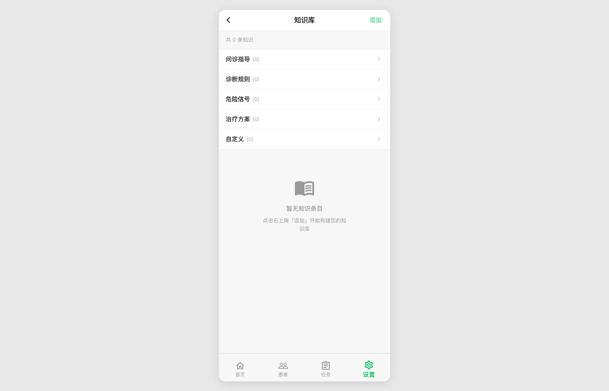
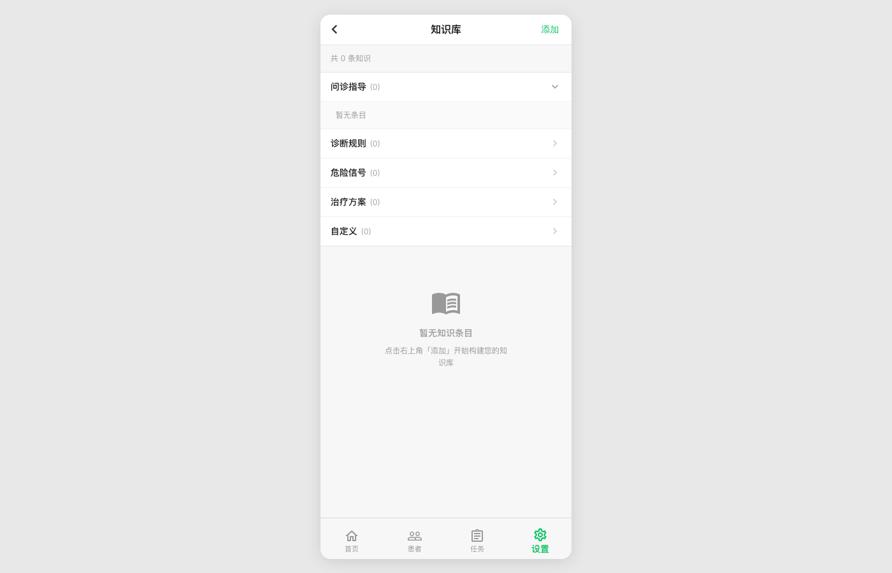
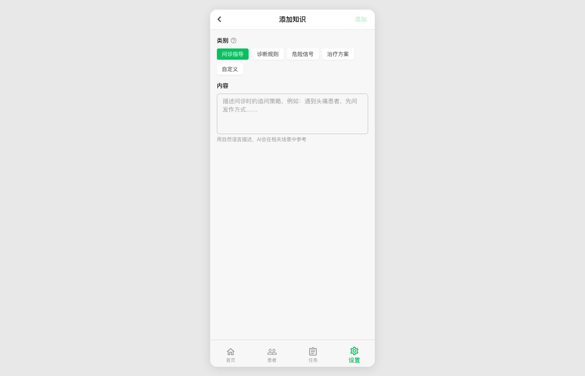
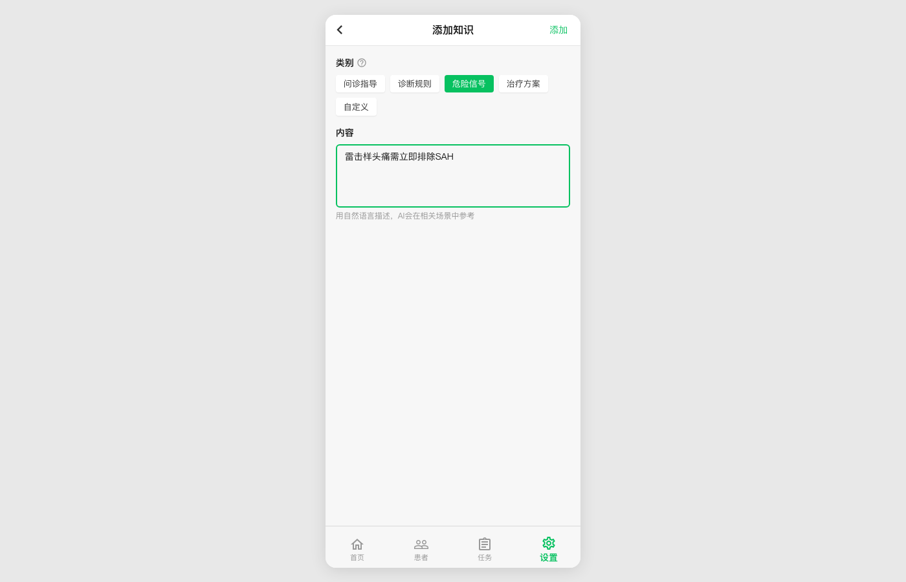
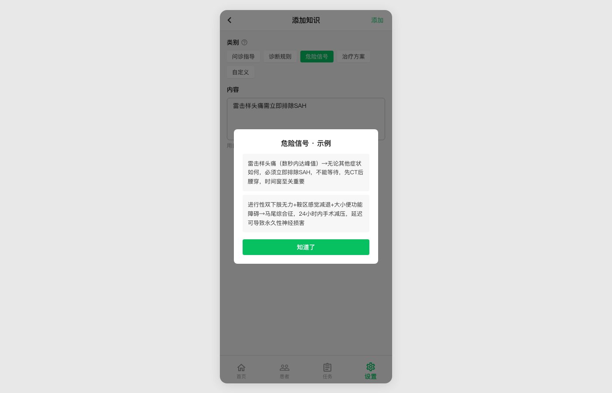
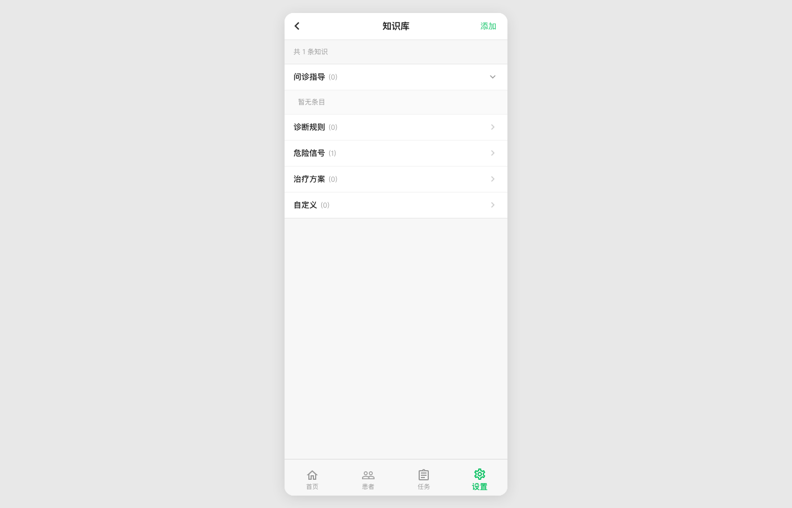
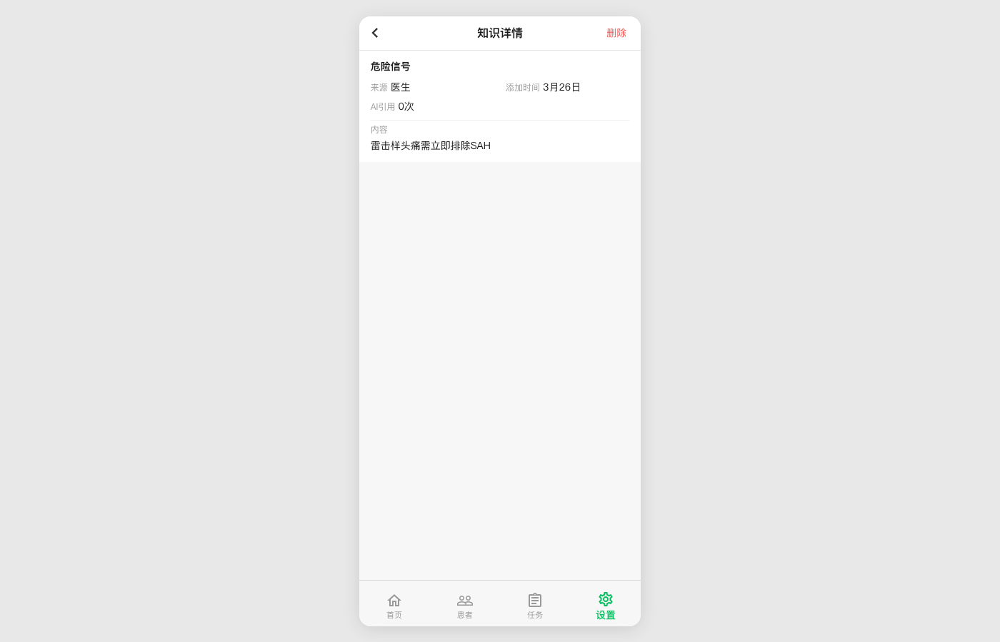
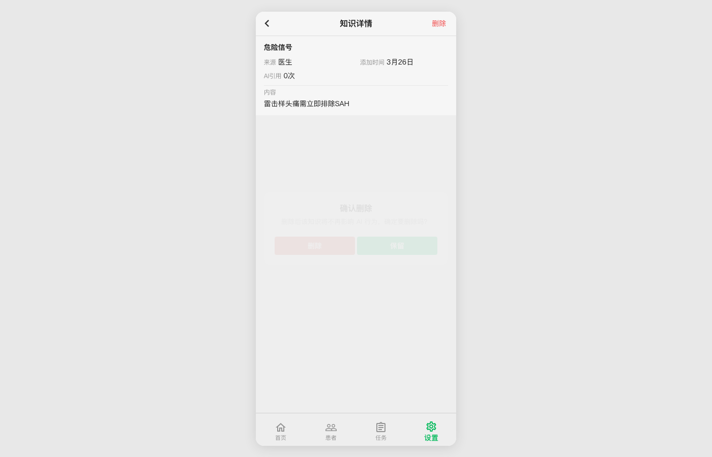
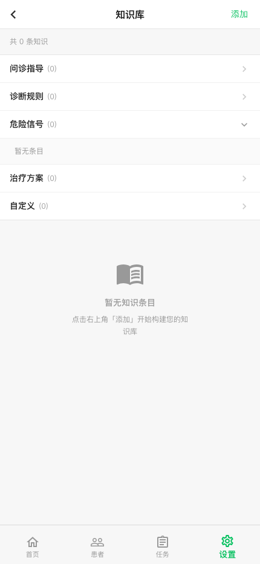

# UX Report: Knowledge Base (知识库) — 2026-03-26

> **Route:** `/doctor/settings/knowledge`
> **Method:** Manual walkthrough with headless Chromium (gstack browse), mobile viewport (375x812)
> **Account:** test_doctor (dev mode)
> **Backend:** localhost:5173 (Vite dev) + localhost:8000 (FastAPI)

---

## 1. Functional Test Results

| # | Flow | Result | API | Notes |
|---|------|--------|-----|-------|
| 1 | Load knowledge list page | PASS | GET /api/manage/knowledge 200 | Shows category counts, summary, empty state |
| 2 | Expand category accordion | PASS | — | Chevron toggles right→down, reveals items or "暂无条目" |
| 3 | Collapse category accordion | PASS | — | Returns to collapsed state with right chevron |
| 4 | Navigate to "添加知识" subpage | PASS | — | URL updates to `/knowledge/new` |
| 5 | Switch category (pill selector) | PASS | — | Active pill turns green, placeholder updates to match category |
| 6 | Help icon (?) opens example dialog | PASS | — | SheetDialog with category-specific examples |
| 7 | Dismiss help dialog ("知道了") | PASS | — | Dialog closes, form state preserved |
| 8 | Type content in textarea | PASS | — | "添加" button enables (green) when content non-empty |
| 9 | Submit knowledge item | PASS | POST /api/manage/knowledge 200 | Navigates back to list, auto-reloads, count updates |
| 10 | Expand category with items | PASS | — | Shows item text, source badge, date, AI reference count |
| 11 | Click item → detail view | PASS | — | URL-driven (`/knowledge/:id`), shows DetailCard |
| 12 | Delete button → confirmation dialog | PASS | — | ConfirmDialog with "删除" / "保留" buttons |
| 13 | Confirm delete | PASS | DELETE /api/manage/knowledge/:id 200 | Navigates back to list, item removed, count updates |
| 14 | Cancel delete (backdrop click) | PASS | — | Dialog dismisses, item preserved |
| 15 | Back button → settings main | PASS | — | URL updates to `/doctor/settings` |
| 16 | Direct URL load (`/doctor/settings/knowledge`) | PASS | — | Page renders correctly on fresh navigation |

**Console errors:** None

---

## 2. Walkthrough Screenshots

### 2.1 Knowledge List — Empty State

- Header: back button (‹), title "知识库", green "添加" action
- Summary line: "共 0 条知识"
- 5 category rows with counts and right chevrons: 问诊指导, 诊断规则, 危险信号, 治疗方案, 自定义
- Empty state illustration with "暂无知识条目" + guidance text
- Bottom nav: 设置 tab highlighted

### 2.2 Accordion Expanded

- "问诊指导" expanded: chevron rotates to down-arrow
- Nested row shows "暂无条目" in lighter background
- Other categories remain collapsed

### 2.3 Add Knowledge Subpage

- Header: back button, "添加知识", "添加" button (grayed out — no content yet)
- Category selector: 5 pill buttons, "问诊指导" active (green fill, white text)
- Help icon (?) next to "类别" label
- Content textarea with category-specific placeholder
- Helper text: "用自然语言描述，AI会在相关场景中参考"

### 2.4 Content Filled + Category Switched

- Switched to "危险信号" (green pill)
- Textarea filled: "雷击样头痛需立即排除SAH"
- "添加" button now active (green text, not grayed)
- Textarea border turns green on focus

### 2.5 Help Dialog

- SheetDialog: "危险信号 · 示例"
- Two example cards with gray background, clinical content
- Green "知道了" dismiss button
- Backdrop dims the page behind

### 2.6 After Adding Item

- Navigated back to list automatically
- Summary updated: "共 1 条知识"
- "危险信号 (1)" — count updated
- Empty state icon removed (items exist now)

### 2.7 Item Detail View

- Header: back button, "知识详情", red "删除" action
- DetailCard with category title "危险信号"
- Metadata row: 来源 = 医生, 添加时间 = 3月26日
- Second row: AI引用 = 0次
- Content section: full text displayed

### 2.8 Delete Confirmation

- ConfirmDialog overlay: "确认删除"
- Warning: "删除后该知识将不再影响 AI 行为，确定要删除吗？"
- Two buttons: "删除" (danger, left) + "保留" (primary, right)

### 2.9 After Deletion

- Back to list, "共 0 条知识"
- "危险信号 (0)" — count reset
- Empty state restored

### 2.10 Settings Main (after back)

- Full settings page with all sections visible
- 知识库 row: "管理 AI 助手参考资料"

---

## 3. UX Issues Found

### Issue A: ConfirmDialog buttons low contrast (Severity: Low)

**Where:** Delete confirmation dialog (screenshot 08)

The "删除" and "保留" buttons appear washed out — the text barely contrasts against their backgrounds. This is caused by the Dialog backdrop overlay dimming the entire dialog including its buttons. The MUI `Dialog` backdrop applies a semi-transparent dark overlay, and the buttons inside inherit this visual dimming.

**Impact:** Users may hesitate or struggle to read the button labels on lower-brightness screens.

**Suggestion:** Either increase button color saturation or ensure the Dialog paper sits above the backdrop visually. This may be a headless-rendering artifact — verify on a real device.

---

### Issue B: "添加" BarButton not in ARIA tree (Severity: Low)

**Where:** Knowledge list header and Add Knowledge header

The "添加" text button rendered by `BarButton` is only detectable as a `cursor:pointer` div — it has no ARIA role, no `tabIndex`, and no keyboard handler. Screen readers and keyboard-only users cannot reach or activate it.

**Current:** `<BarButton onClick={...}>添加</BarButton>` renders as a styled `<Box>` with `cursor: pointer`.

**Suggestion:** Add `role="button"`, `tabIndex={0}`, and `onKeyDown` (Enter/Space) to `BarButton`, or render it as a `<button>` element.

---

### Issue C: HelpOutlineIcon not keyboard-accessible (Severity: Low)

**Where:** "类别" section on Add Knowledge subpage

The `?` help icon has `onClick` and `cursor: pointer` but no `role`, `tabIndex`, or `aria-label`. It's invisible to assistive technology.

**Suggestion:** Wrap in an `IconButton` or add `role="button" tabIndex={0} aria-label="查看示例"`.

---

### Issue D: "删除" BarButton in detail header not in ARIA tree (Severity: Low)

**Where:** Knowledge detail page header

Same issue as Issue B — the red "删除" action is a BarButton with no ARIA role.

---

### Issue E: Category accordion items use `role="button"` correctly (Positive)

The category headers and item rows properly use `role="button"` and `tabIndex={0}` with `onKeyDown` handlers. This is good — the accordion is keyboard-accessible.

---

## 4. UX Scorecard

| Dimension | Score (1-5) | Notes |
|-----------|-------------|-------|
| **Task completion** | 5 | Full CRUD cycle works: add, view, delete. All API calls succeed. |
| **Navigation clarity** | 5 | URL-driven subpages, back buttons work, breadcrumb-style header |
| **Visual hierarchy** | 4 | Clean layout. Category counts, source badges, and dates provide good scannability. Empty state is helpful. Minor: delete dialog buttons lack contrast. |
| **Feedback & state** | 5 | Count updates immediately after add/delete. Loading spinner during API calls. "添加" button grays out when empty. |
| **Accessibility** | 3 | Accordions are good (role=button, tabIndex, onKeyDown). But BarButton, help icon, and header actions miss ARIA roles entirely. |
| **Error handling** | 4 | Error Alert component present for API failures. Delete has confirmation dialog. Could add network error toast for offline case. |
| **Information density** | 4 | Good use of space. Detail view is clean. List items show essential metadata. Category placeholders and examples guide new users well. |

**Overall: 30/35 — Ship-ready with minor accessibility fixes**

---

## 5. Recommendations (Priority Order)

1. **[Quick fix]** Make `BarButton` render as `<button>` element instead of `<Box>` — fixes Issues B and D across the entire app, not just knowledge page.

2. **[Quick fix]** Wrap `HelpOutlineIcon` in MUI `IconButton` with `aria-label="查看示例"`.

3. **[Investigate]** Check ConfirmDialog button contrast on real device — may be headless-only rendering artifact. If real, consider using MUI `Button` with higher z-index or more saturated colors.

4. **[Nice-to-have]** Add swipe-to-delete on knowledge items in the list view for faster mobile deletion.

5. **[Nice-to-have]** Add inline edit capability from the detail view (currently read-only + delete only — no edit).
