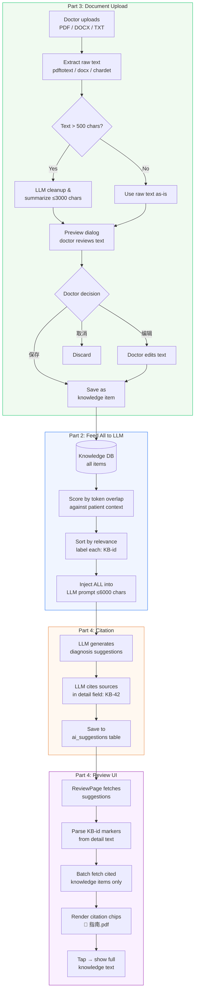

# D6.4 Document Upload + Citation — Design Spec

**Status: ✅ COMPLETED (2026-03-27)**

> Date: 2026-03-27
> Status: Approved (revised after Codex security review)
> Parity Matrix: D6.4
> Codex reviewed: knowledge retrieval strategy + security review

## Workflow Overview



## Goal

1. Doctors upload short clinical reference docs (PDF/DOCX/TXT, 1-10 pages) → LLM processes into clean knowledge item → doctor previews and confirms
2. Simplify knowledge UX: kill 5-category system, single "knowledge" bucket
3. All knowledge items fed to every LLM call (sorted by relevance, never excluded)
4. Diagnosis output cites which knowledge items influenced it via `[KB-{id}]` markers
5. Review UI renders citations as tappable badges showing source

## Scope

- Short reference docs only (1-10 pages): drug tables, dosing charts, checklists, specialty protocols
- No RAG / vector search / embeddings (documented as future when 50+ items per doctor)
- No large document semantic chunking (deferred to Phase A)

## Out of Scope (documented)

- **RAG / embeddings**: Current dead code (`domain/knowledge/embedding.py`, `langchain-huggingface`, `sentence-transformers` in requirements.txt) to be removed. RAG is not needed for 10-50 curated items. Revisit when a doctor exceeds 50 items.
- **GraphRAG**: Future ADR 0022 (Specialty Knowledge Base) territory.
- **Large documents (50+ pages)**: Needs semantic chunking, out of scope.
- **Batch upload**: Single file at a time for now.

---

## Part 1: Simplify Knowledge — Kill 5 Categories

### Current problem

Doctors must choose from 5 categories (interview_guide, diagnosis_rule, red_flag, treatment_protocol, custom). This is confusing. A rule like "高血压患者避免NSAIDs" could be any of 3 categories.

### Change

- **Doctor-facing:** No category picker. Doctor adds knowledge. Period.
- **Storage:** All new items saved as `category="custom"` (column kept for backwards compat, just unused as a filter).
- **Prompt composer:** Remove category filtering from all layers. Use explicit sentinel `knowledge_categories="all"` (not None — avoid falsy confusion with "skip KB").
- **Retrieval:** Score all items by relevance to current context, sort best-first, feed all to LLM.
- **Auto-learn:** Disable `maybe_auto_learn_knowledge()` to prevent auto-generated items from feeding back into prompts (self-reinforcing hallucination loop). Doctor-curated items only.

### What changes

| Component | Change |
|-----------|--------|
| `AddKnowledgeSubpage.jsx` | Remove category picker dropdown |
| `KnowledgeSubpage.jsx` | Remove category filter chips (or keep as display-only) |
| `knowledge_handlers.py` POST | Default `category="custom"`, ignore client-sent category |
| `prompt_config.py` | All layers use `knowledge_categories="all"` (explicit sentinel, not None) |
| `doctor_knowledge.py` | When `categories="all"`, load all items. Disable `maybe_auto_learn_knowledge()`. |

---

## Part 2: Feed All Knowledge to LLM

### Current behavior

- `render_knowledge_context()` scores items by token overlap, picks top 3, caps at 1200 chars
- Category filter pre-selects candidates per intent layer

### New behavior

- Remove category filter — all items are candidates
- Score by token overlap against patient context (chief_complaint + diagnosis + current query)
- **Sort** by score (most relevant first), but **never exclude**
- Soft cap: 6000 chars (~2000 tokens) — enough for 50 items of ~120 chars each
- If over cap: truncate from bottom (least relevant), log a warning so we know when doctors hit the limit
- Label each item: `[KB-{id}] {text}` for citation tracking
- **Sanitize at render time** — escape prompt-breaking patterns when injecting into LLM prompt, not when saving (see Security section). Stored text stays exactly what doctor approved.

### Changes to `render_knowledge_context()`

```python
def render_knowledge_context(query: str, items: list, patient_context: str = "") -> str:
    """
    Sort all items by relevance, label with [KB-{id}], return ALL (soft cap 6000 chars).
    """
    combined_query = f"{query} {patient_context}"  # expand query with patient fields
    scored = [(item, _score(combined_query, item)) for item in items]
    scored.sort(key=lambda x: x[1], reverse=True)

    lines = []
    total_chars = 0
    for item, score in scored:
        text = _sanitize_knowledge_text(_extract_text(item))
        line = f"[KB-{item.id}] {text}"
        if total_chars + len(line) > 6000:
            break  # soft cap — truncate least relevant
        lines.append(line)
        total_chars += len(line)

    if not lines:
        return ""
    return "【医生知识库】\n" + "\n".join(lines)
```

### Config changes

| Config | Before | After |
|--------|--------|-------|
| `KNOWLEDGE_MAX_ITEMS` | 3 | Removed (no hard cap) |
| `KNOWLEDGE_MAX_CHARS` | 1200 | 6000 |
| `KNOWLEDGE_MAX_ITEM_CHARS` | 320 | Removed (no per-item truncation) |

---

## Part 3: Document Upload

### Upload flow (two-step: extract → preview → save)

1. Doctor taps "上传文件" in KnowledgeSubpage
2. File picker: PDF, DOCX, TXT (max 10MB file size)
3. **Step 1 — Extract + LLM process:** Backend extracts raw text, then LLM cleans/summarizes into a concise knowledge item
4. **Step 2 — Preview:** Frontend shows the LLM-processed text to doctor in an editable preview dialog
5. Doctor chooses: **保存** (save as-is) / **编辑** (modify then save) / **取消** (discard)
6. On save: stored as knowledge item with source metadata

### LLM processing

For raw text > 500 chars, pass through LLM cleanup using the structured prompt below. For raw text ≤ 500 chars: skip LLM, show raw text directly (already clean enough).

**Prompt file:** `src/agent/prompts/knowledge_ingest.md`

```
你是"神经科临床知识整理助手"。你的任务是把 OCR/解析后的临床文档整理成可直接注入问诊/诊断模型的中文知识条目。读者是中国私立执业神经科医生。你的输出必须优先保证：医学准确性、可执行性、可读性。

【输入特点】
- 输入来自 PDF/DOCX 的 OCR 或文本解析，可能包含错字、断行、错位表格、重复页眉页脚、目录、版权信息。
- 文档类型可能包括：药物相互作用表、剂量/滴定表、短治疗方案、临床决策规则、症状清单、红旗征象列表、检查/随访要点。
- 文档长度通常为 1-10 页。

【核心目标】
把原文整理为"医生能快速预览、后续 LLM 能直接调用"的知识条目：
- 保留所有可用于临床判断的关键信息
- 删除无关噪声
- 把散乱文本和表格改写为清晰、可执行的规则
- 不补充原文没有的信息，不做推断，不引用外部知识

【高风险保真规则】
以下内容属于高风险医学信息，必须严格保真：
- 药物名称、通用名/商品名、联合用药名称
- 剂量数值、单位、频次、疗程、给药途径、滴定规则、最大剂量
- 禁忌症、慎用条件、相互作用、停药/减量条件
- 实验室阈值、评分阈值、年龄/体重/肾功能等适用条件
- "禁用/慎用/优先/可考虑/不推荐"等措辞强度

处理原则：
- 仅当能依据上下文 100% 确认时，才修正明显 OCR 错误（如"圧"改为"压"）。
- 如果药名、剂量、单位、频次、禁忌、阈值存在疑似 OCR 错误但无法 100% 确认，不要猜测；保留可确认内容，并在"【原文疑点】"中标出。
- 不要自行补全缺失单位，不要做剂量换算，不要把原文没有的缩写解释或展开。

【清洗规则】
- 删除页眉、页脚、页码、目录、版权声明、联系方式、二维码说明、重复段落、广告语等无关内容。
- 合并被 OCR 打断的短句、空格、换行。
- 对明显错位的列表/表格，按语义重新整理为条目。
- 如果"见上表/如下页/附录"等指代在当前输入中无法还原，不能猜测；仅保留当前可确认信息，并在"【原文疑点】"中说明。

【表格处理规则】
1. 药物相互作用表 — 每行改写为独立条目：
   "药物A + 药物B：风险/后果；处理建议；禁用/慎用条件；监测要点"
2. 剂量/滴定表 — 每行改写为独立条目：
   "药物名：适用对象；起始剂量；调整幅度或间隔；维持剂量；最大剂量；给药频次/途径；特殊调整条件"
3. 临床决策规则/流程图 — 改写为"若……，则……"的规则条目，明确触发条件和推荐动作。
4. 症状清单/红旗征象/检查清单 — 保留为项目符号列表。红旗征象单独成节。
5. 破损表格 — 关键对应关系可确认则重组输出；无法确认则只保留可确认部分，其余写入"【原文疑点】"。

【输出要求】
- 仅输出中文知识条目，不要解释你的处理过程。
- 使用短标题 + 项目符号，不使用 Markdown 表格，不写大段散文式摘要。
- 优先呈现：适用场景、核心规则、药物/剂量、禁忌/相互作用、红旗征象、监测/随访。
- 相同信息去重。如果原文本身存在冲突，保留冲突并明确写"原文存在冲突"。
- 如果输入主要是目录、版权页或无实质医学内容，输出："未提取到可用的临床知识内容"。
- 总长度控制在 3000 字以内。

【固定输出格式】
【主题】
一句话概括文档主题或适用场景。

【核心临床规则】
- 用"若……，则……"或"适用于……；不适用于……"表述可执行规则。
- 没有则省略本节。

【药物与剂量】
- 药物名：适用场景；剂量/频次/途径/疗程；调整规则；最大剂量。
- 没有则省略本节。

【禁忌 / 慎用 / 相互作用】
- 药物/情况：禁忌、慎用、相互作用、监测要求。
- 没有则省略本节。

【红旗征象 / 立即处理提示】
- 列出需要警惕或立即处理的情况。
- 没有则省略本节。

【症状 / 检查 / 随访要点】
- 列出关键症状、检查项目、随访监测点。
- 没有则省略本节。

【原文疑点】
- 仅列出无法 100% 确认的药名、剂量、单位、阈值、表格对应关系或疑似 OCR 错误。
- 若无疑点，省略本节。

【输出前自检】
- 是否遗漏任何药名、剂量、禁忌、阈值、相互作用？
- 是否把表格内容改写成了可执行规则？
- 是否误加了原文没有的信息？
- 是否把不确定内容放进了"【原文疑点】"而不是自行猜测？

【待整理文档】
{{document_text}}
```

### Text extraction

Reuse existing functions:
- PDF: `extract_text_from_pdf_smart()` (LLM vision → pdftotext fallback)
- DOCX: `extract_text_from_docx()`
- TXT: read as UTF-8, fallback to GBK/GB18030 detection via `chardet`

### Size limits

- File size: max 10MB
- LLM-processed output: max 3000 chars
- If LLM output still > 3000 chars: show in preview with warning "内容较长，建议编辑精简后保存"
- Doctor can edit down in the preview dialog

### API (two endpoints)

```
POST /api/manage/knowledge/upload/extract
  Content-Type: multipart/form-data
  Fields: file (required)
  Auth: doctor_id from JWT

  Response 200: {
    "extracted_text": "高血压患者应避免NSAIDs类药物...",
    "source_filename": "指南.pdf",
    "char_count": 1250,
    "llm_processed": true
  }
  Response 400: unsupported format, extraction failed, empty content
  Response 413: file > 10MB

POST /api/manage/knowledge/upload/save
  Content-Type: application/json
  Body: {
    "text": "高血压患者应避免NSAIDs类药物...",   // final text (may be doctor-edited)
    "source_filename": "指南.pdf"
  }
  Auth: doctor_id from JWT

  Response 200: { "status": "ok", "id": 42, "text_preview": "高血压患者应避免..." }
  Response 400: empty text
  Response 413: text > 3000 chars
```

Two endpoints because the preview step happens on the frontend between extract and save.

### Backend

**New functions** in `domain/knowledge/doctor_knowledge.py`:

```python
async def extract_and_process_document(file_bytes: bytes, filename: str) -> dict:
    """Extract text from file, LLM-process if long. Returns {extracted_text, source_filename, char_count, llm_processed}."""
    # 1. Detect format from extension (.pdf, .docx, .txt)
    # 2. Extract raw text (reuse existing extractors, TXT with chardet fallback)
    # 3. If raw text > 500 chars: LLM cleanup/summarize
    # 4. Return processed text for preview

async def save_uploaded_knowledge(doctor_id: str, text: str, source_filename: str) -> dict:
    """Save doctor-approved text as a knowledge item. Returns {id, text_preview}."""
    # 1. Validate text length (≤ 3000 chars)
    # 2. Sanitize text
    # 3. Save as knowledge item with source="upload:{filename}"
    # 4. Invalidate cache
    # 5. Return {id, text_preview}
```

### Frontend

**AddKnowledgeSubpage.jsx** changes:
- Add "上传文件" button (file input, accepts `.pdf,.docx,.txt`)
- On file select: call extract endpoint, show loading spinner
- On extract complete: show preview dialog with editable text area
- Buttons: 保存 / 编辑 (already in edit mode) / 取消
- On save: call save endpoint
- Remove category picker (Part 1 simplification)

**KnowledgeSubpage.jsx** changes:
- Items from uploads show a file icon + source filename badge
- Remove category filter chips

---

## Part 4: Citation in Diagnosis

### Prompt change

In `agent/prompts/intent/diagnosis.md`, add instruction:

```
如果你的建议基于医生知识库中的内容，请在 detail 字段末尾标注引用来源，格式：[KB-{id}]
可以引用多个来源：[KB-{id1}][KB-{id2}]
例如：建议使用钙通道阻滞剂控制血压，同时注意肾功能监测 [KB-42][KB-15]
```

### How it works

1. Knowledge items are already injected with `[KB-{id}]` labels (Part 2)
2. LLM sees: `[KB-42] 高血压患者首选钙通道阻滞剂...`
3. LLM may reference `[KB-42]` in its `detail` output
4. Stored in `ai_suggestions.detail` as-is — no schema changes

### Frontend: Citation display in DiagnosisCard.jsx

1. Parse `[KB-{id}]` markers from `detail` text using regex (global match, captures multiple citations)
2. Resolve each ID via a batch endpoint (only fetch cited items, not full KB)
3. Render as tappable chip: `📎 指南.pdf` (using source field from item)
4. On tap: bottom sheet with source filename header + first 200 chars preview. If item > 200 chars, show "查看全部" button to expand to full scrollable text. Short items (≤ 200 chars) show in full directly.
5. Unresolved IDs (hallucinated or deleted): render as plain text `[KB-?]`, no chip

**ReviewPage.jsx** change: extract all `[KB-{id}]` from suggestions, fetch cited items via `GET /api/manage/knowledge/batch?ids=42,57`, pass as lookup map to DiagnosisCard.

**New endpoint:**
```
GET /api/manage/knowledge/batch?ids=42,57
  Auth: doctor_id from JWT
  Response: { "items": [{"id": 42, "text": "...", "source": "upload:指南.pdf"}, ...] }
```

Only returns items belonging to the authenticated doctor. Missing IDs silently omitted.

---

## Security

### Prompt injection defense

**`_sanitize_for_prompt(text: str) -> str`** — applied at **render time** in `render_knowledge_context()`, not at save time. Stored text stays exactly what doctor approved.

What it does:
- Escape XML/HTML-like tags: `<...>` → `＜...＞` (fullwidth brackets, preserves readability)
- Escape `[KB-` patterns in user text to prevent fake citation injection
- Strip control characters (U+0000-U+001F except newlines)

This is a fast regex function, no LLM call. Applied per-item right before building the prompt string.

### GBK/GB18030 encoding support

TXT file upload: try UTF-8 first, fallback to encoding detection via `chardet` library for hospital files commonly saved in GBK.

### Auto-learn disabled

`maybe_auto_learn_knowledge()` disabled to prevent LLM-generated content from re-entering the knowledge base → prompt → LLM loop (self-reinforcing hallucination).

---

## Dead Code Removal

Remove as part of this feature:

| File/Package | What | Why |
|-------------|------|-----|
| `src/domain/knowledge/embedding.py` | Embedding module (BGE-M3, DashScope) | Never called, dead code |
| `main.py` lines 125-131 | Embedding preload on startup | Loads 500MB model for nothing |
| `requirements.txt`: `langchain-huggingface` | Pip dependency | Only used by dead embedding.py |
| `requirements.txt`: `sentence-transformers` | Pip dependency | Only used by dead embedding.py |

---

## Files Modified

| File | Change |
|------|--------|
| `src/domain/knowledge/doctor_knowledge.py` | Remove max_items/max_chars caps, add `extract_and_process_document()` + `save_uploaded_knowledge()` + `_sanitize_for_prompt()` (render-time only), label items with `[KB-{id}]`, expand query with patient context, remove category filtering, disable auto-learn |
| `src/domain/knowledge/embedding.py` | **Delete** |
| `src/main.py` | Remove embedding preload block |
| `requirements.txt` | Remove `langchain-huggingface`, `sentence-transformers` |
| `src/agent/prompt_config.py` | All layers: `knowledge_categories="all"` |
| `src/agent/prompts/intent/diagnosis.md` | Add citation instruction |
| `src/channels/web/ui/knowledge_handlers.py` | Add `POST /upload/extract`, `POST /upload/save`, `GET /batch` endpoints, default category to "custom" |
| `frontend/web/src/pages/doctor/subpages/AddKnowledgeSubpage.jsx` | Add file upload + preview dialog, remove category picker |
| `frontend/web/src/pages/doctor/subpages/KnowledgeSubpage.jsx` | Show upload source badges, remove category filter |
| `frontend/web/src/components/doctor/DiagnosisCard.jsx` | Parse `[KB-{id}]`, render citation chips |
| `frontend/web/src/pages/doctor/ReviewPage.jsx` | Extract cited IDs, fetch via batch endpoint, pass lookup map |
| `frontend/web/src/api.js` | Add `uploadKnowledgeExtract()`, `uploadKnowledgeSave()`, `getKnowledgeBatch()` |

## No Changes

- `ai_suggestions` schema — citations live in existing `detail` text field
- `DoctorKnowledgeItem` schema — `category` column kept, just unused as filter
- Backend diagnosis pipeline structure — only prompt content changes
