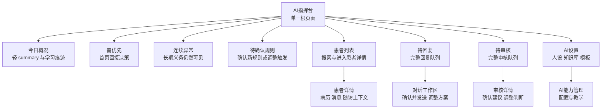

# AI Command Center V3 — Navigation & Visual Redesign

> Date: 2026-04-19
> Status: Proposed
> **Mock HTML:** [2026-04-19-mockups/ai-command-center-v3.html](2026-04-19-mockups/ai-command-center-v3.html)

## Goal

Replace the current multi-tab doctor shell with a single-root AI command center that makes the copilot feel primary, reduces navigation fatigue, and gives the doctor a more modern, less rigid workspace.

## Core Decision

V3 uses **one root page only**: `AI指挥台`.

Everything else becomes a pushed subpage:

- `患者列表`
- `待回复`
- `待审核`
- `AI设置`

There is **no bottom tab bar**.

## Why This Direction

The current V2 shell still behaves like a module browser: multiple root tabs, internal tabs inside pages, and a fairly deep settings tree. That keeps the app understandable, but it weakens the product promise that this is a personal AI copilot rather than a mini EMR.

The approved V3 direction shifts the mental model from:

`我在不同模块之间切换`

to:

`我先看今天最重要的工作概况，并在首页直接完成第一步判断`

## Proposed Information Architecture

### Root

`AI指挥台`

### Primary actions on home

- `患者列表`
- `新建病历`
- `预问诊码`

`患者列表` is the anchor action. It should feel visibly stronger than the other two entries because it replaces a former root destination.

### Core work modules on home

- `今日概况`
- `需优先`
- `连续异常`
- `待确认规则`

### Secondary entry

- `AI设置` in the top-right corner

### Removed as root destinations

- `患者` tab
- `审核` tab
- `随访` tab
- `我的AI` tab

### Reframed behavior

- `患者列表` remains important, but is reached from home as a strong action, not as permanent navigation chrome.
- `随访` stops being a root-level destination. It becomes patient-context work, conversation history, or a detail-level workflow.
- `待回复` and `待审核` still exist, but the home page should surface the first decisive item directly instead of acting as a pure preview layer.

## Screen Model

### 1. AI指挥台

The home screen is a command center, not a chat page.

Top to bottom:

1. Top bar: `AI指挥台` + `AI设置`
2. Calm summary card with one concrete “learned from you” artifact
3. `需优先` direct-decision card
4. `连续异常` compact direct-decision block
5. `待确认规则` direct-decision block
6. Bottom action row with `患者列表` as the dominant card plus `新建病历 / 预问诊码`

There is no persistent `对 AI 说...` input on the home screen.

`连续异常` is not a rebadged task module. It is a compact monitoring surface that keeps long-horizon obligations visible after removing the root `随访` tab.

The home screen should not force the doctor to click into a queue before doing any work. It is a working surface for the most important item, while `待回复` and `待审核` remain deeper backlog-management subpages.

### 2. 待回复 subpage

Dedicated subpage showing reply work only.

Each item should show:

- patient name
- fact-first summary of what changed
- inbound message snippet
- AI draft status
- urgency or confidence cue
- decision-level actions such as `确认并发送` and `调整方案`
- a restrained responsibility boundary

### 3. 待审核 subpage

Dedicated subpage showing diagnosis / recommendation review only.

Each item should show:

- patient name
- fact-first clinical summary
- recommendation summary
- provenance / groundedness cue
- decision-level actions such as `确认建议` and `调整判断`
- a restrained responsibility boundary

### 4. 患者列表 subpage

Patient lookup becomes an intentional destination from home, not a permanent root.

The patient list should support:

- search first
- recent / active patients first
- compact AI status hints on each row
- an explicit `连续异常` / `需复核` surface near the top so doctors can still see longer-horizon obligations

### 5. AI设置 subpage

This page owns:

- AI人设
- 知识库
- 回复模板
- 预问诊入口 / 二维码
- general settings

The key change is psychological: these are AI-management tools, not the product’s primary home.

## Visual Direction

The current V2 design is clean but too close to a utility list app. V3 should keep clinical trust while feeling more intentional and current.

### Desired tone

- calm
- precise
- premium but not flashy
- AI-forward without looking like a generic chatbot

### Visual changes

- a calmer hero hierarchy for the daily summary, not an anthropomorphic AI narrative
- at least one visible “AI learned from you” artifact on home
- fewer global separators and fewer stacked list headers
- larger card rhythm with more whitespace around important decisions
- a clearer accent system centered on AI work rather than navigation chrome
- no bottom tab bar competing for attention
- more contrast between overview and detail surfaces
- fact-first copy on work surfaces: main clause = clinical fact, secondary clause = system suggestion
- decision-level CTA labels on work surfaces, not generic language-edit labels
- direct-decision cards on home, so the first action happens before queue navigation

### What stays

- Chinese-first copy
- touch-friendly controls
- medically trustworthy tone
- restrained color use

## Workflow Diagram

## Cascading Impact

### 1. DB schema

None.

### 2. ORM models & Pydantic schemas

None.

### 3. API endpoints

None required for the design proposal itself.

Likely implementation impact later: existing doctor dashboard endpoints may need aggregated home payloads if the AI briefing becomes richer than today’s scattered queries.

### 4. Domain logic

None for the proposal itself.

Likely implementation impact later: follow-up work should be reframed from a root module into patient-context or decision-context entry points.

### 5. Prompt files

None.

### 6. Frontend

High impact.

Likely affected areas:

- `frontend/web/src/v2/pages/doctor/DoctorPage.jsx`
- `frontend/web/src/v2/pages/doctor/MyAIPage.jsx`
- `frontend/web/src/v2/pages/doctor/ReviewQueuePage.jsx`
- `frontend/web/src/v2/pages/doctor/TaskPage.jsx`
- `frontend/web/src/v2/pages/doctor/PatientsPage.jsx`
- `frontend/web/src/v2/pages/doctor/SettingsPage.jsx`
- any doctor routing helpers, shell layout helpers, and page-stack transitions

### 7. Configuration

None.

### 8. Existing tests

Likely frontend E2E and navigation tests would need updates once implemented, especially any tests that assume bottom-tab navigation.

### 9. Cleanup

Likely removal or demotion of:

- root tab configuration for `患者 / 审核 / 随访`
- tab badge logic tied to the current shell
- UI copy and affordances that assume `我的AI` is just one tab among peers

## Out of Scope

- backend data model changes
- changing diagnosis/reply workflow behavior
- converting home into a chat surface
- defining the final production component API

## Review Notes

This proposal intentionally changes the product posture, not just the look:

- AI becomes the root frame
- the home becomes a direct-decision workspace for the most important items
- work queues become deeper decision-oriented subpages
- patient browsing becomes a strong home action instead of permanent chrome

If approved, the next step should be an implementation plan that breaks the redesign into shell, home, and subpage streams.
