# Design: Deterministic Onboarding for Knowledge + Patient Intake

> **Mock HTML:** [2026-03-28-mockups/deterministic-onboarding-demo.html](2026-03-28-mockups/deterministic-onboarding-demo.html)
>
> Status: Completed implementation reference
>
> Completed: 2026-03-28
>
> Goal: Make solo doctor discovery deterministic for three core questions:
> 1. How do I teach the AI?
> 2. What does my patient actually see?
> 3. Where does that knowledge show up in review, reply, and follow-up work?

## Problem

The current product has strong surfaces for:
- doctor AI dashboard
- knowledge creation
- QR sharing
- patient guided intake

But discovery is still non-deterministic because the doctor has to infer the
intended sequence. The app behaves like a dashboard with many valid entry
points, not like a conductor with one recommended first-run path.

## Proposed Product Behavior

Add a first-run onboarding layer centered on `我的AI` with:

### Entry missions

1. `教 AI 一条规则`
2. `体验患者预问诊`

### Proof steps unlocked in sequence

3. `看 AI 如何用于诊断审核`
4. `看 AI 如何用于患者回复`
5. `看系统如何生成随访任务`

Each step has:
- one primary CTA
- one explicit success condition
- one explicit next step

The app should guide the doctor through a deterministic proof chain:
- create one rule
- see it cited in diagnosis review
- see it cited in reply review
- preview patient intake inside a doctor-side mini patient page
- see patient submit create a review task
- return to doctor review
- see review completion produce approved follow-up tasks

The intended first-run order is:
1. 我的AI 引导
2. 三种知识添加
3. 保存规则后
4. 诊断审核示例
5. 回复示例
6. QR / 聊天发起
7. 医生端患者预览
8. 提交后审核任务
9. 审核完成随访任务

### Knowledge Addition Entry Types

The product should present exactly three deterministic ways to add knowledge on
first run:

1. `网址导入`
   URL field accepts a source link, fetches content, then pre-fills editable
   knowledge text.
2. `图片 / 文件导入`
   Upload or photo capture extracts text via OCR/LLM, then pre-fills editable
   knowledge text.
3. `直接输入`
   Free-text entry opens with useful starter content prefilled. The doctor can
   keep, edit, or replace it before saving.

These three modes should all converge into the same review/edit/save screen so
the doctor always understands that imported content is only a draft and can be
modified before it becomes a rule.

## Workflow

```mermaid
flowchart LR
    A[Doctor opens 我的AI] --> B[Checklist: 教AI一条规则]
    B --> C[Choose URL / image-file / text]
    C --> D[Editable prefilled draft]
    D --> E[Post-save sheet: 看诊断示例 / 看回复示例]
    E --> F[Seeded case input provenance: 预问诊摘要 / 医生聊天建档]
    F --> G[Diagnosis review example with citation]
    G --> H[Seeded patient original message]
    H --> I[Reply review example with citation]
    I --> J[Checklist marks knowledge proof complete]
    J --> K[Checklist: 体验患者预问诊]
    K --> L[QR dialog or doctor-chat record creation]
    L --> M[Doctor-side mini patient page]
    M --> N[Previewed patient completes guided intake]
    N --> O[Review task + pending-review record are highlighted]
    O --> P[Doctor finalizes review]
    P --> Q[Approved follow-up tasks are highlighted]
```

## Key Screens

### 1. 我的AI as conductor

Replace equal-weight first-run cards with a compact checklist module:
- Step 1: 教 AI 一条规则
- Step 2: 看 AI 如何用于诊断审核
- Step 3: 看 AI 如何用于患者回复
- Step 4: 体验患者预问诊
- Step 5: 看系统如何生成随访任务

This does not replace the normal dashboard forever. It only dominates the
surface until the doctor completes the first-run journey.

### 2. Post-save knowledge handoff

After saving a rule, do not immediately bounce back.

Show a sheet:
- `这条规则会影响：诊断审核 / 患者回复`
- `看诊断示例`
- `看回复示例`

These buttons should open seeded feature-linked examples, not rely on future
organic traffic.

### 2A. Diagnosis review must be a deterministic proof screen

The doctor should land on a seeded review case where:
- the page first shows where the case input came from
- input provenance is explicit: patient intake summary and/or doctor chat record
- the just-saved rule is visibly cited
- one suggestion can be confirmed
- one suggestion can be edited
- the doctor can continue to the reply example

This is the first proof that the rule affects clinical output.

### 2B. Reply review must be a deterministic proof screen

The doctor should then land on a seeded patient-thread example where:
- the original patient message is shown before the AI draft
- the AI draft is already generated
- the same or related rule is visibly cited
- the doctor can inspect or send the draft
- the next CTA leads to patient intake preview

This is the second proof that the same personalization system affects patient
communication, not only diagnosis review.

### 3. Knowledge creation should start from three explicit choices

On first run, `继续教AI` should not drop the doctor into one generic form.
It should first present:
- `网址导入`
- `图片 / 文件导入`
- `直接输入`

All three should produce prefilled editable content. The app should frame this
as:
- `AI 已帮你整理初稿`
- `请确认或修改后保存`

This is especially important for solo exploration because it shows that the
system is assistive at the point of rule creation, not only at the point of
rule usage.

### 4. QR as previewable product entry

The QR dialog should explain the downstream patient experience and expose:
- `发给患者`
- `预览患者端`

`预览患者端` in MVP should open a doctor-side mini patient page that simulates
the patient intake experience, not the real patient shell.

### 5. Patient intake as focused first-run flow

The patient preview should begin inside a doctor-side mini patient page with a
simple intro layer:
- 约 2 分钟完成预问诊
- 描述症状
- AI 追问补全病史
- 确认提交给医生

After submit, the first visible result should be:
- `已创建审核任务`
- `查看审核任务`

This makes the first task moment legible: patient submit creates a doctor
review task before any follow-up execution tasks exist.

### 6. Review finalize must bridge to generated tasks

Once the doctor returns from patient intake to review the newly created case,
the flow should not end at “审核完成”.

It should explicitly surface:
- `已生成 X 条已确认随访任务`
- `查看任务`

This is the second task moment. It should be clearly separated from the earlier
review-task creation so doctors can distinguish:
- patient submit -> review task
- doctor finalize -> approved follow-up tasks

## Additional Missing Workflows

Beyond knowledge discovery and QR-driven patient preview, the following
workflows should also be made deterministic over time:

### A. Doctor-chat onboarding to patient intake

Yes, onboarding the patient from doctor chat is a missing shortcut.

Current product understanding:
- QR and patient portal already exist
- doctor chat is still a natural “control center” for many doctors

Recommended deterministic flow:
- doctor types or taps `新建患者预问诊`
- system first creates a provisional patient record in doctor chat
- system then creates or opens patient intake link / QR
- app offers:
  - `发送给患者`
  - `预览患者端`
  - `复制链接`

This matters because some doctors will never go to Settings or 我的AI first.

### B. Review proof after rule save

After saving a rule, the doctor should be able to jump directly to:
- `看诊断示例`
- `看回复示例`

This is the fastest way to prove the rule is actually used.

### C. Review-to-task handoff

After finalizing a review, the app should explicitly surface:
- `已生成 X 条随访任务`
- `查看任务`

Otherwise task creation remains hidden as backend behavior.

### D. Patient-submit to doctor-review bridge

After patient intake submission, both sides need deterministic next steps:
- patient sees `已提交给医生`
- doctor sees highlighted pending-review item

### E. Follow-up reply discovery

Once the doctor has seen knowledge usage in diagnosis, they should be led to a
message thread where the AI reply also cites rules. This proves the same
personalization system drives both clinical review and patient communication.

## Why this is deterministic

This flow removes ambiguity around:
- where to start
- what action matters next
- what a saved rule does
- where diagnosis proof appears
- where reply proof appears
- what the patient actually sees
- where the doctor goes after patient submit
- where task creation becomes visible

Seeded data still matters, but only as proof for the guided path. It should be
feature-linked, not generic volume:
- one seeded diagnosis review example
- one seeded reply review example
- one seeded patient intake path
- one seeded review-finalize -> task example

## Minimum Implementation Scope

- `frontend/web/src/pages/doctor/MyAIPage.jsx`
  Add first-run checklist module and ordered mission CTAs.
- `frontend/web/src/pages/doctor/subpages/AddKnowledgeSubpage.jsx`
  Add three explicit entry types, all converging into editable prefilled content.
  Replace save-and-back with post-save next-step sheet.
- `frontend/web/src/pages/doctor/subpages/KnowledgeSubpage.jsx`
  Add optional “体验示例” affordance in onboarding/demo mode.
- `frontend/web/src/pages/doctor/ReviewPage.jsx`
  Highlight seeded review example and expose next-step CTA after proof / finalize.
- `frontend/web/src/pages/doctor/ReviewQueuePage.jsx`
  Highlight seeded reply example and patient-submit review case.
- `frontend/web/src/pages/doctor/TaskPage.jsx`
  Highlight tasks created from the just-finalized review.
- `frontend/web/src/components/QRDialog.jsx`
  Add explanatory copy and `预览患者端`.
- `frontend/web/src/pages/doctor/ChatPage.jsx`
  Add patient-onboarding shortcut entry for doctors who start from chat.
- `frontend/web/src/pages/patient/PatientPage.jsx`
  Route preview / QR-first entry into intake-first experience.
- `frontend/web/src/pages/patient/IntakePage.jsx`
  Add intro framing and success CTA back to doctor review.

## Cascading Impact

1. **DB schema** — None.
2. **ORM models & Pydantic schemas** — None for the mock/design. Likely none for implementation if first-run state stays client-side; otherwise a small doctor preference flag may be needed later.
3. **API endpoints** — Optional only. Current flows can mostly work with existing routes. A later implementation may want explicit preview/example routes, seeded-example deep links, and doctor-chat link generation helpers.
4. **Domain logic** — None for the mock. Implementation may add lightweight onboarding state helpers, seeded-example selection helpers, and doctor-chat patient-intake helpers.
5. **Prompt files** — None.
6. **Frontend** — Primary impact. `MyAIPage`, knowledge flow, review proof surfaces, QR flow, doctor chat shortcut, patient preview routing, patient intake success state, task highlight state.
7. **Configuration** — None.
8. **Existing tests** — UI/mock tests and any route assumptions around patient default tab may need updates if preview mode is introduced.
9. **Cleanup** — Remove or down-rank equal-weight first-run cards that currently compete with the guided path.
