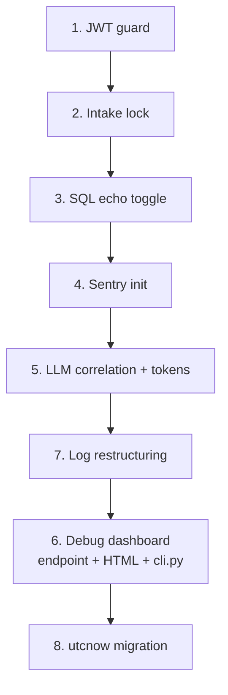

# Backend Hardening for Production Launch

**Date:** 2026-03-29
**Status:** Draft
**Scope:** 8 targeted fixes validated against actual codebase and deployment context

---

## Context

A comprehensive backend audit identified findings across 5 dimensions (feature completeness, best practices, fault tolerance, observability, extensibility). After validating each finding against the actual code and deployment constraints, most were either overstated, already handled, or not applicable.

### Deployment constraints

| Constraint | Value | Impact |
|-----------|-------|--------|
| Timeline | Weeks from launch | Only ship fixes with clear production value |
| Deployment | Single instance | Eliminates distributed concurrency concerns |
| Scale | 1-5 doctors (pilot) | Eliminates performance optimization concerns |
| Primary channel | WeChat mini app (own web app) | WeChat KF message path is not critical |

### Findings dismissed (with rationale)

| Audit finding | Why dismissed |
|---------------|--------------|
| Hardcoded JWT secret (critical) | Code already raises RuntimeError in production if env var missing. Only dev/test uses fallback. |
| WeChat message lost on send failure | Primary channel is mini app (HTTP API), not WeChat KF messaging. Not applicable. |
| DB pool exhaustion (30 connections) | 1-5 doctors on single instance. Not a real risk. |
| N+1 queries in patient search | Not noticeable at pilot scale. |
| Unindexed LIKE searches | Fast on small datasets. Defer until scale demands it. |
| DB query timeout | Queries are milliseconds at this scale. LLM timeout (30s) already handled. |
| Transaction rollback on commit failure | AsyncSession context manager auto-rollbacks. Already correct. |
| 176 raw AsyncSessionLocal() calls | Context manager ensures cleanup. DI only applies to ~40% of usages (FastAPI routes). Not a leak risk. |
| Latency percentiles missing | Already built — `get_latency_summary()` computes p50/p95/p99. Audit was wrong. |
| Missing Pydantic validators | Low risk at 1-5 doctor scale. Add reactively when bad data appears. |
| Circuit breaker persistence | In-memory is fine for single instance. |
| Background worker auto-restart | Health endpoint reports status. Manual restart acceptable at pilot scale. |

---

## Changes

### 1. Tighten JWT environment guard

**File:** `src/infra/auth/unified.py`

**Problem:** The `_secret()` function allows empty-string `ENVIRONMENT` to use the dev fallback secret. If someone deploys without setting `ENVIRONMENT`, they silently get the insecure dev secret.

**Fix:** Remove `""` from the allowed-fallback list.

```python
# Before:
if env not in ("development", "dev", "test", ""):

# After:
if env not in ("development", "dev", "test"):
```

**Risk:** If existing dev setups rely on unset `ENVIRONMENT`, they'll get a RuntimeError. Acceptable — they should set `ENVIRONMENT=development` explicitly.

---

### 2. In-memory lock for intake turns

**File:** `src/domain/patients/intake_turn.py`

**Problem:** `intake_turn()` does load → process (LLM call) → save without any guard. If a doctor double-taps send or the browser retries on a slow network, two concurrent requests on the same session can race — the second overwrites the first's turn.

**Fix:** Add a per-session asyncio.Lock before entering the turn logic.

```python
import asyncio

_session_locks: dict[str, asyncio.Lock] = {}

async def intake_turn(session_id: str, patient_text: str) -> IntakeResponse:
    lock = _session_locks.setdefault(session_id, asyncio.Lock())
    async with lock:
        # ... existing logic unchanged ...
```

Cleanup: remove lock entry when session completes or is abandoned (in `confirm_session` and `cancel_session`).

**Why not optimistic locking (version column)?** Adds schema change, migration complexity, and changes the CRUD layer. The in-memory lock is simpler, correct on single instance, and zero-risk.

**Why not a frontend debounce instead?** Defense in depth — the backend should be correct regardless of frontend behavior.

---

### 3. SQL echo environment toggle

**File:** `src/db/engine.py`

**Problem:** `echo=False` is hardcoded. When debugging production data issues, there's no way to see what SQL queries are executing without a code change and redeploy.

**Fix:** Make echo configurable via environment variable.

```python
# Before:
echo=False,

# After:
echo=os.environ.get("DB_ECHO", "false").lower() == "true",
```

Apply to both the SQLite and MySQL engine creation paths (lines 53-55 and 59-61).

**Default:** Off. No performance impact. Flip to `true` via env var when debugging.

---

### 4. Sentry integration

**File:** `src/main.py` (in lifespan or module-level init)

**Problem:** Errors only exist in local log files. If the app throws 500s, nobody knows until a doctor complains. No proactive alerting.

**Fix:** Add optional Sentry initialization, activated only when `SENTRY_DSN` env var is set.

```python
def _init_sentry() -> None:
    dsn = os.environ.get("SENTRY_DSN", "")
    if not dsn:
        return
    import sentry_sdk
    sentry_sdk.init(
        dsn=dsn,
        traces_sample_rate=float(os.environ.get("SENTRY_TRACES_RATE", "0.1")),
        environment=os.environ.get("ENVIRONMENT", "development"),
    )
```

Call `_init_sentry()` at the top of the lifespan function, before any other initialization.

**Dependency:** `pip install sentry-sdk[fastapi]`

**Default:** Disabled (no `SENTRY_DSN` = no Sentry). Zero impact on existing behavior.

---

### 5. LLM call correlation + token tracking

**Files:** `src/agent/llm.py`, `src/utils/log.py`

**Problem:** LLM calls are logged to `llm_calls.jsonl` but include NO `trace_id`, `doctor_id`, or `intent`. These three fields exist as ContextVars in the same async context (set by `bind_log_context()` at request start) but `_log_llm_call()` never reads them. Result: you cannot go from "this request was slow" → "what prompt was sent."

This is the root cause of the "I can't see LLM input/output" pain point. The data is logged but it's **uncorrelated** — an island disconnected from the rest of the observability system.

**Fix:** Read ContextVars in `_log_llm_call()` and add them to the log entry, plus token usage.

```python
def _log_llm_call(op_name: str, model: str, messages: list, output: Any = None,
                  usage: Any = None) -> None:
    # ... existing entry building ...

    # ADD: correlation fields from request context
    from utils.log import _ctx_doctor_id, _ctx_trace_id, _ctx_intent
    entry["trace_id"] = _ctx_trace_id.get("")
    entry["doctor_id"] = _ctx_doctor_id.get("")
    entry["intent"] = _ctx_intent.get("")

    # ADD: token usage from LLM response
    if usage:
        entry["tokens"] = {
            "prompt": getattr(usage, "prompt_tokens", 0),
            "completion": getattr(usage, "completion_tokens", 0),
            "total": getattr(usage, "total_tokens", 0),
        }
```

Pass `usage` from `structured_call()` and `llm_call()` after getting the response:
```python
usage = getattr(response, "usage", None)
_log_llm_call(op_name, model, messages, result, usage=usage)
```

**After this fix, every LLM log entry contains:**
- `trace_id` — links to HTTP trace in observability system
- `doctor_id` — who triggered this call
- `intent` — what the routing decided
- `tokens` — cost tracking
- `op` — operation name (routing, diagnosis, intake, etc.)
- `input` / `output` — full prompt and response (already present)

This makes LLM calls searchable by any dimension and correlatable with the trace system.

---

### 6. Local debug dashboard

**Files:**
- `src/channels/web/ui/debug_handlers.py` — add `/api/debug/llm-calls` endpoint
- `frontend/web/public/debug.html` — self-contained admin page

**Problem:** The observability infrastructure exists (traces, spans, LLM logs, app logs) but there is NO way to browse, search, or correlate any of it without grepping raw files. 2941 LLM debug files sit unindexed. 43 MB of JSONL is unreadable. The developer experience is: "I know the data is there but I can't find anything."

**Design principle:** The dashboard's primary UX is **search → drill-down**. Every view starts with "find the request" and ends with "see everything about it."

#### 6a. New API endpoint: `/api/debug/llm-calls`

Reads from `llm_calls.jsonl` (the current file + rotated backups if needed).

```python
@router.get("/api/debug/llm-calls")
async def debug_llm_calls(
    limit: int = Query(default=30, ge=1, le=200),
    op: Optional[str] = Query(default=None),        # "routing", "diagnosis", etc.
    doctor_id: Optional[str] = Query(default=None),
    trace_id: Optional[str] = Query(default=None),
    status: Optional[str] = Query(default=None),     # "ok" or "error"
    since_minutes: int = Query(default=60, ge=1, le=1440),
):
    """Return recent LLM calls with filtering. Reads from llm_calls.jsonl."""
```

Returns entries with full `input.messages` and `output`, plus the new correlation fields.

#### 6b. Debug dashboard HTML page

A single self-contained HTML file (no build step, no npm) with 4 tabs:

**Tab 1 — Request Explorer (default)**
The primary search interface. Shows recent HTTP requests as a filterable list.

```
Search: [________________] [intent: all ▼] [status: all ▼] [last 1h ▼]

┌─────────────────────────────────────────────────────────────────┐
│ POST /api/records/chat         200   1240ms   10:33:55          │
│ doctor: 王医生  intent: query_record  trace: 7571...            │
│                                                                 │
│ ▼ Expand                                                        │
│ ┌─ Spans ──────────────────────────────────────────────────┐    │
│ │ ██████████████████████████████████░░░░░░  router  340ms  │    │
│ │ ░░░░░░░░░░████████████████████████████░  llm     890ms  │    │
│ │ ░░░░░░░░░░░░░░░░░░░░░░░░░░░░░░░░░░██░  db        8ms  │    │
│ └──────────────────────────────────────────────────────────┘    │
│ ┌─ LLM Call ───────────────────────────────────────────────┐    │
│ │ op: routing | model: deepseek-chat | tokens: 120         │    │
│ │                                                          │    │
│ │ SYSTEM:                                                  │    │
│ │ 你是一个路由分类器...                                     │    │
│ │                                                          │    │
│ │ USER:                                                    │    │
│ │ 查张三的病历                                              │    │
│ │                                                          │    │
│ │ OUTPUT:                                                  │    │
│ │ {"intent":"query_record","patient_name":"张三"}           │    │
│ └──────────────────────────────────────────────────────────┘    │
└─────────────────────────────────────────────────────────────────┘
```

**Key interaction:** Click any request → expands to show spans (waterfall) + LLM calls (prompt/response) + errors, all correlated by `trace_id`.

**Tab 2 — LLM Calls**
Dedicated LLM call browser. Filters: operation type, model, time range, doctor. Each entry expands to show full prompt and response with syntax-highlighted JSON output.

**Tab 3 — Errors**
App log filtered to `[ERROR]` and `[CRITICAL]`. Each error shows trace_id (clickable → jumps to Tab 1 with that trace).

**Tab 4 — Metrics**
Latency summary (p50/p95/p99), routing metrics (fast-router hit rate), status code distribution. Data from existing `/api/debug/observability` and `/api/debug/routing-metrics` endpoints.

#### Serving & CLI integration

**Served by FastAPI, not Vite.** The debug page lives at `http://localhost:8000/debug` — works in both dev and production, no dependency on the frontend build.

```python
# In debug_handlers.py:
@router.get("/debug")
async def debug_dashboard(x_debug_token: str = Query(None, alias="token")):
    """Serve the debug dashboard HTML page."""
    _require_ui_debug_access(x_debug_token)
    return FileResponse(Path(__file__).parent / "debug.html")
```

**Token via URL parameter:** Access at `http://localhost:8000/debug?token=YOUR_TOKEN`. The token is stored in localStorage after first use so you don't need to type it again. All subsequent API calls from the page include the token in the `X-Debug-Token` header.

**`cli.py` integration:** Add the debug URL to `_print_urls()` so it shows on every startup:

```python
def _print_urls(host, port, want_frontend, background=False):
    print()
    print(f"  Local API  : http://127.0.0.1:{port}")
    if want_frontend:
        print(f"  Frontend   : http://127.0.0.1:{FRONTEND_PORT}")
        print(f"  Dashboard  : http://127.0.0.1:{FRONTEND_PORT}/admin")
    print(f"  Debug      : http://127.0.0.1:{port}/debug")  # ← NEW
    print(f"  Docs       : http://127.0.0.1:{port}/docs")
```

The debug URL appears every time you run `./cli.py start` — you always know where to find it.

#### Implementation approach

- Single `debug.html` file in `src/channels/web/ui/` (next to debug_handlers.py)
- Inline CSS/JS, no build step, no npm dependencies
- Fetches from 4 existing endpoints + 1 new endpoint
- Auto-refreshes every 30 seconds (configurable, or manual refresh button)
- Token passed via URL parameter, persisted in localStorage
- No framework — vanilla HTML/JS with `fetch()`
- Mobile-friendly (you'll check it from your phone)

---

### 7. Log restructuring for dashboard

**Files:** `src/agent/llm.py`, `src/domain/diagnosis_pipeline.py`, `src/utils/log.py`

**Problem:** Current logs are optimized for humans reading files directly. With the dashboard as the primary interface, logs should be optimized for machine consumption: structured, compact, deduplicated.

**Three sub-changes:**

#### 7a. Kill `llm_debug/` per-call .txt files

Remove the per-call human-readable file generation from `_log_llm_call()`. The dashboard replaces this entirely.

```python
# DELETE these ~15 lines from _log_llm_call():
per_call = _LLM_LOG_DIR / f"{op_name}_{ts}.txt"
lines = [...]
for msg in messages:
    ...
per_call.write_text("\n".join(lines), encoding="utf-8")
```

**Saves:** 32 MB + eliminates 2941-file navigation problem.

#### 7b. Merge `diagnosis_llm.jsonl` into main LLM log

`diagnosis_pipeline.py` has a separate logger (`_log_llm_io`) writing to its own `diagnosis_llm.jsonl`. This creates a parallel logging path the dashboard doesn't know about.

**Fix:** Remove the separate `_log_llm_io()` function and its dedicated FileHandler. Ensure diagnosis LLM calls go through the standard `_log_llm_call()` path (they already use `structured_call()` which calls `_log_llm_call()`; the separate logger is a duplicate).

**Saves:** 296 KB + eliminates "which log file do I check?" confusion.

#### 7c. JSON format for log files, text for console

Currently `app.log` format depends on `LOG_JSON` env var (defaults to `False` = text). Text format is unparseable by the dashboard's Errors tab.

**Fix:** Always use JSON for file handlers, respect `LOG_JSON` only for console output:

```python
# In log.py _configure_logging():
file_formatter = _build_formatter(use_json=True)      # always JSON for files
console_formatter = _build_formatter(use_json=use_json)  # user's preference for terminal
```

Apply to all three file handlers: `app.log`, `tasks.log`, `scheduler.log`.

**Result:** Your terminal still shows pretty text. Files are always machine-parseable JSON. Dashboard can filter/search/correlate by any field.

---

### 8. Bulk datetime.utcnow() migration

**Files:** 31 files across `src/` (40 occurrences)

**Problem:** `datetime.utcnow()` is deprecated since Python 3.12. Returns naive datetimes (no timezone info). Mixed usage with `datetime.now(timezone.utc)` across the codebase.

**Fix:** Mechanical find-and-replace:
- `datetime.utcnow()` → `datetime.now(timezone.utc)`
- Ensure `from datetime import datetime, timezone` is present in each file

**Affected areas:** `db/crud/`, `db/models/`, `domain/`, `channels/`, `infra/`, `agent/`

**Risk:** Minimal. Both produce the same UTC timestamp value. The only difference is the returned object carries timezone info (`tzinfo=UTC`). SQLAlchemy handles both correctly for DB writes. No logic changes.

---

## What this does NOT include (deferred)

| Item | Reason | When to revisit |
|------|--------|----------------|
| WeChat KF message retry | Not using KF messaging for mini app | If you enable push notifications |
| DB query timeouts | Queries are fast at pilot scale | When moving to MySQL in production |
| DI for session management | Current pattern is correct, not leaking | If codebase grows past 200+ files |
| Pydantic validator coverage | Low risk at 1-5 doctors | When you see bad data in production |
| OpenTelemetry migration | Custom tracing is already solid | When scaling past 10+ doctors |
| Notification abstraction | Only one channel (mini app) | When adding SMS/email/push channels |
| Per-doctor config table | All doctors share same config | When doctors need different settings |
| Background worker auto-restart | Health endpoint reports; manual restart OK | When running unattended |

---

## Cascading Impact

| Category | Impact |
|----------|--------|
| DB schema | None |
| ORM models / Pydantic | None |
| API endpoints | 2 new: `/api/debug/llm-calls`, `/debug` (dashboard page). Both debug-only, token-protected |
| Domain logic | intake_turn.py gains a lock |
| Prompt files | None |
| Frontend | None — dashboard is backend-served |
| CLI | `cli.py` prints debug URL on startup |
| Configuration | 3 new optional env vars: `DB_ECHO`, `SENTRY_DSN`, `SENTRY_TRACES_RATE` |
| Log format | `app.log` / `tasks.log` / `scheduler.log` switch to JSON for file output |
| Existing tests | None should break — all changes are additive or mechanical |
| Cleanup | Remove `logs/llm_debug/` (2941 .txt files), remove `logs/diagnosis_llm.jsonl` (duplicate), remove `_log_llm_io()` from diagnosis_pipeline.py |
| Dependencies | `sentry-sdk[fastapi]` added to requirements |

---

## Workflow diagram



**Dependencies:**
- Item 5 (LLM correlation) must complete before item 7 (log restructuring) and item 6 (dashboard) — the dashboard relies on `trace_id`/`doctor_id` being present in LLM log entries
- Item 7 (log restructuring) should complete before item 6 (dashboard) — the dashboard reads JSON-formatted log files
- All other items are independent
