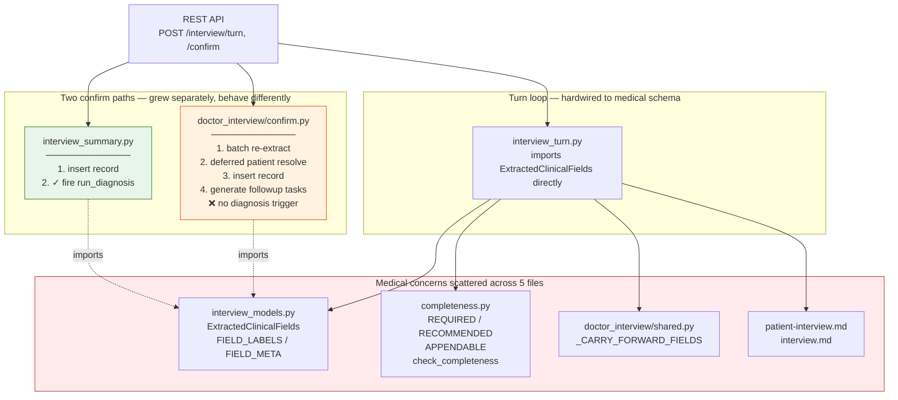
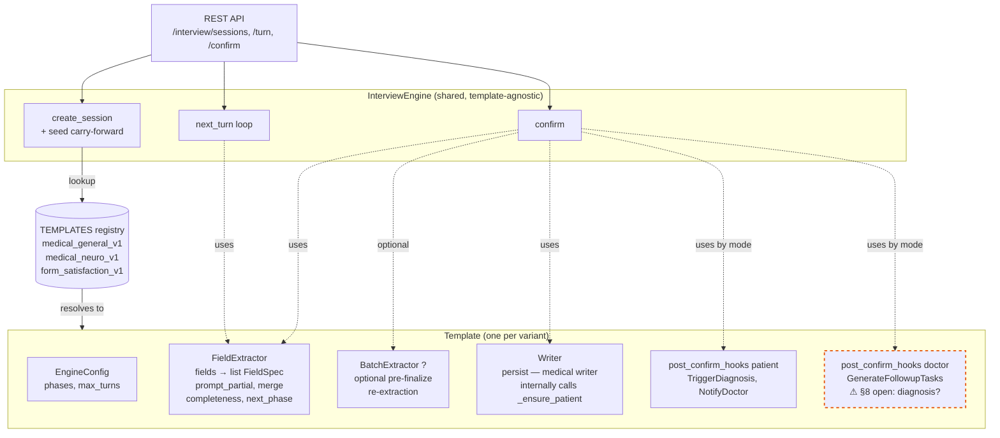
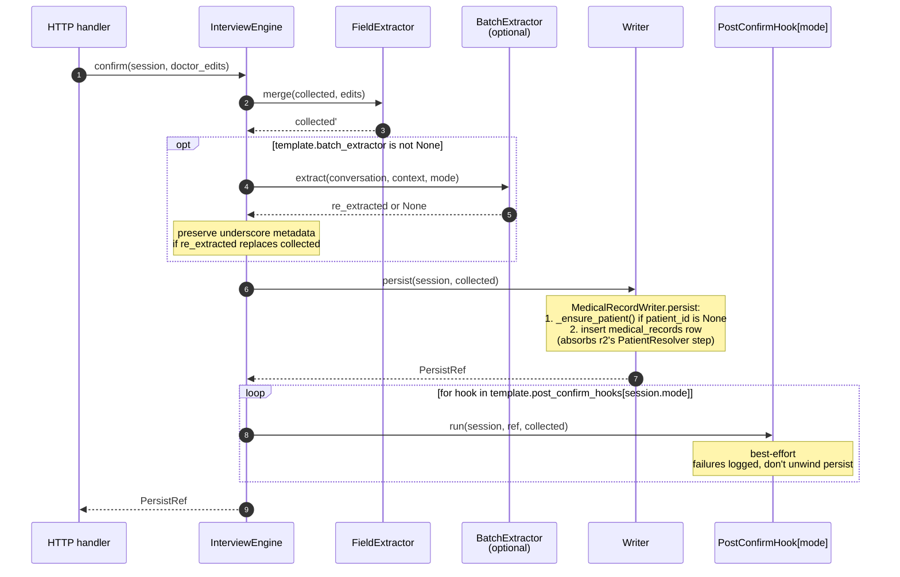

# Interview Pipeline Extensibility — Design

**Date:** 2026-04-22
**Status:** Draft (revision 3.1, FieldSpec swap)
**Scope decision:** A1 + B1 (platform-curated templates, patient-only respondents)
**Architectural direction:** Approach 3 (polymorphic pipeline with protocol-based seams)

**Revision history:**
- r1: initial design after scope brainstorm
- r2: incorporates Claude + codex review feedback. Key changes: protocol set expanded for completeness/carry-forward/batch-extract/patient-resolve; writer split into `Writer.persist()` + `PostConfirmHook` list; prompt split reframed to match real composer stack; Phase 0 expanded to include ORM/dataclass/CRUD plumbing; byte-identical snapshot claim dropped; SQL rewritten as Alembic-native; §2 factual errors corrected.
- r3: second review pass resolved 5 open questions. Key changes: `PatientResolver` folded into `MedicalRecordWriter` (one-template concern doesn't warrant a protocol); versioning adopts patch-vs-major split reusing existing `prompt_hash` infra; `preferred_template_id = NULL` becomes the "follow latest" sentinel; `abandoned` / `draft_created` statuses handled explicitly (backfill + admin_overview query update); Phase 2 re-estimated 4–6d → 8–12d; doctor-mode diagnosis trigger asymmetry flagged as explicit product-decision open item rather than quietly preserved.
- r3.1: `pydantic_model()` swapped for `fields() -> list[FieldSpec]`. Dynamic Pydantic classes per specialty would have broken IDE type-safety outside the LLM boundary while pretending to offer it; declarative field specs let specialty variants extend a list instead of override a class method. `appendable_fields()` and `carry_forward_fields()` collapse into `FieldSpec` attributes (FieldExtractor shrinks 9 methods → 5). New §3e documents the single engine helper that synthesizes the LLM structured-output contract at call time; new §7f adds explicit tests for append/carry-forward semantics (codex caveat: "don't drift into stringly-typed by accident"). Trigger: spec author asked "given fields may change per specialist, do we need pydantic_model at all?" — a reframe both earlier review rounds failed to prompt themselves to make.

---

## 1. Goals and non-goals

### Goals

- One conversational engine drives multiple interview variants: specialty-specific medical intakes (神外 / 骨科 / 心内科 / 眼科) and curated non-medical forms (术前筛查, 满意度调查).
- Isolate domain-specific concerns (field schema, prompts, persistence, post-confirm side effects) from engine-level concerns (turn mechanics, completeness evaluation, phase transitions).
- Behavior-preserving migration of the current medical interview with **no regression in the existing `reply_sim` / `interview` sim suites** and no user-visible change until a second template ships.
- Leave clean seams so future work (doctor-authored templates, non-medical tenants, new output sinks, multi-tenant SaaS) can land without re-architecting.

### Non-goals (for this spec)

- Doctor-authored templates (A3).
- Anonymous respondents (B2).
- New LLM capabilities or prompt improvements. The refactor preserves current prompt behavior; optimization is a separate effort.
- Multi-tenant SaaS (C).

---

## 2. Current state — corrected map

This section replaces r1's §2; two factual errors corrected.

### 2a. Where domain coupling lives today

| Concern | File / symbol | Notes |
|---|---|---|
| Pydantic schema of extracted fields | `src/domain/patients/interview_models.py` → `ExtractedClinicalFields`, `FIELD_LABELS`, `FIELD_META`, `_FIELD_PRIORITY` | 17 medical fields hardcoded as class attributes. |
| Completeness tiers + next-focus logic | `src/domain/patients/completeness.py` → `REQUIRED`, `SUBJECTIVE_RECOMMENDED`, `OBJECTIVE`, `ASSESSMENT`, `PLAN`, `check_completeness`, `get_completeness_state` | Mode-aware. Patient = subjective only (7 fields). Doctor = all 14. Two recommended lists. |
| Append-vs-overwrite per field | `completeness.py` → `APPENDABLE` frozenset | 11 fields accumulate across turns; 3 overwrite (`chief_complaint`, `diagnosis`, `patient_*`). |
| Carry-forward from last record | `src/channels/web/doctor_interview/shared.py:61` → `_CARRY_FORWARD_FIELDS` = (`allergy_history`, `past_history`, `family_history`, `personal_history`) | Doctor-mode only. Populates seed from prior record at session start. |
| Underscore-prefixed metadata | `_patient_name`, `_patient_gender`, `_patient_age` in `collected` | Engine-level, not medical. Used by `resolve()` for deferred patient creation. |
| Turn-level LLM call + prompt stack | `src/agent/prompt_composer.py:79`, `src/agent/prompt_config.py:40` | Composed as `base + (domain) + intent + patient_context + history + (KB/persona)`. **Patient mode** loads domain + KB; **doctor mode** skips KB. |
| Prompt files | `src/agent/prompts/intent/patient-interview.md`, `interview.md` | Two separate intent-layer prompts. Semantics diverge materially. |
| Per-turn state machine | `src/domain/patients/interview_turn.py` | Wraps LLM call, updates `collected`, appends to `conversation`, increments `turn_count`, decides status. |
| Per-turn field patch validation | `src/channels/web/doctor_interview/turn.py:202` | Only `_CARRY_FORWARD_FIELDS` can be patched via the field-edit endpoint. |
| Doctor-mode confirm path | `src/channels/web/doctor_interview/confirm.py` | Does: (1) batch re-extract from full transcript (LLM call #2); (2) preserve underscore metadata; (3) deferred patient creation via `resolve()`; (4) record insert; (5) follow-up task generation. **Does NOT fire diagnosis pipeline.** |
| Patient-mode confirm path | `src/domain/patients/interview_summary.py:280` | Inserts record, then fires `run_diagnosis()` via `safe_create_task`. This is where the diagnosis trigger lives. |
| Batch re-extraction LLM call | `src/domain/patients/interview_summary.py` → `batch_extract_from_transcript` | A second LLM call at confirm time that re-parses the full conversation. Used by both confirm paths. |

### 2b. Summary

The session DB row is already schema-agnostic (JSON `collected` + `conversation`). The coupling lives in seven places above, not three. Any refactor that touches only schema + prompt + persistence will hit at least three hidden medical assumptions before shipping a second template.

---

## 3. Core abstractions (expanded)

All new code lives under `src/domain/interview/`.

### 3a. Protocols

```python
# domain/interview/protocols.py

class FieldSpec(BaseModel):
    """Declarative per-field metadata. Constrained vocabulary — do not extend
    without widening the engine's schema-synthesis helper (see §3e)."""
    name: str
    type: Literal["string", "text", "number", "enum"] = "string"
    description: str                                  # LLM-facing explanation
    example: str | None = None                        # few-shot anchor
    enum_values: tuple[str, ...] | None = None        # required when type == "enum"
    label: str | None = None                          # human label (defaults to name)
    tier: Literal["required", "recommended", "optional"] = "optional"
    appendable: bool = False                          # merge rule: True accumulates across turns, False overwrites
    carry_forward_modes: frozenset[Mode] = frozenset() # modes that pre-seed this field from prior record


class FieldExtractor(Protocol):
    """Per-template. Schema, prompt, merge, and completeness semantics.
    Schema lives in fields(); everything else is behavior on top of it."""
    def fields(self) -> list[FieldSpec]: ...
    def prompt_partial(self, collected: dict, history: list, phase: Phase, mode: Mode) -> str: ...
    def merge(self, collected: dict, extracted: dict) -> dict: ...   # dict in, dict out
    def completeness(self, collected: dict, mode: Mode) -> CompletenessState: ...
    def next_phase(self, session: SessionState, phases: list[Phase]) -> Phase: ...

class BatchExtractor(Protocol):
    """Optional per-template. Pre-finalize re-extraction from full transcript.
    Templates that don't need it return None; engine skips the step."""
    async def extract(self, conversation: list, context: dict, mode: Mode) -> dict | None: ...

class Writer(Protocol):
    """Per-template. Pure persistence. Does whatever a specific template's final
    write step demands. Medical writer internally handles deferred patient
    creation before insert; form writers don't need that and skip it. No
    LLM calls; no post-confirm side effects (those are hooks)."""
    async def persist(self, session: SessionState, collected: dict) -> PersistRef: ...

class PostConfirmHook(Protocol):
    """One effect per hook. Declared as a list on the template. Run after persist,
    in order, best-effort (failures logged, don't unwind the persist)."""
    name: str                                        # for logging
    async def run(self, session: SessionState, ref: PersistRef, collected: dict) -> None: ...

class Template(Protocol):
    """Registry entry. Ties everything together."""
    id: str                                          # "medical_general_v1"
    kind: Literal["medical", "form"]
    display_name: str
    requires_doctor_review: bool
    supported_modes: tuple[Mode, ...]                # e.g. ("patient", "doctor") for medical_general
    phases: dict[Mode, list[Phase]]                  # patient has 2 phases; doctor has 1
    extractor: FieldExtractor
    batch_extractor: BatchExtractor | None
    writer: Writer
    post_confirm_hooks: dict[Mode, list[PostConfirmHook]]   # per-mode; repeat same list for both modes if asymmetry isn't needed
    config: EngineConfig

class InterviewEngine:
    """Template-agnostic. One instance serves every template."""
    def __init__(self, llm: LLMClient): ...
    async def next_turn(self, session: SessionState, user_input: str) -> TurnResult: ...
    async def confirm(self, session: SessionState, doctor_edits: dict) -> PersistRef: ...
```

### 3b. Responsibility split

| Concern | Owner |
|---|---|
| Turn budget, append `conversation`, status transitions | `InterviewEngine` |
| Turn-level anti-repetition rules | `InterviewEngine` shared system text |
| Field declarations (schema, tiers, append, carry-forward, labels, examples) | `FieldExtractor.fields() -> list[FieldSpec]` — single source of truth |
| LLM structured-output contract synthesis from `fields()` | Engine helper `build_response_schema()` (see §3e) |
| Completeness evaluation (`can_complete`, `missing`, `next_focus`) | `FieldExtractor.completeness()` |
| Carry-forward seeding from prior record | Engine, driven by `[f for f in fields() if mode in f.carry_forward_modes]` |
| Phase selection | `FieldExtractor.next_phase` over `Template.phases[mode]` |
| Intent-layer prompt partial | `FieldExtractor.prompt_partial` |
| Batch re-extraction at confirm | `BatchExtractor` (optional) |
| Deferred patient creation | `MedicalRecordWriter._ensure_patient()` — private method called before insert |
| DB insert | `Writer.persist` |
| Diagnosis pipeline, task generation, notifications | Individual `PostConfirmHook`s |

This split directly addresses review concerns: writer stops smuggling orchestration, completeness/carry-forward get real seams, batch re-extraction and patient resolve are explicit steps instead of being buried in confirm, and `FieldSpec` makes per-template schema variation a data problem rather than a class-inheritance problem.

### 3c. Prompt composition — what actually happens

Reframing to match `prompt_composer.py`: the template does **not** own the full prompt. The runtime composition stays:

```
base (engine-agnostic system text)
  + optional domain layer
  + intent-layer prompt partial  ← this is what FieldExtractor.prompt_partial returns
  + patient_context
  + conversation history
  + optional KB / persona
```

What changes: `intent-layer prompt partial` stops being a hardcoded file path (`patient-interview.md`) and becomes `template.extractor.prompt_partial(collected, history, phase, mode)`. Mode selects the right prompt file inside the extractor — for `medical_general_v1` that's still two files, just now owned by the extractor class.

What does **not** change: `base`, `domain`, `patient_context`, history, KB/persona injection. The engine's shared turn mechanics live in `base`, not in a new `shared_rules()` helper.

### 3d. Visual overview

**Today's architecture — medical coupling scattered across 5 files, two asymmetric confirm paths:**



**What the diagram makes visible:**

- "Medical" isn't one module — it's *scattered* across `interview_models.py`, `completeness.py`, `doctor_interview/shared.py`, and two prompt files. Any new template would have to fork or monkey-patch five places.
- The turn loop in `interview_turn.py` imports `ExtractedClinicalFields` directly. There's no abstraction boundary.
- Two confirm paths live in different files and do *different things*. The asymmetry (no diagnosis trigger on doctor confirm) is archaeological, not designed — captured as the §8 open product question.
- Patient-mode (green) fires diagnosis. Doctor-mode (orange) does not. Both insert records, but with different side-effect graphs.

**After r3 — shared engine + per-template protocols:**



**The confirm flow (the part that changed most between r1 → r2 → r3):**



**Reading the diagrams:**

- The engine is one class; the template is a bag of plugs. Everything a new specialty needs (fields, prompt, completeness rules, hook list) is inside the `Template` box. Nothing bleeds into the engine.
- The dashed orange border on doctor-mode hooks is the §8 open question — it's the only asymmetry left in the design, and it's flagged for human resolution.
- In r2, step 5 of the sequence was a separate `PatientResolver.resolve` call boxed outside the writer. r3 collapses that into `Writer.persist` — the note above the Writer participant makes the seam explicit but it's no longer a protocol-level concern.
- The `opt` block around `BatchExtractor` captures that form templates skip the re-extraction step entirely; only medical templates currently need it.

### 3e. LLM contract synthesis

Templates declare fields; they do **not** own a Pydantic class. The engine centralizes the "turn `fields()` into whatever this LLM provider needs" logic in exactly one helper:

```python
# domain/interview/contract.py

def build_response_schema(fields: list[FieldSpec]) -> type[BaseModel]:
    """Build a throwaway Pydantic class for validating an LLM structured-output
    response. Called once per LLM call, discarded after the response is parsed
    into a dict. Template authors never see the class."""
    attrs = {}
    for f in fields:
        py_type = _SPEC_TO_PY_TYPE[f.type]          # str, int, Enum[...]
        if f.tier != "required":
            py_type = py_type | None
        attrs[f.name] = (py_type, Field(None, description=f.description))
    return create_model("ExtractedFields", **attrs)
```

**Ground rules (codex review caveat — don't drift):**

- `FieldSpec.type` vocabulary is frozen to `string | text | number | enum`. Widening requires a PR to `contract.py` + a matching test. No ad-hoc types, no "just use string and parse it downstream".
- Exactly one helper. Every provider adapter (OpenAI `response_format`, Groq Instructor, OpenRouter, etc.) calls `build_response_schema` and never invents its own synthesis path.
- The class is throwaway. It's created per LLM call, used to validate, and the result is converted to `dict` before leaving the call site. Nothing downstream imports or references the generated class.
- Validation lives here. If the LLM returns a malformed value, `pydantic.ValidationError` is caught at this boundary, logged, and the engine falls back to "keep previous `collected`" (existing behavior). Template code sees only validated dicts.

**Why this is safer than what we had:** the old `FieldExtractor.pydantic_model()` method leaked the Pydantic class into the protocol surface. That invited callers to `isinstance(extracted, ExtractedClinicalFields)` or type-hint against it, which would have silently broken the moment a specialty variant produced a different dynamic class. Now there is one place Pydantic exists, and no template author can accidentally depend on its identity.

---

## 4. Data model changes

### 4a. Alembic migration (SQLite + MySQL compatible)

```python
# alembic/versions/NNNN_interview_template_id.py
def upgrade():
    # interview_sessions.template_id — default fills existing rows, then NOT NULL
    op.add_column(
        "interview_sessions",
        sa.Column("template_id", sa.String(64), nullable=False,
                  server_default="medical_general_v1"),
    )
    op.create_index("ix_interview_template", "interview_sessions", ["template_id"])

    # doctors.preferred_template_id — nullable
    op.add_column(
        "doctors",
        sa.Column("preferred_template_id", sa.String(64), nullable=True),
    )

    # form_responses — new table
    op.create_table(
        "form_responses",
        sa.Column("id", sa.Integer, primary_key=True, autoincrement=True),
        sa.Column("doctor_id", sa.String(64),
                  sa.ForeignKey("doctors.doctor_id", ondelete="CASCADE"),
                  nullable=False),
        sa.Column("patient_id", sa.Integer,
                  sa.ForeignKey("patients.id", ondelete="CASCADE"),
                  nullable=False),
        sa.Column("template_id", sa.String(64), nullable=False),
        sa.Column("session_id", sa.String(36),
                  sa.ForeignKey("interview_sessions.id", ondelete="SET NULL"),
                  nullable=True),
        sa.Column("payload", sa.JSON, nullable=False),
        sa.Column("status", sa.String(16), nullable=False, server_default="draft"),
        sa.Column("created_at", sa.DateTime, nullable=False, server_default=sa.func.now()),
        sa.Column("updated_at", sa.DateTime, nullable=False, server_default=sa.func.now()),
    )
    op.create_index("ix_form_response_doctor_patient_template",
                    "form_responses", ["doctor_id", "patient_id", "template_id"])
    op.create_index("ix_form_response_patient_template_created",
                    "form_responses", ["patient_id", "template_id", "created_at"])

def downgrade():
    op.drop_index("ix_form_response_patient_template_created", "form_responses")
    op.drop_index("ix_form_response_doctor_patient_template", "form_responses")
    op.drop_table("form_responses")
    op.drop_column("doctors", "preferred_template_id")
    op.drop_index("ix_interview_template", "interview_sessions")
    op.drop_column("interview_sessions", "template_id")
```

Using `server_default` + `NOT NULL` in a single `add_column` collapses the "add nullable → backfill → alter to not null" dance into one atomic step for both SQLite and MySQL. Existing rows get `medical_general_v1` automatically.

`status` is a plain `String(16)` with check-constraint at the application layer; avoids MySQL ENUM / SQLite-compat mismatch.

### 4b. Template registry

```python
# domain/interview/templates/__init__.py
TEMPLATES: dict[str, Template] = {
    "medical_general_v1":   GeneralMedicalTemplate(),
    # "medical_neuro_v1":     NeuroTemplate(),
    # "form_satisfaction_v1": SatisfactionTemplate(),
}

def get_template(template_id: str) -> Template:
    if template_id not in TEMPLATES:
        raise UnknownTemplate(template_id)
    return TEMPLATES[template_id]
```

**No `Template.version` attribute** — version lives in the id suffix, single source of truth.

### 4c. Template selection at session creation

Precedence unchanged from r1: explicit param → `doctors.preferred_template_id` → `medical_general_v1`.

### 4d. Versioning policy

Templates have two change magnitudes. Hard-versioned identity (`_v<n>` suffix on the id) is reserved for changes that actually break session reproducibility. Everything else lands in-place on the current id and is tracked via `prompt_hash`.

| Change type | Bumps id? | Tracked how? |
|---|---|---|
| Prompt hint / wording polish — extraction behavior unchanged | No | `prompt_hash` stamped on the session row at each turn (infrastructure already shipped in commit `8367a4a4`). Audit trail reconstructs exact prompt from hash. |
| Prompt change that alters extraction behavior (observable in sim delta) | **Yes** (`_v<n>` → `_v<n+1>`) | New registry entry; old entry kept until retirement. |
| Extractor logic change (field add/remove/rename, merge rule, appendable set) | **Yes** | Schema change. |
| `EngineConfig.phases` change | **Yes** | Alters state machine. |
| `post_confirm_hooks` list change | **Yes** | Alters side effects per session. |
| Bug fix in shared engine paths (`InterviewEngine`, `prompt_composer`) | No | Engine is not versioned; fixes land once. |

**Operational rule:** if a change would make two sessions with the same `template_id` produce materially different behavior, bump the id. Prompt word-smithing with no behavior shift gets a `prompt_hash` log entry — not a new version.

**`preferred_template_id` resolution (NULL-as-sentinel):**

Schema stays a single nullable `VARCHAR(64)`. Semantics:

- `NULL` means "follow the current default for this doctor's specialty" — resolved at session-create time, not stored. Default today is `medical_general_v1`; tomorrow it might be `medical_general_v2` or `medical_neuro_v1` depending on specialty mapping.
- A concrete value (`medical_general_v1`, `medical_neuro_v1`, etc.) means "this doctor explicitly chose this template" — engine honors it verbatim and never auto-migrates.

Onboarding MUST write `NULL` unless the doctor actively picks a non-default template from a real chooser UI. Writing `medical_general_v1` on every signup breaks auto-migration silently — treat this as a requirement on the onboarding wizard.

**Auto-migration on version bump:** when `medical_general_v2` ships, nothing changes in the `doctors` table. Doctors with `NULL` pick up v2 at their next session. Doctors with explicit `medical_general_v1` keep using v1 until they manually update. No bulk UPDATE script needed.

**Retirement:** a template id is safe to remove from the registry once (a) no `doctors.preferred_template_id` references it, and (b) 90 days pass with zero in-flight (`status != confirmed`) sessions referencing it.

### 4e. Read-back endpoints

- `GET /api/patients/{patient_id}/form_responses?template_id=...` — list (ownership-gated on `doctor_id` from auth).
- `GET /api/form_responses/{id}` — detail (ownership-gated).
- Medical-kind read paths unchanged.

---

## 5. Runtime flow

### 5a. Session lifecycle

```
create → interviewing → (optional) reviewing → confirmed
                             ↑ skipped when requires_doctor_review=False
         interviewing → abandoned   (user cancels; terminal, no hooks fire)
```

The current enum has 5 values: `interviewing, reviewing, confirmed, abandoned, draft_created`. Treatment in the new engine:

- `interviewing`, `reviewing`, `confirmed` — primary lifecycle (above).
- `abandoned` — kept. Set by `confirm.py:201` and `patient_interview_routes.py:214` when the user cancels. Terminal state. The new engine treats it read-only: no turns, no hooks, can be listed but not mutated.
- `draft_created` — **retired**. It was set by a legacy doctor-side "save as draft" flow that no longer exists; the only live reader is `admin_overview.py:145` (`_completed_statuses = ("confirmed", "draft_created")` for the 7-day hero metric). The Phase 0 Alembic migration backfills `UPDATE interview_sessions SET status='confirmed' WHERE status='draft_created'`, and the Python enum drops the value. `admin_overview.py:145` is updated in the same PR to `_completed_statuses = ("confirmed",)`.

### 5b. Session creation seeds carry-forward

At session create, engine:

1. Creates `InterviewSessionDB` row with `template_id`, empty `collected`/`conversation`, `mode`.
2. If template has `requires_doctor_review` (medical) and patient has prior records, engine iterates `template.extractor.fields()` for fields where `mode in carry_forward_modes` and pre-populates `collected` with those field values from the patient's latest record.
3. Returns session_id + first AI greeting (engine drives an initial LLM turn with empty user input).

### 5c. Turn loop (corrected for appendable + mode)

```python
async def next_turn(session, user_input):
    template = get_template(session.template_id)
    phase = template.extractor.next_phase(session, template.phases[session.mode])

    # Intent-layer partial slots into the existing prompt_composer stack.
    intent_partial = template.extractor.prompt_partial(
        collected=session.collected,
        history=session.conversation,
        phase=phase,
        mode=session.mode,
    )

    # Synthesize the LLM response schema from the template's field list.
    # build_response_schema is the single canonical helper (see §3e).
    response_schema = build_response_schema(template.extractor.fields())

    llm_out = await llm.chat(
        **compose_prompt(
            intent_partial=intent_partial,
            session=session,
            mode=session.mode,
            response_schema=response_schema,
        )
    )

    # Merge with per-field append vs overwrite semantics (derived from FieldSpec.appendable)
    session.collected = template.extractor.merge(session.collected, llm_out.extracted)
    session.conversation += [user(user_input), ai(llm_out.reply, llm_out.suggestions)]
    session.turn_count += 1

    state = template.extractor.completeness(session.collected, session.mode)
    if state.can_complete or session.turn_count >= template.config.max_turns:
        session.status = "confirmed" if not template.requires_doctor_review else "reviewing"

    await save(session)
    return TurnResult(reply=llm_out.reply, suggestions=llm_out.suggestions, state=state)
```

### 5d. Confirm flow (preserves all current seams)

```python
async def confirm(session, doctor_edits):
    template = get_template(session.template_id)

    # 1. Merge doctor's last-minute edits
    collected = template.extractor.merge(session.collected, doctor_edits)

    # 2. Batch re-extraction seam (currently at confirm.py:52 for doctor mode,
    #    interview_summary.py for patient mode). Templates without it skip this step.
    if template.batch_extractor:
        context = {
            "name": collected.get("_patient_name", ""),
            "gender": collected.get("_patient_gender", ""),
            "age": collected.get("_patient_age", ""),
        }
        re_extracted = await template.batch_extractor.extract(
            session.conversation, context, session.mode,
        )
        if re_extracted:
            # Preserve engine-level underscore metadata across re-extraction
            for k, v in collected.items():
                if k.startswith("_") and k not in re_extracted:
                    re_extracted[k] = v
            collected = re_extracted

    # 3. Persistence. MedicalRecordWriter's persist() internally calls
    #    _ensure_patient() before insert (covers the deferred patient-creation
    #    seam currently at confirm.py:72). Form writers don't need it and skip.
    ref = await template.writer.persist(session, collected)

    # 5. Post-confirm hooks (best-effort, logged on failure, don't unwind persist)
    for hook in template.post_confirm_hooks[session.mode]:
        try:
            await hook.run(session, ref, collected)
        except Exception as e:
            log(f"[confirm] hook {hook.name} failed: {e}", level="warning")

    session.status = "confirmed"
    await save(session)
    return ref
```

**Hook composition for `medical_general_v1` — provisional, pending product decision (see §8):**
- `patient_mode.post_confirm_hooks`: `[TriggerDiagnosisPipelineHook(), NotifyDoctorHook()]`
- `doctor_mode.post_confirm_hooks`: `[GenerateFollowupTasksHook()]`  ← **open: should doctor-mode also fire diagnosis?**

Phase 2 preserves the current asymmetry (doctor-mode does NOT fire diagnosis, matching today's `confirm.py`). This is an archaeological split — the two confirm paths grew separately, not by design. The product question ("should a doctor's full-field dictated record also run the diagnosis pipeline?") needs to be resolved before Phase 4 (specialty variants), because each specialty template inherits its hook list from `medical_general_v1`.

`Template.post_confirm_hooks` is `dict[Mode, list[PostConfirmHook]]` to capture any asymmetry — intended or inherited. A template without mode-specific effects assigns the same list under each mode key.

### 5e. Field patch endpoint

Current: `doctor_interview/turn.py:202` allows patches only for `_CARRY_FORWARD_FIELDS`. New: the route asks `template.extractor.is_patchable_field(field)`, which defaults to returning only the carry-forward set for medical templates and can be overridden per template.

### 5f. Failure modes

| Failure | Behavior |
|---|---|
| LLM malformed extraction | Keep previous `collected`, append reply, log warning. Same as today. |
| Template id not in registry | Session becomes read-only with `UnknownTemplate` sentinel in session metadata. 90-day retirement window prevents this in normal ops. |
| `BatchExtractor.extract` fails | Log warning, proceed with per-turn `collected`. Same as today's fallback. |
| `Writer.persist` fails (includes medical `_ensure_patient` failure) | 500 to caller on infra failure; 422 on "no patient name in collected" (same as today's `confirm.py:95`). Session stays `reviewing`. |
| `PostConfirmHook` fails | Log warning. Persist is already done; confirm returns successfully. Ops can replay individual hooks via admin tool. |

---

## 6. Migration path

**Principle:** behavior-preserving refactor. Existing `reply_sim` and interview sim scenarios pass **with pass-rate delta ≤ 2%** at each phase. `reply_sim` is the backstop, not a byte-identical prompt snapshot.

### 6a. Phases (revised — Phase 0 expanded)

| Phase | Ships | Risk | Est. |
|---|---|---|---|
| **0. Skeleton + plumbing** | Alembic (from §4a) — also backfills `draft_created` → `confirmed` and updates `admin_overview.py:145`. `InterviewSessionDB.template_id` ORM field. `InterviewStatus` enum drops `draft_created`. `InterviewSession` dataclass field. `create_session` / `load_session` / `save_session` updated to read/write `template_id`. `prompt_composer` accepts a `template_id` param (default `"medical_general_v1"`). Session-create API accepts optional `template_id`. Onboarding wizard writes `preferred_template_id = NULL` (not a literal). Empty `domain/interview/` package. Still **zero** code path uses the protocols. | Low — additive but touches every session read/write. | 2–3d |
| **1. Engine extraction** | Move state machine from `interview_turn.py` into `InterviewEngine`. Introduce protocol shapes under `domain/interview/protocols.py`. Medical logic still lives in its current files, but engine now calls through typed stubs that forward to current code. | Low-medium — internal rename behind a thin indirection layer. | 3–4d |
| **2. Medical template extraction** | `GeneralMedicalExtractor` owns the Pydantic model, prompt partials for both modes, completeness logic (moved from `completeness.py`), appendable set, carry-forward set. `MedicalBatchExtractor` wraps `batch_extract_from_transcript`. `MedicalRecordWriter.persist` does the minimal record insert, calls private `_ensure_patient()` before insert (absorbs deferred patient creation from `confirm.py:72`). Existing post-confirm effects become individual hooks: `TriggerDiagnosisPipelineHook`, `GenerateFollowupTasksHook`, `NotifyDoctorHook`. Register `TEMPLATES["medical_general_v1"]`. Engine dispatches all work through the protocols. `completeness.py` and `doctor_interview/shared.py` become thin shims that re-export from the template. | **High** — simultaneously untangles `completeness.py`, `confirm.py`, `interview_models.py`; absorbs two asymmetric confirm paths with different underscore-metadata handling; sim tests (LLM-backed, noisy at ±2%) are the only safety net. | **8–12d** |
| **3. First form template** | `form_satisfaction_v1` end-to-end: extractor, prompt partial, `FormResponseWriter.persist` + list/detail API, minimal doctor-side UI to view responses. Proves the seams hold. | Low — isolated. | 3–5d |
| **4. Specialty variants** | `medical_neuro_v1`, `medical_ortho_v1`, … subclasses of `GeneralMedicalExtractor` overriding fields/prompt deltas. | Per-template. | 0.5–1d each |

### 6b. Backwards-compat shim

Direct references to `ExtractedClinicalFields`, `FIELD_LABELS`, `FIELD_META`, `check_completeness`, `get_completeness_state`, `_CARRY_FORWARD_FIELDS` exist in: diagnosis pipeline, record handlers, `doctor_interview/turn.py`, various serializers. During Phase 2:

```python
# src/domain/patients/interview_models.py (thin shim, deleted after one release)
import warnings
from domain.interview.templates.medical_general import GeneralMedicalTemplate

warnings.warn(
    "interview_models symbols are re-exported from medical_general template; "
    "import from domain.interview.templates.medical_general directly.",
    DeprecationWarning,
    stacklevel=2,
)

from domain.interview.contract import build_response_schema

_t = GeneralMedicalTemplate()
_fields = _t.extractor.fields()
ExtractedClinicalFields = build_response_schema(_fields)        # same Pydantic shape as today
FIELD_LABELS = {f.name: f.label or f.name for f in _fields}
FIELD_META   = {f.name: {"hint": f.description,
                         "example": f.example,
                         "tier": f.tier} for f in _fields}
```

Same pattern for `completeness.py` and `doctor_interview/shared.py` (carry-forward). Shims deleted after one release.

### 6c. What stays untouched

- Patient-side UX (InterviewPage, ChatTab).
- Doctor-side interview review UI (Phase 3 adds a lightweight form-response view).
- `reply_sim` / `run_reply_sim` scripts — keep running against `medical_general_v1`.
- WeCom / WeChat mini-app handlers.

---

## 7. Testing strategy (revised)

### 7a. Behavior-preservation bar

Replace the byte-identical-snapshot claim with **semantic-equivalence via sim pass rate**:

- Tier-2 reply_sim scenarios: baseline pass rate captured on main before Phase 1 lands.
- Every phase must keep pass-rate delta within ±2% of baseline.
- Diagnosis prompt sniff tests (existing `test_diagnosis_prompt_sniff.py`) must stay green.
- Patient-interview eval scenarios (if any) must stay green.

### 7b. Template-level tests

`parametrize_templates` fixture runs a 5-turn scripted conversation against every registered template and asserts:

- `collected` non-empty after turn 1.
- `reply` within reasonable bounds.
- `suggestions` length in [2, 4].
- `completeness(collected, mode)` returns a `CompletenessState` with expected shape.
- At confirm, the right hooks fire (mock each hook, assert `.run` called in order).

### 7c. Writer isolation tests

For each writer: round-trip through `persist`, read back via API, assert payload shape. Writers are unit-tested without any engine involvement.

### 7d. Hook isolation tests

Each `PostConfirmHook` tested in isolation with a minimal fake `PersistRef`. Failures in one hook don't affect others in the chain.

### 7e. New-template gate

Before a new template lands in `TEMPLATES`:

- ≥3 sim scenarios: happy path, mid-abandonment, edge case.
- Writer integration test.
- Prompt partials committed for review.

### 7f. FieldSpec semantic tests (codex caveat — anti-drift)

With field metadata living in a declarative list, it's easy for `appendable` and `carry_forward_modes` to go stringly-typed and silently misbehave. Dedicated tests per registered template:

- **Append semantics:** for every `FieldSpec` with `appendable=True`, simulate two turns where the LLM returns partial text; assert the final `collected[field.name]` contains both turn fragments joined. For `appendable=False`, assert turn-2 overwrites turn-1.
- **Carry-forward semantics:** for every `FieldSpec` with `carry_forward_modes ∋ mode`, create a session with a prior record containing that field; assert the session's initial `collected` is pre-seeded. For modes not in the set, assert no seeding.
- **Required-tier completeness:** `completeness(collected, mode).can_complete` must be `False` until all `tier == "required"` fields are non-empty; must be `True` once they are.
- **Contract synthesis stability:** `build_response_schema(template.extractor.fields())` produces a stable (hashable) output; no unintended variance across calls.

Runs as part of `parametrize_templates`. Failures are fail-gate for shipping a new template.

---

## 8. Open risks and deferred items

- **DOCTOR-MODE DIAGNOSIS TRIGGER (OPEN PRODUCT DECISION).** Today's doctor confirm path does not fire the diagnosis pipeline; patient confirm does. This asymmetry is archaeological — the two paths grew separately in `confirm.py` and `interview_summary.py`, not by design. Phase 2 preserves it. Before Phase 4 (specialty variants ship), the product owner must decide: (a) keep as-is (doctor records are "trusted" and don't need AI diagnosis), (b) unify (both modes fire diagnosis), or (c) make it template-configurable (some specialties want it, others don't). Defaulting to (a) by inaction is how archaeology accumulates; flagged here to force a decision.
- **Template retirement window** — 90-day zero-sessions rule needs an abandoned-session janitor. Spec commits to adding it as part of Phase 2.
- **Phase config expressivity** — linear phase lists. No branching ("if pregnant → pregnancy phase"). Defer until needed.
- **Prompt duplication across specialty variants** — once 2+ specialty variants exist, consider a prompt-fragment library. Defer.
- **Form-kind UI placement** — where form responses live in the doctor UI (patient timeline? separate tab? MyAI cards?) is a product decision, out of scope.
- **Hook ordering guarantees** — hooks run in declared order, best-effort. If we later need transactionality across hooks, that's a pipeline redesign; spec defers.
- **Mid-flow version upgrade** — if a template version bumps during an in-flight session (e.g. v1 → v2), the session stays on v1. Spec commits to **never hot-swapping template_id** on an existing session.

---

## 9. Summary of decisions

| Decision | Value |
|---|---|
| Scope | A1 + B1 |
| Approach | 3 — polymorphic pipeline with protocol-based seams |
| Protocol set | `FieldExtractor` (5 methods), `BatchExtractor` (optional), `Writer`, `PostConfirmHook`, `Template`. Deferred patient creation is a private method on `MedicalRecordWriter`. |
| Field schema declaration | `FieldExtractor.fields() -> list[FieldSpec]`. No dynamic Pydantic classes per template. Specialty variants extend the list. |
| LLM structured-output contract | Single engine helper `build_response_schema(fields)` (see §3e). Throwaway Pydantic class per LLM call; invisible to template authors. Vocabulary frozen to `string / text / number / enum`. |
| Template storage | Static Python registry, version suffixed in id; no `Template.version` attribute |
| Prompt composition | Existing `prompt_composer` stack preserved; only the intent-layer partial becomes template-owned |
| Completeness logic | Moves from `completeness.py` into `FieldExtractor.completeness` (mode-aware) |
| Appendable / carry-forward | Attributes on `FieldSpec`, not separate methods. Derivable from `fields()`. Guarded by dedicated tests (§7f). |
| Batch re-extraction at confirm | Preserved as `BatchExtractor` protocol (optional per template) |
| Deferred patient creation | Private `_ensure_patient()` on `MedicalRecordWriter`, called before insert. Not a separate protocol (one-template concern). |
| Writer scope | Template-scoped persistence. No LLM calls, no post-confirm side effects. Diagnosis pipeline / task generation / notifications are individual `PostConfirmHook`s. |
| Mode handling | Modes are first-class parameter on extractor methods and phases; `medical_general_v1` covers both patient and doctor modes; hooks can differ per mode |
| Patient vs doctor asymmetry (Phase 2) | Preserved provisionally: patient hooks = `[TriggerDiagnosis, NotifyDoctor]`; doctor hooks = `[GenerateFollowupTasks]`. **Flagged in §8 as an open product decision — must be resolved before Phase 4.** |
| Per-template review gate | `requires_doctor_review: bool`; medical True by default |
| Form respondent | Always an existing `patients.id` (B1) |
| Form storage | New `form_responses` table (Alembic, SQLite-compatible) |
| Existing sessions | Backfilled to `medical_general_v1` via `server_default` on ADD COLUMN |
| Behavior-preservation proof | sim pass-rate delta ≤ 2% (not byte-identical snapshot) |
| Versioning policy | Patch-versioning for prompt wording changes that don't alter extraction (tracked via `prompt_hash` on session rows — infra from commit `8367a4a4`). Major bump (`_v<n>`) for schema / phases / hooks / extraction-behavior changes. |
| `preferred_template_id` resolution | NULL-as-sentinel: NULL = follow current default; concrete value = locked. Onboarding wizard must write NULL unless the doctor actively picks. Auto-migration happens via resolution, not via bulk UPDATE. |
| Session statuses | `interviewing / reviewing / confirmed / abandoned` kept. `draft_created` retired — Phase 0 migration backfills to `confirmed`, drops enum value, updates `admin_overview.py:145`. |
| SQL migration style | Alembic ops with SQLAlchemy generic types (no MySQL-specific MODIFY/ENUM/JSON) |
| Phase 2 realism | **8–12 working days** (not 4–6d). Biggest untangle of the project — completeness, confirm paths, and `interview_models.py` move simultaneously with only sim tests as safety net. |
