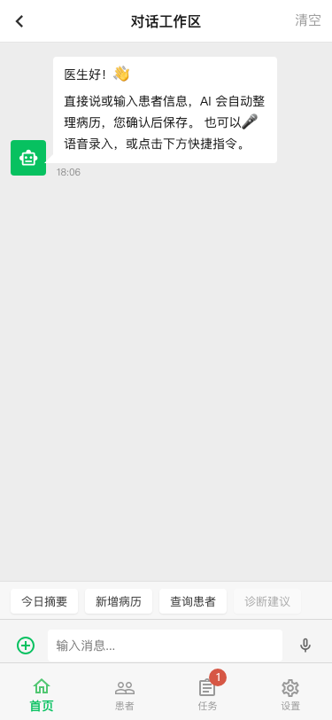
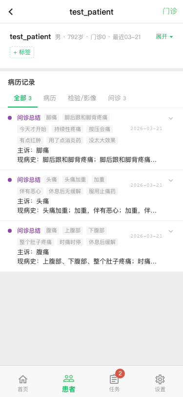
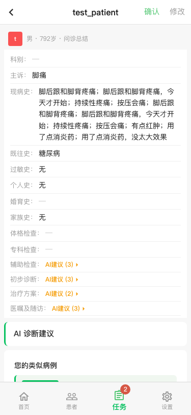
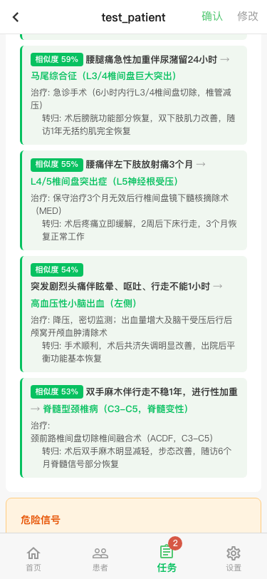
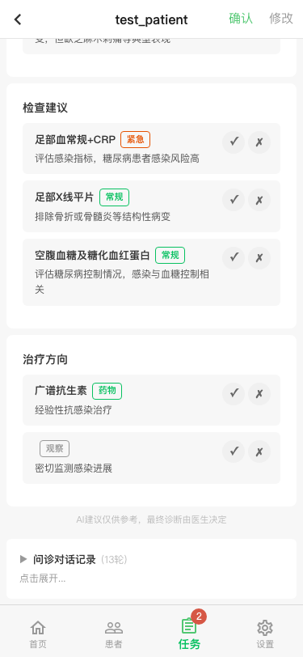
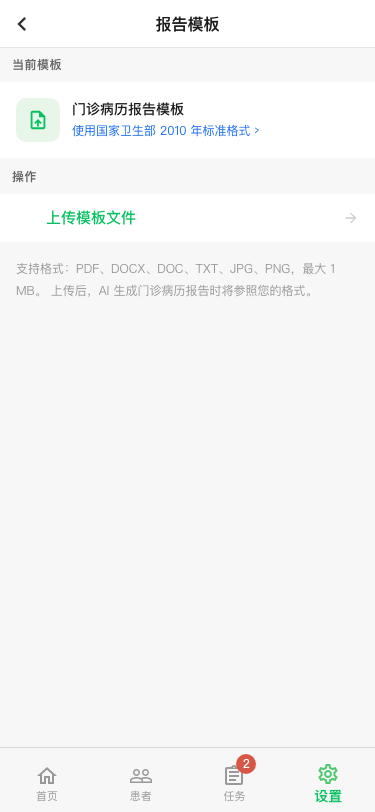
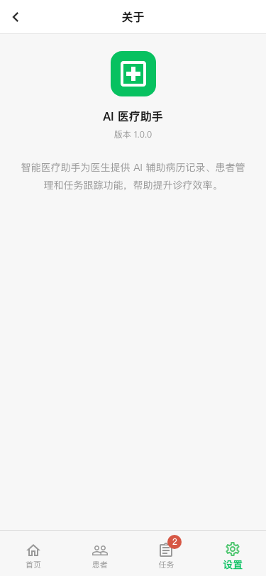

# UI Checkpoint — 2026-03-21

Captured after: P1.5 doctor training surfaces, UI restructure, design system (TYPE/ICON tokens), URL-based routing.

HTML files use iframe phone-frame wrapper (375x812) for mobile views. Open in browser to view.

## Doctor (Mobile 375x812)

| Page | Route | HTML | Screenshot |
|---|---|---|---|
| 首页 (Briefing) | `/doctor` | [html](doctor-home.html) |  |
| AI 助手 (Chat) | `/doctor/chat` | [html](doctor-chat.html) |  |
| 患者列表 | `/doctor/patients` | [html](doctor-patients.html) |  |
| 患者详情 | `/doctor/patients/:id` | [html](doctor-patient-detail.html) |  |
| 任务 | `/doctor/tasks` | [html](doctor-tasks.html) |  |
| 审核+AI诊断 (top) | `/doctor/tasks/review/:id` | [html](doctor-review-diagnosis.html) |  |
| 审核+AI诊断 (鉴别诊断) | ↑ scrolled | — |  |
| 审核+AI诊断 (检查+治疗) | ↑ scrolled | — |  |
| 设置 | `/doctor/settings` | [html](doctor-settings.html) |  |
| 报告模板 | `/doctor/settings/template` | [html](doctor-settings-template.html) |  |
| 知识库 | `/doctor/settings/knowledge` | [html](doctor-settings-knowledge.html) |  |
| 关于 | `/doctor/settings/about` | [html](doctor-settings-about.html) |  |

## Doctor (Desktop 1280x720)

| Page | Route | HTML | Screenshot |
|---|---|---|---|
| 首页 | `/doctor` | [html](doctor-home-desktop.html) |  |
| 患者 | `/doctor/patients` | [html](doctor-patients-desktop.html) |  |
| 任务 | `/doctor/tasks` | [html](doctor-tasks-desktop.html) |  |
| 设置 | `/doctor/settings` | [html](doctor-settings-desktop.html) |  |
| 知识库 | `/doctor/settings/knowledge` | [html](doctor-knowledge-desktop.html) |  |

## Patient (Mobile 375x812)

| Page | Route | HTML | Screenshot |
|---|---|---|---|
| 主页 (Chat + Quick Actions) | `/patient/chat` | [html](patient-home.html) |  |
| 病历 | `/patient/records` | [html](patient-records.html) |  |
| 任务 | `/patient/tasks` | [html](patient-tasks.html) |  |
| 设置 | `/patient/profile` | [html](patient-settings.html) |  |

## Login

| View | Route | HTML | Screenshot |
|---|---|---|---|
| Mobile | `/login` | [html](login.html) |  |
| Desktop | `/login` | [html](login-desktop.html) |  |

## What's in this build

- 4-tab navigation: 首页/患者/任务/设置 (doctor), 主页/病历/任务/设置 (patient)
- Centralized TYPE (7 text levels) + ICON (8 icon levels) from theme.js
- URL-based subpage routing (survives refresh)
- Knowledge base: categorized accordion, add form, case library
- Patient interview with suggestion chips
- ListCard pattern across all list views
- PageSkeleton layout (desktop 3-column, mobile fullscreen)
- SubpageHeader for drill-down navigation
- DiagnosisSection with per-item confirm/reject in review flow
- Review detail: structured fields + AI suggestion chips + diagnosis + conversation history

## File structure

- `{name}.html` — iframe wrapper with phone frame (open in browser)
- `{name}_raw.html` — raw DOM snapshot (loaded inside iframe)
- `{name}-mobile.png` / `{name}-desktop.png` — screenshot
