# UI Checkpoint — 2026-03-21

Captured after: P1.5 doctor training surfaces, UI restructure, design system (TYPE/ICON tokens), URL-based routing.

## Doctor (Mobile 375x812)

| Page | Screenshot |
|---|---|
| 首页 (Home/Briefing) | 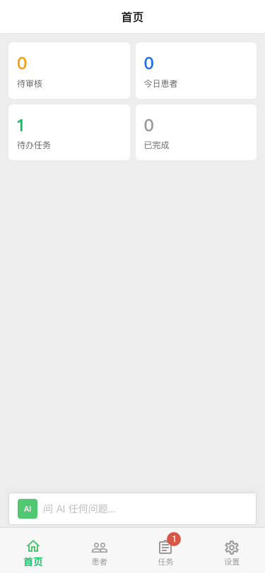 |
| 患者 (Patients) | 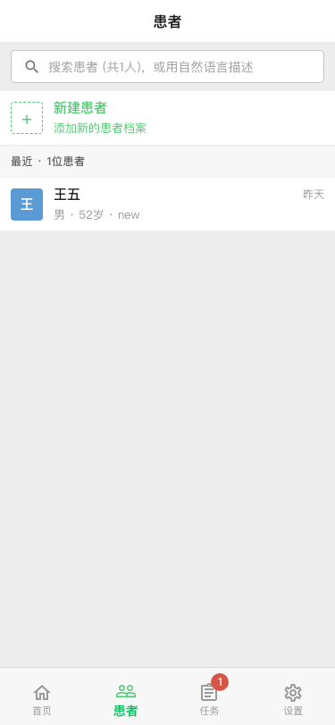 |
| 任务 (Tasks) | 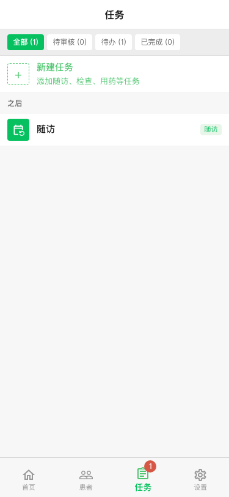 |
| 设置 (Settings) | 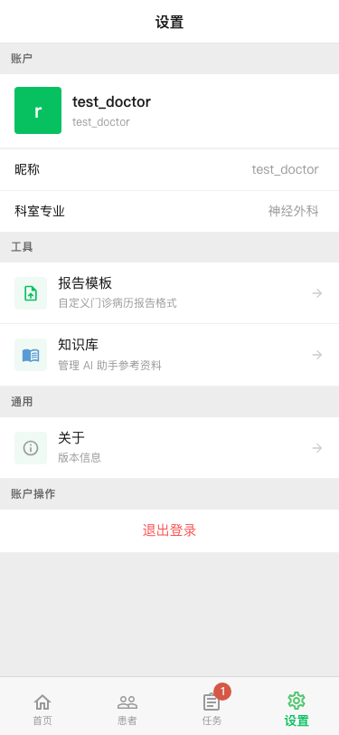 |
| 知识库 (Knowledge Base) | 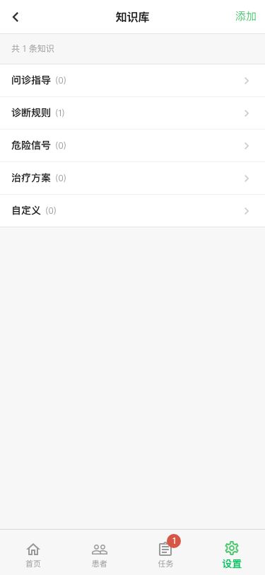 |

## Doctor (Desktop 1280x720)

| Page | Screenshot |
|---|---|
| 首页 (Home/Briefing) | 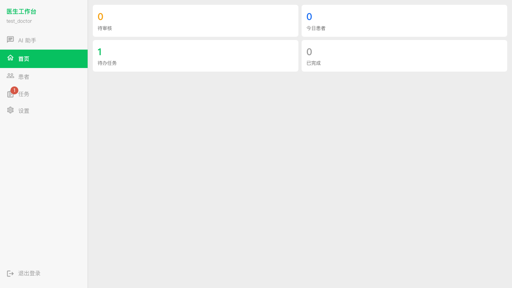 |
| 患者 (Patients) | 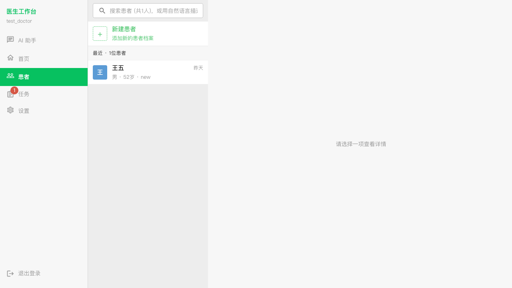 |
| 任务 (Tasks) | 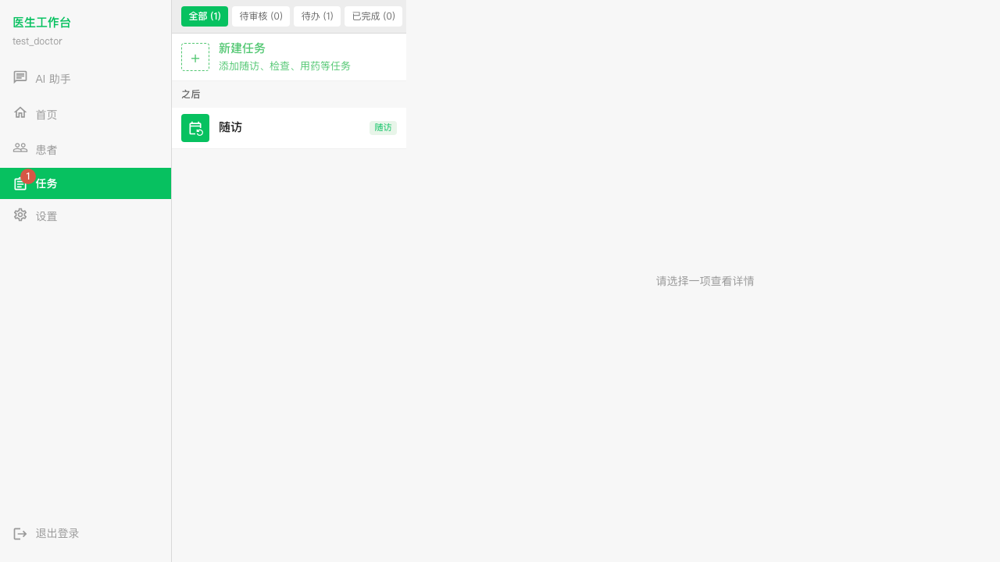 |
| 设置 (Settings) | 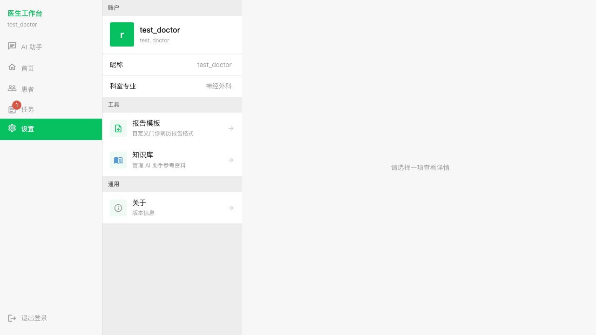 |
| 知识库 (Knowledge Base) | 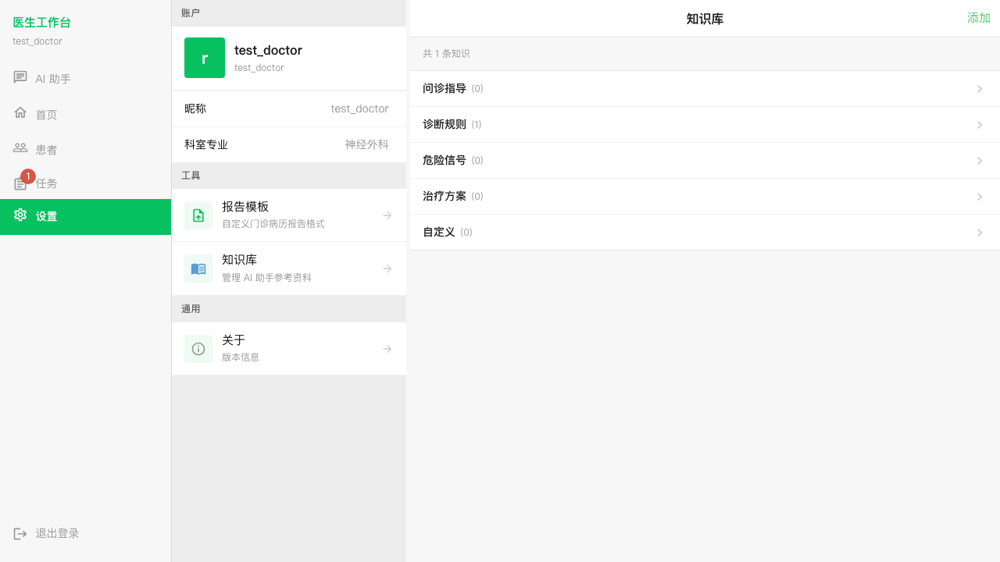 |

## Patient (Mobile 375x812)

| Page | Screenshot |
|---|---|
| 主页 (Home + Quick Actions) |  |
| 病历 (Records) |  |
| 任务 (Tasks) |  |
| 设置 (Settings/Profile) | 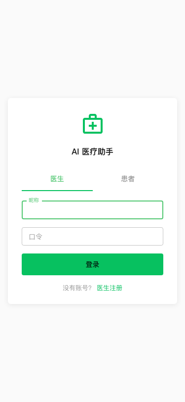 |

## Login

| View | Screenshot |
|---|---|
| Mobile |  |
| Desktop | 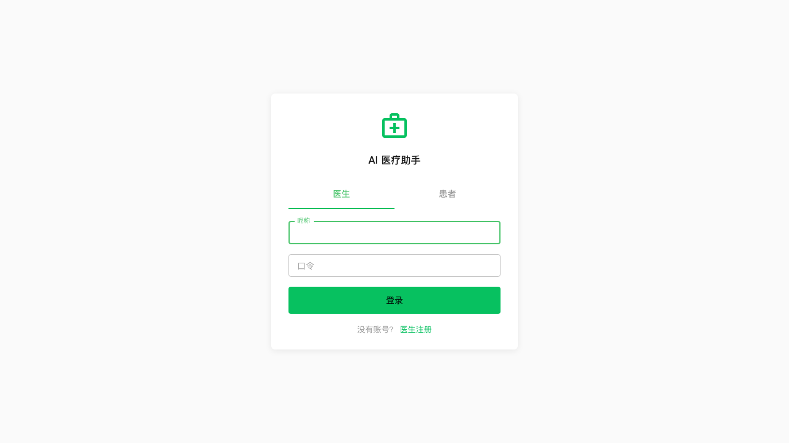 |

## What's in this build

- 4-tab navigation: 首页/患者/任务/设置 (doctor), 主页/病历/任务/设置 (patient)
- Centralized TYPE (7 text levels) + ICON (8 icon levels) from theme.js
- URL-based subpage routing (survives refresh)
- Knowledge base: categorized accordion, add form, case library
- Patient interview with suggestion chips
- ListCard pattern across all list views
- PageSkeleton layout (desktop 3-column, mobile fullscreen)
- SubpageHeader for drill-down navigation
