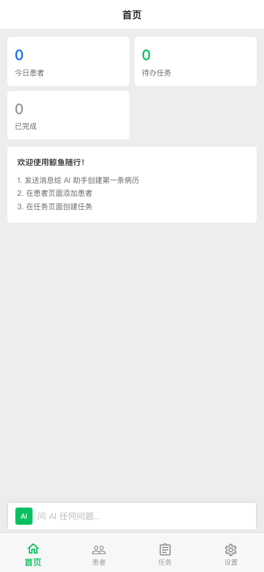
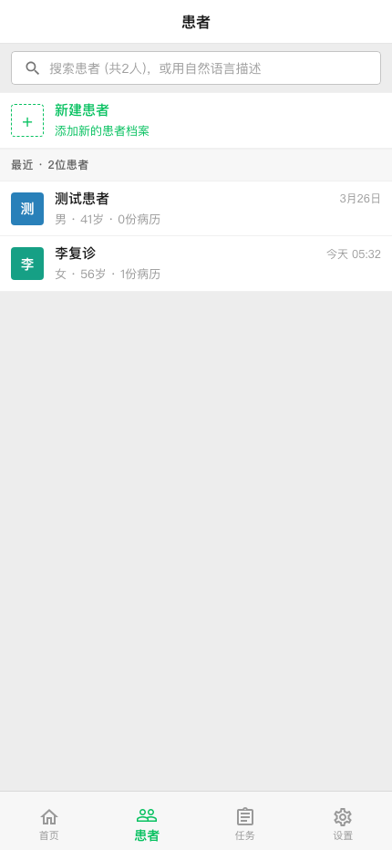
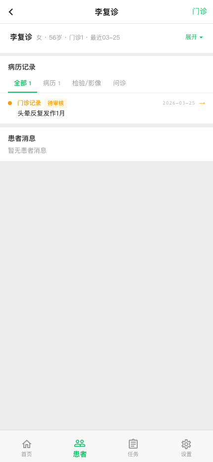
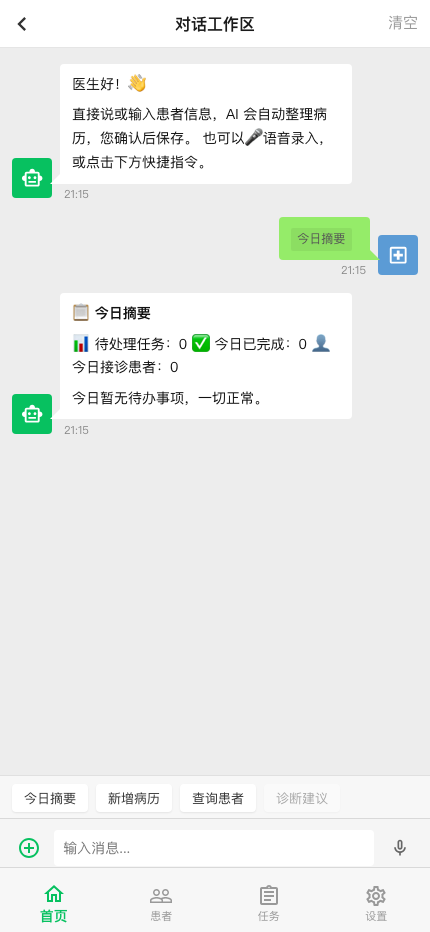
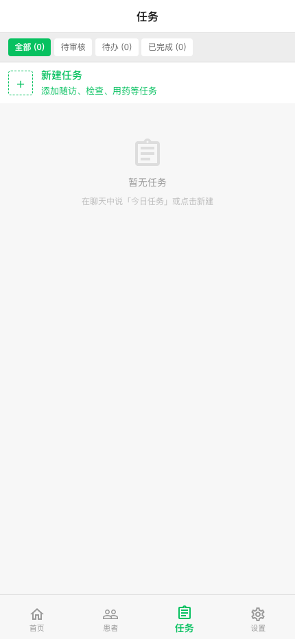
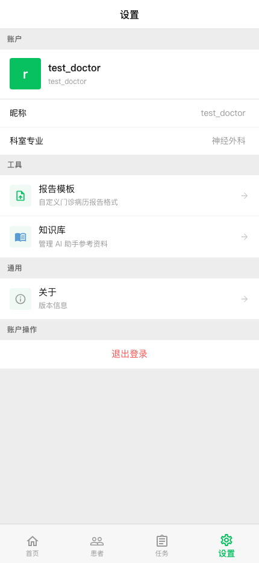
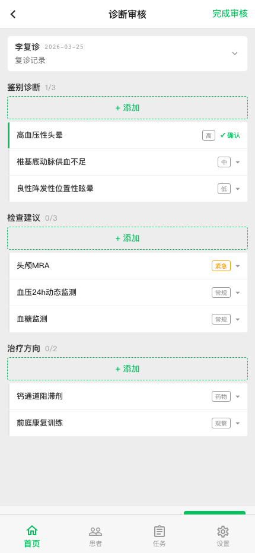
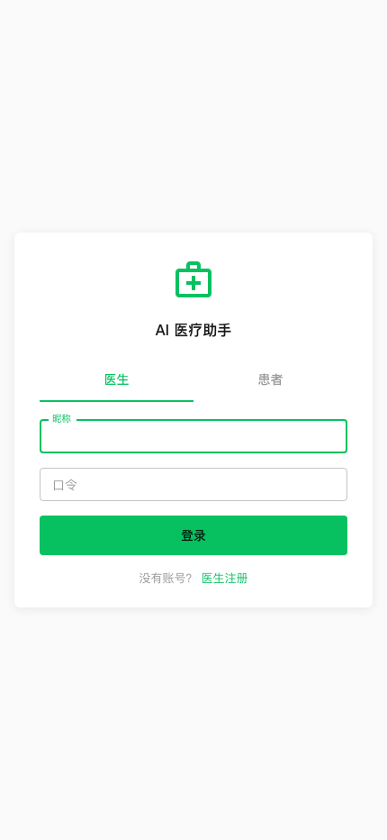
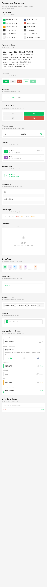

# UI Design Principles & Component Guide

> Source of truth for all frontend visual and interaction decisions.
> Read this before creating or modifying any UI component.

## Quick Reference — Component File Map

### App Shell
| Component | File | Purpose |
|-----------|------|---------|
| MobileFrame | [`src/App.jsx`](src/App.jsx) | Phone-shaped container for desktop |
| DoctorPage | [`src/pages/DoctorPage.jsx`](src/pages/DoctorPage.jsx) | Doctor app shell (top bar + content + nav) |
| PatientPage | [`src/pages/PatientPage.jsx`](src/pages/PatientPage.jsx) | Patient portal shell |
| LoginPage | [`src/pages/LoginPage.jsx`](src/pages/LoginPage.jsx) | Unified login (doctor/patient tabs) |

### Top Bar & Navigation
| Component | File | Purpose |
|-----------|------|---------|
| SubpageHeader | [`src/pages/doctor/SubpageHeader.jsx`](src/pages/doctor/SubpageHeader.jsx) | ‹ back + title + action |
| BarButton | [`src/components/BarButton.jsx`](src/components/BarButton.jsx) | Top bar text action button |
| MobileBottomNav | [`src/pages/DoctorPage.jsx`](src/pages/DoctorPage.jsx) | 4-tab bottom navigation |

### Layout & Structure
| Component | File | Purpose |
|-----------|------|---------|
| PageSkeleton | [`src/components/PageSkeleton.jsx`](src/components/PageSkeleton.jsx) | Page layout wrapper (list + detail) |
| SectionLabel | [`src/components/SectionLabel.jsx`](src/components/SectionLabel.jsx) | Section header label (12px/600) |
| EmptyState | [`src/components/EmptyState.jsx`](src/components/EmptyState.jsx) | Centered "暂无XX" placeholder |

### Buttons & Actions
| Component | File | Purpose |
|-----------|------|---------|
| AppButton | [`src/components/AppButton.jsx`](src/components/AppButton.jsx) | Content-level button (primary/secondary/danger) |
| CancelConfirm | [`src/components/CancelConfirm.jsx`](src/components/CancelConfirm.jsx) | Two-step cancel popup (确認\|返回) |

### Content Components
| Component | File | Purpose |
|-----------|------|---------|
| ListCard | [`src/components/ListCard.jsx`](src/components/ListCard.jsx) | List row (avatar + title + subtitle) |
| NewItemCard | [`src/components/NewItemCard.jsx`](src/components/NewItemCard.jsx) | "+" dashed new item row |
| RecordCard | [`src/pages/doctor/RecordCard.jsx`](src/pages/doctor/RecordCard.jsx) | Expandable medical record card |
| DiagnosisCard | [`src/pages/doctor/DiagnosisCard.jsx`](src/pages/doctor/DiagnosisCard.jsx) | Collapsible diagnosis review card |

### Page-Level Components
| Component | File | Purpose |
|-----------|------|---------|
| BriefingSection | [`src/pages/doctor/BriefingSection.jsx`](src/pages/doctor/BriefingSection.jsx) | Home tab: stats + onboarding |
| ChatSection | [`src/pages/doctor/ChatSection.jsx`](src/pages/doctor/ChatSection.jsx) | AI chat with quick commands |
| PatientsSection | [`src/pages/doctor/PatientsSection.jsx`](src/pages/doctor/PatientsSection.jsx) | Patient list + detail drill-down |
| PatientDetail | [`src/pages/doctor/PatientDetail.jsx`](src/pages/doctor/PatientDetail.jsx) | Patient profile + records + actions |
| TasksSection | [`src/pages/doctor/TasksSection.jsx`](src/pages/doctor/TasksSection.jsx) | Task list with filter chips |
| SettingsSection | [`src/pages/doctor/SettingsSection.jsx`](src/pages/doctor/SettingsSection.jsx) | Profile, tools, knowledge base |
| ReviewPage | [`src/pages/doctor/ReviewPage.jsx`](src/pages/doctor/ReviewPage.jsx) | Diagnosis review subpage |
| InterviewView | [`src/pages/doctor/InterviewView.jsx`](src/pages/doctor/InterviewView.jsx) | Doctor interview (chat + fields) |
| InterviewCompleteDialog | [`src/pages/doctor/InterviewCompleteDialog.jsx`](src/pages/doctor/InterviewCompleteDialog.jsx) | NHC preview + save/diagnose popup |

### Theme & Tokens
| File | Purpose |
|------|---------|
| [`src/theme.js`](src/theme.js) | `TYPE`, `ICON`, `COLOR` tokens + MUI theme |
| [`src/api.js`](src/api.js) | All API functions |
| [`src/store/doctorStore.js`](src/store/doctorStore.js) | Auth state (Zustand) |
| [`src/pages/doctor/constants.jsx`](src/pages/doctor/constants.jsx) | Labels, enums, field definitions |

---

## Page Screenshots

All screenshots at 430x932 (iPhone 14 Pro resolution).

### Doctor Views

| Home | Patients | Patient Detail |
|------|----------|---------------|
|  |  |  |

| Chat | Tasks | Settings |
|------|-------|----------|
|  |  |  |

| Diagnosis Review | Login |
|-----------------|-------|
|  |  |

---

## 1. Overall Design Philosophy

### Identity

WeChat-native medical assistant. The app should feel like a professional
extension of WeChat — familiar to Chinese smartphone users, not a foreign
SaaS product. Every interaction should feel like messaging a trusted assistant.

### Core Principles

1. **Function over decoration** — No visual element without purpose. If it
   doesn't help the doctor treat patients faster, remove it.
2. **Flat and clean** — No shadows, no gradients, no 3D effects. WeChat flat
   design: white cards on gray backgrounds, hairline borders, text hierarchy
   through size and weight only.
3. **Mobile-first, mobile-only (for now)** — All views render as mobile layout.
   Desktop shows a phone-shaped frame. Optimize for one-thumb operation.
4. **Scan, don't read** — Doctors have 30 seconds per patient. Use brief labels
   for scanning (card titles), full text for reading (expanded detail).
   Collapse by default, expand on tap.
5. **Safety through layout** — Destructive actions (delete) always on the left,
   constructive actions (save, confirm) always on the right. Red for danger,
   green for go. No exceptions.
6. **Consistent density** — Clinical data is dense. Use compact spacing (4px
   base unit) but never sacrifice tap targets (min 44px touch area).
7. **Chinese-first** — All UI text in Chinese. Preserve medical abbreviations
   (CT, MRI, NIHSS). No English UI labels except technical identifiers.

### What We Don't Do

- No skeleton screens for fast loads (<200ms) — show content directly
- No toast notifications for expected outcomes — only for errors and
  async completions
- No modal dialogs unless blocking is intentional (delete confirmation,
  interview complete choice)
- No hover effects — this is a touch-first UI
- No animations except page transitions and loading spinners
- No color for color's sake — gray is the default, color = meaning

---

## 2. Platform & Frame

### MobileFrame

Desktop browsers render the app inside a phone-shaped container:

```
┌─────────────── viewport ───────────────┐
│                                         │
│         ┌───────────────┐               │
│         │   Phone App   │               │
│         │   (9:19.5)    │               │
│         │               │               │
│         │               │               │
│         └───────────────┘               │
│                                         │
│         #e8e8e8 background              │
└─────────────────────────────────────────┘
```

- Ratio: 9:19.5 (modern phone).
- **Constraint-driven sizing** — uses CSS `min()` to pick whichever dimension
  would cause overflow:
  - Wide screen → height is constraint, width = `95vh * 9/19.5`
  - Short screen → width is constraint, height = `90vw * 19.5/9`
  - Always maintains phone proportions regardless of viewport shape.
- `transform: translateZ(0)` creates a containing block so `position: fixed`
  elements stay inside the frame.
- Rounded corners: `16px border-radius`. Subtle shadow: `0 4px 24px rgba(0,0,0,0.12)`.
- On actual mobile (<520px viewport): full screen, no frame, no rounding.

### Breakpoint Override

`theme.js` sets `sm: 9999` so all `useMediaQuery(down("sm"))` returns `true`.
This forces mobile layout everywhere. To enable desktop layout later, revert
`sm` to `600` and remove MobileFrame wrapping.

---

## 3. Three-Component Page Architecture

Every page is composed of exactly 3 components stacked vertically:

```
┌─────────────────────────────────────┐
│          TOP BAR (48px)             │  Fixed. Navigation + 1 action.
├─────────────────────────────────────┤
│                                     │
│          CONTENT (flex: 1)          │  Scrollable. Different per page.
│                                     │
├─────────────────────────────────────┤
│       BOTTOM NAVIGATION (64px)      │  Fixed. 4 tabs. Always visible.
└─────────────────────────────────────┘
```

No page deviates from this structure. Top bar and bottom nav are shared
chrome. Only the content area changes between pages.

---

### 3A. Top Bar

**Purpose:** Where am I, how to go back, what's the one action here.

```
┌─────────────────────────────────────┐
│  ‹       Title Text          Action │  48px
└─────────────────────────────────────┘
```

| Element | Rule |
|---------|------|
| **Background** | White `#fff`, border-bottom `0.5px solid #d9d9d9` |
| **Height** | 48px |
| **Back (‹)** | Chevron only, no text. 44x48px tap area. Present on subpages, hidden on root tabs. |
| **Title** | `TYPE.title` (16px/600), centered. Page name or patient name. |
| **Action** | Max 1 BarButton. Max 2 Chinese characters. Green `#07C160`, `TYPE.action` (15px/400). |
| **No icons** | Text-only. Icons belong in content area. |
| **Overflow** | If 2+ actions needed, put extras in content area. |

**Per-page examples:**

| Page | ‹ | Title | Action |
|------|---|-------|--------|
| 首页 | — | 首页 | — |
| 患者 | — | 患者 | — |
| 患者详情 | ‹ | 李复诊 | 门诊 |
| 对话 | ‹ | 对话工作区 | 清空 |
| 诊断审核 | ‹ | 诊断审核 | 完成 |
| 新建病历 | ‹ | 新建病历 | 46% |
| 任务 | — | 任务 | — |
| 设置 | — | 设置 | — |

---

### 3B. Content Area

**Purpose:** The doctor's workspace. Different per page. Always scrollable,
always has 64px bottom padding to clear the nav.

**Each page defines its own content layout.** There is no single content
template. The shared rules (cards, spacing, components) are in sections 4-6.

**Per-page content structure:**

| Page | Screenshot | Layout |
|------|-----------|--------|
| **首页** |  | Stat cards (2-col grid) → onboarding hint card → AI chat entry bar |
| **患者** |  | Search bar → "新建患者" card → patient list rows |
| **患者详情** |  | Collapsible profile → record tabs → record cards → 患者消息 |
| **对话** |  | Chat bubbles → quick command chips → input bar + mic |
| **诊断审核** |  | Record summary → diagnosis sections → sticky bottom bar |
| **新建病历** | (interview) | Progress bar → conversation → carry-forward → input bar |
| **任务** |  | Filter chips → "新建任务" card → task list |
| **设置** |  | Profile → tools (模板, 知识库) → general → 退出登录 |

**Shared content rules:**

1. White cards on gray `#ededed` background, 8px gap between cards
2. Stack vertically — no columns, no grids
3. Bottom clearance: always `pb: 64px`
4. Sticky bars (e.g., review bottom bar) sit above bottom nav, never overlapping

---

### 3C. Bottom Navigation

**Purpose:** One tap to any section. Always visible.

```
┌─────────────────────────────────────┐
│   🏠       👥       📋       ⚙️    │  64px
│   首页     患者     任务     设置    │  + safe-area-inset
└─────────────────────────────────────┘
```

| Rule | Detail |
|------|--------|
| **Position** | `absolute` (not fixed — contained by MobileFrame) |
| **Background** | `#f7f7f7`, border-top `0.5px solid #d9d9d9` |
| **Height** | 64px + `env(safe-area-inset-bottom)` |
| **Active** | Green icon + text `#07C160`, fontWeight 600 |
| **Inactive** | Gray icon + text `#999` |
| **Labels** | 10px (MUI default) |
| **Badge** | Red dot + count on 任务 when pending |
| **Visibility** | Always visible. No exceptions. |

**Tab mapping:**

| Tab | Active when viewing |
|-----|-------------------|
| 首页 | home, chat |
| 患者 | patient list, patient detail, review |
| 任务 | task list, task detail |
| 设置 | settings, subpages |

---

## 4. Color System

### Semantic Colors

| Color | Hex | Meaning | Where |
|-------|-----|---------|-------|
| **Green** | `#07C160` | Positive, primary, active, go | Buttons, nav, confirm, links |
| **Red** | `#D65745` | Destructive, danger | Delete only. Never for emphasis. |
| **Amber** | `#F59E0B` | Attention, pending, modified | 待审核 badge, edited items, 紧急 urgency |
| **Accent blue** | `#576B95` | Secondary action, info | Edit (✎ 修改), WeChat link style |
| **Gray** | `#999` | Neutral, inactive, metadata | Timestamps, labels, disabled |

### Background Colors

| Surface | Hex | Where |
|---------|-----|-------|
| Page background | `#ededed` | Behind all cards |
| Card background | `#ffffff` | All content cards |
| Bottom bar / surface | `#f7f7f7` | Nav bar, action bars |
| Rejected/dimmed | `#fafafa` | Rejected diagnosis items |

### Text Colors

| Level | Hex | Usage |
|-------|-----|-------|
| `text1` | `#1A1A1A` | Names, headings, primary content |
| `text2` | `#333333` | Body text, field values |
| `text3` | `#666666` | Descriptions, reasoning text |
| `text4` | `#999999` | Labels, metadata, timestamps, section headers |

### Border Colors

| Type | Hex | Usage |
|------|-----|-------|
| Card border | `#E5E5E5` | Around cards, between major sections |
| Hairline divider | `#f0f0f0` | Between rows inside a card |
| Top bar border | `#d9d9d9` | Bottom of top bar, top of bottom nav |

---

## 5. Typography System

Import from `theme.js`. **Never hardcode font sizes.**

```jsx
import { TYPE, ICON, COLOR } from "../../theme";
```

| Token | Size/Weight | Usage |
|-------|------------|-------|
| `TYPE.title` | 16px/600 | Page titles, top bar |
| `TYPE.action` | 15px/400 | Top bar actions, patient name in compact header |
| `TYPE.heading` | 14px/600 | Section titles, form labels |
| `TYPE.body` | 14px/400 | Content text, button labels |
| `TYPE.secondary` | 13px/400 | Descriptions, field labels, action buttons |
| `TYPE.caption` | 12px/400 | Metadata, timestamps, counters |
| `TYPE.micro` | 11px/500 | Badges, tags, status pills |

### Icon Sizes (`ICON`)

| Token | Size | Usage |
|-------|------|-------|
| `xs` | 13px | Inline tiny (sort arrows) |
| `sm` | 16px | Action button icons, inline icons |
| `md` | 18px | List item icons, expand/collapse |
| `lg` | 20px | Nav icons, settings row icons |
| `xl` | 22px | Quick action cards |
| `xxl` | 24px | Detail header icons |
| `hero` | 28px | SubpageHeader back chevron |
| `display` | 48px | Empty state icons |

---

## 6. Component Patterns

> **Live showcase:** Visit [`/debug/components`](http://localhost:5173/debug/components)
> to see all components rendered in isolation.
> Source: [`src/pages/ComponentShowcase.jsx`](../../frontend/web/src/pages/ComponentShowcase.jsx)
>
> 

### Buttons

**File:** [`src/components/AppButton.jsx`](../../frontend/web/src/components/AppButton.jsx), [`src/components/BarButton.jsx`](../../frontend/web/src/components/BarButton.jsx)

| Type | Style | Where |
|------|-------|-------|
| **BarButton** | Plain text, green, 15px | Top bar only |
| **Primary button** | Green fill, white text | One per screen max |
| **Secondary button** | Gray border, dark text | Cancel, secondary actions |
| **Text button** | No background, colored text | Inline actions (删除, 编辑) |
| **Disabled** | `opacity: 0.4` or `color: #ccc` | Loading, conditions unmet |

**Action button placement:** destructive left, constructive right. Always.

```
[删除 (red)]  ───── spacer ─────  [编辑 (green)]
```

### Collapsible Profile

**File:** [`src/pages/doctor/PatientDetail.jsx`](../../frontend/web/src/pages/doctor/PatientDetail.jsx) (`CollapsibleProfile`)

*See live: [`/debug/components`](http://localhost:5173/debug/components)*

- Collapsed: one-line summary ("李复诊 女·56岁·门诊1") + "展开 ▾"
- Expanded: demographics grid + stats + action bar (删除 left, 导出 right)
- Toggle: `TYPE.caption` (12px), green. Entire row tappable.

### List Rows

**File:** [`src/components/ListCard.jsx`](../../frontend/web/src/components/ListCard.jsx)

*See live: [`/debug/components`](http://localhost:5173/debug/components)*

- Height: 48-56px
- Avatar (36px) + title (`TYPE.body`) + subtitle (`TYPE.secondary`, `#999`)
- Right: timestamp (`TYPE.caption`) or chevron
- Tap target: full row width

### Record Card

**File:** [`src/pages/doctor/RecordCard.jsx`](../../frontend/web/src/pages/doctor/RecordCard.jsx)

*See live: [`/debug/components`](http://localhost:5173/debug/components)*

- Collapsed: type label (colored) + chief complaint preview + date
- Expanded: NHC field rows (label-value, 13px) + 删除/编辑 action bar
- Field rows: label (`60px min, #999`) + value (`#333`), separated by `1px #f0f0f0`
- Same field layout used in: profile demographics, interview preview, review summary

### Diagnosis Review Card

**File:** [`src/pages/doctor/DiagnosisCard.jsx`](../../frontend/web/src/pages/doctor/DiagnosisCard.jsx)

| Collapsed | Expanded |
|-----------|----------|
| *See live showcase* | *See live showcase* |

5 states indicated by 3px left border:

| State | Border | Right label |
|-------|--------|-------------|
| Unreviewed | `#ddd` solid | ▾ chevron |
| Confirmed | `#07C160` solid | ✓ 确认 (green) |
| Rejected | `#e5e5e5` solid | ✗ 排除 (dimmed, strike-through) |
| Edited | `#F59E0B` solid | ✎ + 已改 badge |
| Doctor-added | `#07C160` dashed | 补充 badge |

- Collapsed: ~44px. Name + badge + status.
- Expanded: detail text + action row (`✓ 确认 | ✗ 排除 | ✎ 修改`)
- "+ 添加": **top of section**, dashed green border

### Settings Rows

**File:** [`src/pages/doctor/SettingsSection.jsx`](../../frontend/web/src/pages/doctor/SettingsSection.jsx)

*See live: [`/debug/components`](http://localhost:5173/debug/components)*

- Icon (colored square) + title + subtitle + chevron (→)
- Grouped by section labels (账户, 工具, 通用, 账户操作)

### Empty State

**File:** [`src/components/EmptyState.jsx`](../../frontend/web/src/components/EmptyState.jsx)

*See live: [`/debug/components`](http://localhost:5173/debug/components)*

- Centered icon (48px, `#ccc`) + "暂无XX" (`TYPE.body`) + hint (`TYPE.caption`, `#999`)
- **Show** when guidance helps user act
- **Hide** when empty section adds no value

### Badges / Status Pills

- Outlined: `border: 0.5px solid; border-radius: 3px; padding: 0 5px`
- Font: `TYPE.micro` (11px/500)
- Red: 急诊. Amber: 紧急/待审核/已修改. Gray: everything else

### Filter Chips

**File:** [`src/pages/doctor/TasksSection.jsx`](../../frontend/web/src/pages/doctor/TasksSection.jsx)

- Active: green fill + white text
- Inactive: gray border + gray text
- Used in: task list (全部/待审核/待办/已完成), record tabs (全部/病历/检验/问诊)

### ActionButtonPair

**File:** [`src/components/ActionButtonPair.jsx`](../../frontend/web/src/components/ActionButtonPair.jsx)

- Cancel + confirm two-button row for dialog footers
- Usage: `<ActionButtonPair onCancel={fn} onConfirm={fn} confirmLabel="保存" />`
- `danger` prop turns confirm button red

### AskAIBar

**File:** [`src/components/AskAIBar.jsx`](../../frontend/web/src/components/AskAIBar.jsx)

- Sticky floating "问 AI 任何问题..." entry bar on home page
- Green AI icon + gray placeholder text. Taps navigate to chat.

### BottomSheet

**File:** [`src/components/BottomSheet.jsx`](../../frontend/web/src/components/BottomSheet.jsx)

- Swipe-up panel overlay (~85% screen). Dark backdrop.
- Swipe down or tap backdrop to close.
- Used for: mobile dialogs, pickers, action menus.

### DetailCard

**File:** [`src/components/DetailCard.jsx`](../../frontend/web/src/components/DetailCard.jsx)

- Compact key-value card for short-field detail views
- Title heading + label-value rows. Used in task detail, knowledge detail.

### DoctorBubble

**File:** [`src/components/DoctorBubble.jsx`](../../frontend/web/src/components/DoctorBubble.jsx)

- Doctor reply message bubble in patient chat
- Shows doctor name + timestamp + message content

### ErrorBoundary

**File:** [`src/components/ErrorBoundary.jsx`](../../frontend/web/src/components/ErrorBoundary.jsx)

- React error boundary. Wraps each section in DoctorPage.
- Shows fallback UI on crash instead of blank screen.

### NewItemCard

**File:** [`src/components/NewItemCard.jsx`](../../frontend/web/src/components/NewItemCard.jsx)

- Dashed "+" card for creating new items
- Used at top of: patient list ("新建患者"), task list ("新建任务"), record list ("新建病历")

### PageSkeleton

**File:** [`src/components/PageSkeleton.jsx`](../../frontend/web/src/components/PageSkeleton.jsx)

- Unified page layout wrapper. Handles: SubpageHeader, list/detail split, mobile subpage override.
- Props: `title`, `headerRight`, `listPane`, `detailPane`, `mobileView`

### RecordAvatar

**File:** [`src/components/RecordAvatar.jsx`](../../frontend/web/src/components/RecordAvatar.jsx)

- Colored icon for record type (visit=green, lab=purple, imaging=blue, etc.)
- Shared by doctor and patient views.

### RecordFields

**File:** [`src/components/RecordFields.jsx`](../../frontend/web/src/components/RecordFields.jsx)

- Renders NHC structured fields as label-value rows
- Used in: record card, interview preview dialog, review page summary

### SectionLabel

**File:** [`src/components/SectionLabel.jsx`](../../frontend/web/src/components/SectionLabel.jsx)

- Small gray group header: 12px/600, `#666`
- Examples: "账户", "工具", "最近 · 5位患者"

### StatusBadge

**File:** [`src/components/StatusBadge.jsx`](../../frontend/web/src/components/StatusBadge.jsx)

- Inline colored pill badge for status/category labels
- Props: `label`, `colorMap` (maps label to color)
- Examples: 高/中/低 confidence, 急诊/紧急/常规 urgency

### SuggestionChips

**File:** [`src/components/SuggestionChips.jsx`](../../frontend/web/src/components/SuggestionChips.jsx)

- Floating quick-reply options above input bar
- Multi-select toggle. Selected chips shown as green tags in input field.
- × to dismiss entire bar. Used in: interview (AI suggestions), chat.

### TaskChecklist

**File:** [`src/components/TaskChecklist.jsx`](../../frontend/web/src/components/TaskChecklist.jsx)

- Checkbox list for patient-facing tasks
- Shows: title, subtitle, due-date badge, urgency badge, optional upload button
- Used in: patient portal tasks tab

---

## 7. Interaction Patterns

### Navigation

- **Tab tap** → switch section, no animation
- **List row tap** → push to detail (SubpageHeader with back button)
- **Back button** → pop to previous (browser history)
- **Swipe** → not used (reserved for future)

### Destructive Actions (Delete)

1. **Single tap** shows the delete text button
2. **Second tap** shows inline confirmation: "确认删除？[确认] [取消]"
3. **Third tap** on "确认" executes deletion
4. Never delete in fewer than 2 intentional taps

### Cancel / Discard (leaving unsaved work)

**Every cancel/back action that would discard user work MUST use
`CancelConfirm`** ([`src/components/CancelConfirm.jsx`](../../frontend/web/src/components/CancelConfirm.jsx)).

Two-step flow:
1. User taps cancel/back → `CancelConfirm` popup appears
2. User sees: "确认离开？未保存的内容将会丢失"
3. Two buttons: **确认** (red text, left — discard and leave) | **返回** (green fill, right — continue working)

```
┌────────────────────────┐
│     确认离开？          │
│  未保存的内容将会丢失    │
│                        │
│  [确认]      [返回]     │
│  red,left   green,right │
└────────────────────────┘
```

**When to use:** Any cancel/back that would lose unsaved data:
- Interview in progress → back button
- Record edit dialog → cancel
- Diagnosis review with unsaved decisions → back button
- Any form with user input → cancel

**When NOT to use:** Navigation that doesn't lose data:
- Browsing between tabs (no unsaved state)
- Back from read-only views (patient detail, record view)
- Closing a dialog that has no user input

### Collapsible Content

- **Tap header** → toggle expand/collapse
- **Default state**: collapsed on mobile
- **Auto-collapse**: carry-forward section collapses after all items acted on

### Auto-Save vs Manual Save

- **Diagnosis decisions** (✓/✗/✎): auto-save per item (API call on each action)
- **Record editing**: manual save (edit dialog with 保存 button)
- **Interview**: manual save (完成 button → preview dialog → 保存/保存并诊断)

### Loading States

- **Fast loads** (<200ms): show content directly, no skeleton
- **LLM calls** (5-15s): "AI 正在分析..." with animated skeleton
- **Polling**: every 3 seconds when waiting for async diagnosis results
- **Button loading**: disabled + "保存中..." text replacement

---

## 8. Rules Checklist

Before submitting any UI change, verify:

- [ ] Import `TYPE`, `ICON`, `COLOR` from theme — no hardcoded sizes or colors
- [ ] Delete on left, actions on right — everywhere
- [ ] Max 1 BarButton in top bar, max 2 characters
- [ ] Deletion requires 2-tap confirmation
- [ ] Cancel/back that discards work uses `CancelConfirm` popup (确认|返回)
- [ ] Content has bottom padding for nav clearance (`pb: 64px`)
- [ ] Sticky bars don't overlap with bottom nav
- [ ] Empty sections hidden when they add no value
- [ ] Font sizes use only the 7 `TYPE` tokens
- [ ] No shadows, no gradients — flat only
- [ ] `position: absolute` (not fixed) for elements inside MobileFrame
- [ ] Record field labels and values use same `TYPE.secondary` (13px)
- [ ] Chinese text for all UI. English for technical identifiers only.
