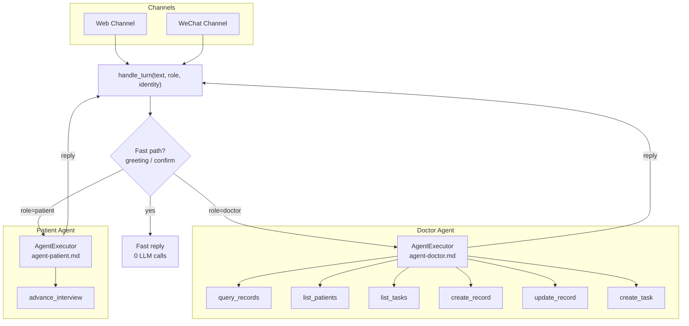
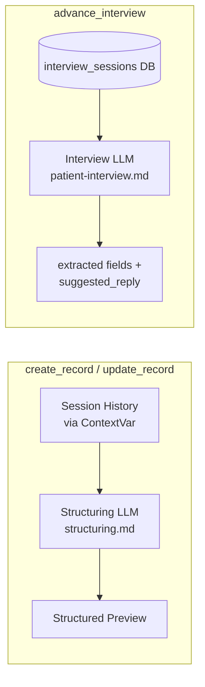
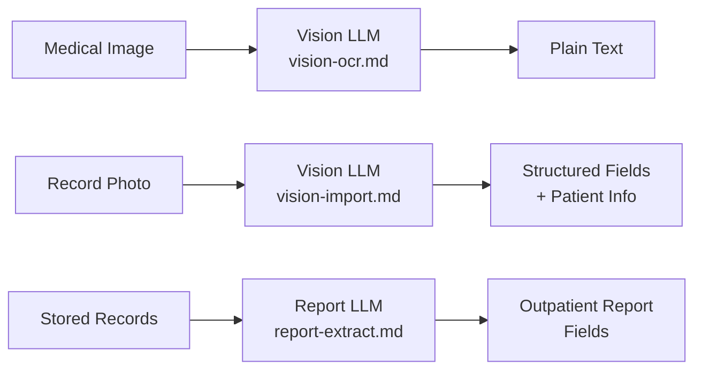

# Prompts

LLM prompt files — one `.md` file per prompt. Edit directly to tune behavior.

## How it works

- `utils/prompt_loader.py` reads files by key: `get_prompt("structuring")` → `prompts/structuring.md`
- Files are cached in memory on first read; call `invalidate()` to reload
- Agent prompts (`agent-doctor.md`, `agent-patient.md`) are loaded by `build_prompt(role)` and injected into the LangChain `ChatPromptTemplate`
- Tool-internal prompts (`structuring.md`, `patient-interview.md`) are loaded inside `@tool` functions for specialized LLM calls

## Architecture

### Agent Pipeline

### Internal LLM Calls (inside tools)

### Standalone Prompts (not in agent pipeline)

## Prompt Index

### Agent System Prompts

| File | Role | Template vars | Description |
|------|------|---------------|-------------|
| `agent-doctor.md` | Doctor | `{current_date}`, `{timezone}`, `{tools_section}` | Doctor agent system prompt — clinical collection, tool usage rules, examples |
| `agent-patient.md` | Patient | `{current_date}`, `{timezone}` | Patient agent system prompt — interview orchestration, off-topic handling, scope boundaries |

### Tool-Internal Prompts

| File | Called by | Template vars | Description |
|------|----------|---------------|-------------|
| `structuring.md` | `create_record`, `update_record` | _(receives session history)_ | Conversation → structured medical record (content + structured JSON) |
| `patient-interview.md` | `advance_interview` | `{name}`, `{gender}`, `{age}`, `{previous_history}`, `{collected_json}`, `{missing_fields}` | Clinical field extraction + next-question suggestion for patient pre-consultation |

### Standalone Prompts

| File | Used by | Template vars | Description |
|------|---------|---------------|-------------|
| `report-extract.md` | `services/export/outpatient_report.py` | `{records_text}` | Extract outpatient report fields from stored records |
| `vision-import.md` | `services/record_import/vision_import.py` | _(image input)_ | Extract structured fields + patient info from medical record photos |
| `vision-ocr.md` | `services/ai/vision.py` | _(image input)_ | Plain-text OCR for medical documents |
| `patient-chat.md` | `channels/wechat/patient_pipeline.py` | _(conversation history)_ | Legacy — used by WeChat patient pipeline until migrated to agent |

### Deprecated (delete after migration)

| File | Replaced by | Reason |
|------|------------|--------|
| ~~`understand.md`~~ | `agent-doctor.md` + LangChain agent | Agent LLM handles intent reasoning directly |
