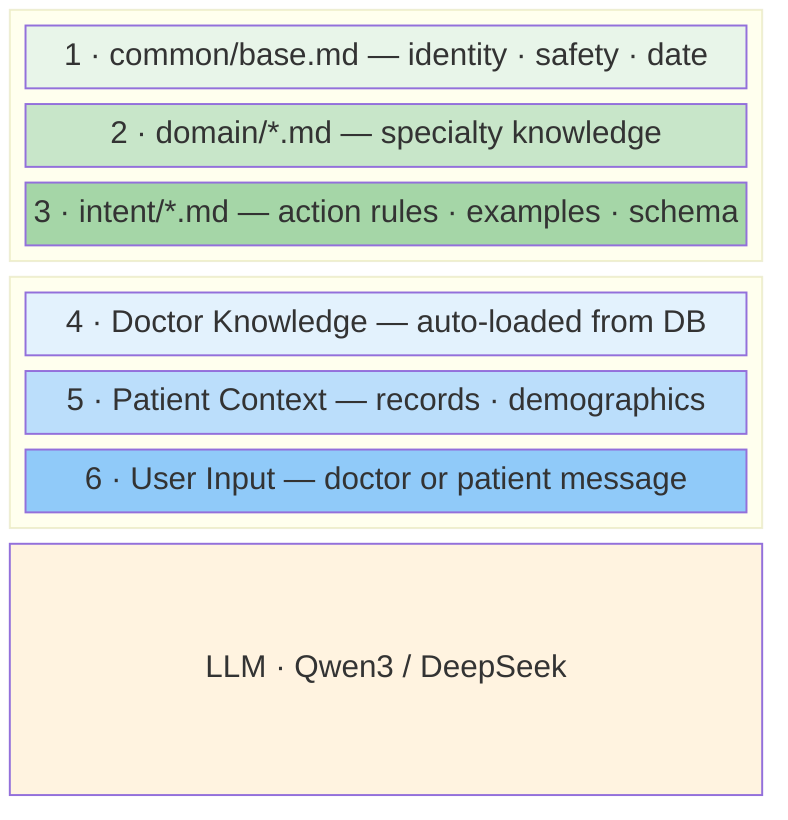
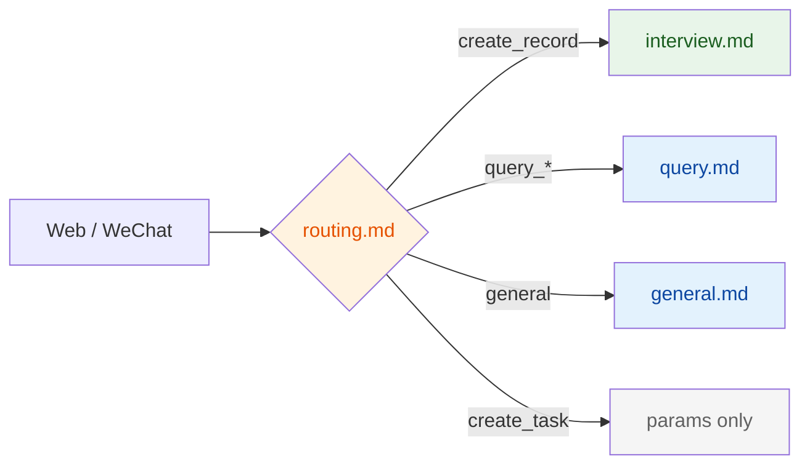
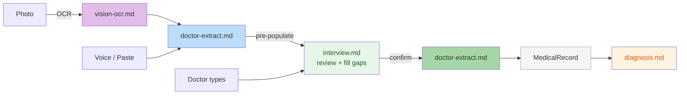
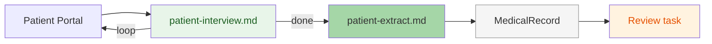

# Prompts

LLM prompt files — one `.md` file per prompt. Edit directly to tune behavior.

## How it works

- `utils/prompt_loader.py` reads files by key: `get_prompt("intent/doctor-extract")` → `prompts/intent/doctor-extract.md`
- Files are cached in memory on first read; call `invalidate()` to reload
- `prompt_composer.py` assembles the 6-layer prompt stack (common → domain → intent → knowledge → context → user)
- `{current_date}` is auto-injected by the composer at runtime

## Directory Structure

```
prompts/
├── common/                  ← L1 Identity: universal (every LLM call)
│   └── base.md                 role, safety rules, {current_date}
├── domain/                  ← L2 Specialty: domain knowledge (when LayerConfig.domain=True)
│   └── neurology.md            conditions, red flags, key tests
├── intent/                  ← L3 Task: action-specific rules + output format
│   ├── routing.md              intent classification (7 intents)
│   ├── interview.md            doctor dictation → field extraction
│   ├── patient-interview.md    patient pre-consultation interview
│   ├── query.md                query results → Chinese summary
│   ├── general.md              greetings, off-topic handling
│   ├── diagnosis.md            differential diagnosis generation
│   ├── doctor-extract.md       extract 14 fields (dictation, voice, paste, photo OCR)
│   ├── patient-extract.md      extract 7 fields from patient transcript
│   ├── vision-ocr.md           clinical image → plain text (OCR)
│   ├── triage-classify.md      patient message → triage category (5 categories)
│   ├── triage-informational.md auto-reply to informational patient questions
│   ├── triage-escalation.md    structured escalation summary for doctor
│   └── followup_reply.md       draft reply in doctor's voice (WeChat-style, ≤100 chars)
├── knowledge_ingest.md      ← OCR/document cleanup → structured knowledge entry
└── README.md
```

Hierarchy: **L1 Identity** (universal) → **L2 Specialty** (domain) → **L3 Task** (action) → **L4 Doctor Rules** (KB from DB) → **L5 Case Memory** (diagnosis only) → **L6 Patient** (context) → **L7 Input** (message)

## 6-Layer Prompt Stack



> **Pattern A** (single-turn): L1-L3 (Identity+Specialty+Task) → system msg, L4-L7 (Doctor Rules+Patient+Input) → user msg with XML tags
> **Pattern B** (conversation): L1-L6 (Identity through Patient) → system msg, history turns, L7 Input → user msg
> **Pattern C** (direct): Only L3 Task prompt, no composer

## Workflow Diagrams

### Doctor Pipeline





### Patient Pipeline



### Composition Patterns

| Pattern | System msg | User msg | Used by |
|---------|-----------|----------|---------|
| **A** single-turn | base + intent | KB + context + msg | routing, query, general, diagnosis, followup_reply |
| **B** conversation | base + domain + intent + KB + ctx | history turns | interview, patient-interview |
| **C** direct | prompt only (or none) | template.format(vars) | doctor-extract, patient-extract, vision-ocr |

## Assembly Patterns

Three patterns are used to build LLM input from prompts:

### Pattern A: Composer Single-Turn

```
system = common/base.md + [domain/{specialty}.md] + intent/{intent}.md
user   = <doctor_knowledge>KB</> + <patient_context>ctx</> + <doctor_request>msg</>
```

Used by: routing, query, general, diagnosis

### Pattern B: Composer Conversation

```
system  = common/base.md + domain/{specialty}.md + intent/{intent}.md + KB + patient_context
history = user/assistant turns (full multi-turn conversation)
user    = (latest turn or empty)
```

Used by: interview, patient-interview

### Pattern C: Direct (no composer)

```
[system = prompt.md]              ← some have system msg, some don't
user    = template.format(vars)   ← or image + text for vision
```

Used by: doctor-extract, patient-extract, vision-ocr

## Prompt Workflow Map

| # | Prompt | Trigger | Pattern | LLM Input | Model | Output |
|---|--------|---------|---------|-----------|-------|--------|
| 1 | common/base.md | Every call | L1 Identity | Always first in system msg | All | N/A (foundation) |
| 2 | domain/neurology.md | create_record, review, patient-interview | L2 Specialty | Appended after base.md | All | N/A (knowledge ref) |
| 3 | routing.md | Every doctor message | A | `sys: base+routing` → `user: msg` + 5 history turns | ROUTING_LLM | `RoutingResult` |
| 4 | interview.md | Doctor dictation session | B | `sys: base+domain+interview+KB+ctx` → full history | CONVERSATION_LLM | `InterviewLLMResponse` |
| 5 | patient-interview.md | Patient pre-consult | B | `sys: base+domain+patient-interview+KB+ctx` → full history | CONVERSATION_LLM | `InterviewLLMResponse` |
| 6 | query.md | "查病历" / "我的任务" / "所有患者" | A | `sys: base+query` → `user: KB + records_json + msg` | ROUTING_LLM | Plain text |
| 7 | general.md | Greetings / off-topic | A | `sys: base+general` → `user: msg` | ROUTING_LLM | Plain text |
| 8 | diagnosis.md | "Review & AI" button | A | `sys: base+domain+diagnosis+KB` → `user: record_fields` | ROUTING_LLM | `DiagnosisResponse` |
| 9 | vision-ocr.md | Photo upload (OCR step) | C | `sys: vision-ocr.md` → `user: [image] + request` | VISION_LLM | Plain text |
| 10 | doctor-extract.md | Interview confirm, voice/paste, photo OCR | C | `user: prompt.format(name,gender,age,transcript)` | ROUTING_LLM | `DoctorExtractResult` |
| 11 | patient-extract.md | Patient interview confirm | C | `user: prompt.format(name,gender,age,transcript)` | ROUTING_LLM | `PatientExtractResult` |
| 12 | triage-classify.md | Patient message received | C | `user: message + patient_context` | ROUTING_LLM | `TriageResult` |
| 13 | followup_reply.md | Patient escalation → draft | A | `sys: base+domain+followup_reply+KB` → `user: ctx+msg` | ROUTING_LLM | Draft text or empty (no-draft when no KB citation) |

### LLM Providers

| Env Var | Default | Used By |
|---------|---------|---------|
| `ROUTING_LLM` | groq (qwen3-32b) | routing, query, general, diagnosis, extract |
| `CONVERSATION_LLM` | falls back to ROUTING_LLM | interview, patient-interview |
| `STRUCTURING_LLM` | groq (qwen3-32b) | voice/paste extraction (uses doctor-extract.md) |
| `VISION_LLM` | ollama (qwen3-vl:8b) | vision-ocr |

### Response Models

All structured outputs use `instructor` (`structured_call` + Pydantic model). Plain text outputs use `llm_call`.

| Model | Method | Fields | Used By |
|-------|--------|--------|---------|
| `RoutingResult` | instructor | intent, patient_name, params, deferred | routing |
| `InterviewLLMResponse` | instructor | reply, extracted (ExtractedClinicalFields), suggestions | interview, patient-interview |
| `DoctorExtractResult` | instructor | 14 clinical fields (all Optional[str]) | doctor-extract |
| `PatientExtractResult` | instructor | 7 history fields (all Optional[str]) | patient-extract |
| `DiagnosisResponse` | instructor | differentials, workup, treatment | diagnosis |
| _(plain text)_ | llm_call | raw string | query, general, vision-ocr |

## Field Standard

All extraction prompts follow **《病历书写基本规范》(卫医政发〔2010〕11号)** outpatient record structure:

| Group | Fields |
|-------|--------|
| 病史 (7) | chief_complaint, present_illness, past_history, allergy_history, family_history, personal_history, marital_reproductive |
| 检查 (3) | physical_exam, specialist_exam, auxiliary_exam |
| 诊断 (1) | diagnosis |
| 处置 (2) | treatment_plan, orders_followup |
| 科别 (1) | department |

**14 fields total.** Patient-mode extraction uses only the 7 病史 fields.

## Notes

- **Pattern C prompts skip base.md** — doctor-extract, patient-extract, and vision-ocr don't receive safety rules from common/base.md. They rely on inline constraints in the prompt itself.
- **query.md serves 3 intents** — query_record, query_task, query_patient all use the same prompt via LayerConfig.
- **{current_date} injection** — `prompt_composer.py:_inject_date()` replaces `{current_date}` in all composer-assembled prompts. Pattern C prompts must include it in their own template if needed.

## Regression Tests

```bash
cd tests/prompts && ./run.sh          # run all 75 tests (14 prompts)
./run.sh doctor-extract routing       # run specific prompts
npx promptfoo view                    # open results UI
```

Config: `tests/prompts/promptfooconfig.yaml`
Test cases: `tests/prompts/cases/{prompt}.yaml`
Wrappers: `tests/prompts/wrappers/{prompt}.md`
